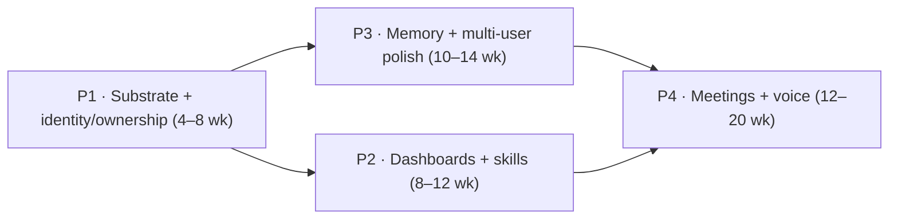

# HANDOFF PROMPT — Port OpenClaw's best subsystems into ROX (`rox-one/rox-one`)

**Audience:** you, the implementing agent. **Operator:** hand this document to an agent with write access to `rox-one/rox-one` and access to the study artifacts below. It is a complete assignment — read it end-to-end before acting.

You have **full autonomy** to execute this program: recon, plan, implement, verify, deliver — without seeking approval between routine stages. Ask only when a decision would materially change product direction and cannot be derived from repository evidence. The target repository's own instructions (`AGENTS.md`, `CONTEXT.md`, `DESIGN.md`, `CONTRIBUTING.md`, `docs/ru/*`, CI gates) are binding and override this document wherever stricter; this document supplies mission, evidence, sequencing, and acceptance criteria.

---

## 1. Mission

Improve `github.com/rox-one/rox-one` (**ROX**) by borrowing the best mechanisms and implementations from **OpenClaw** across five areas — plus the gateway substrate they depend on:

| Area | OpenClaw equivalent | Desired ROX outcome |
|---|---|---|
| **(a) multiplayer** | multi-user mode, roles/scopes, presence, public sharing, team server | shared workspaces feel alive and attributed: owner assignment, participants, presence/typing, share links, per-person connections |
| **(b) interactive dashboards** | Control UI, Workboard, Canvas/A2UI widgets, embedded browser | a first-class dashboard (embedded web + in-app) with streaming chat, sessions, config, a Kanban workboard, and sandboxed widgets |
| **(c) memory & skills** | memory stack (index/provenance/hybrid recall), skills + plugin system | durable, provenance-safe memory with hybrid recall; the 330-skill catalog wired into prompts with gating/search |
| **(d) meeting & voice** | meeting-bot transports, caption provenance, Talk realtime voice, TTS/STT, wake | meeting capture with per-line provenance + rolling notes; realtime voice and dictation aligned on one event model |
| **(e) macOS setup** | install/onboard/daemon lifecycle, menu-bar app, node host | hardened service lifecycle (install/start/stop/doctor), tray shell, capability-gated native helpers, update channels |

**"Borrow the best" means parity of experience and invariants — not line-by-line copying.**

- ROX already has an equivalent → wire/strengthen it (`reuse-as-is` rows in the study).
- ROX has a seam → adapt the mechanism onto it (`adapt` rows).
- ROX has nothing → reimplement in ROX idioms (`reimplement` rows).
- OpenClaw's design is known-fragile → improve on it (the study flags these; ROX constraints forbid several OpenClaw patterns outright — see §5, §6).

---

## 2. Evidence base — use it; do not re-research from scratch

A completed 12-agent study (2026-10-09, adversarially verified) ships with this document:

- **Local**: `/Users/t/Projects/openclaw/port-analysis/` (this file's directory)
- **Remote**: `github.com/agisota/openclaw` → branch `port-analysis/openclaw-features-2026-10-09`
- **OpenClaw source pinned** at upstream `b0c330d2` (fork `main` synced 2026-10-09; local clone `/Users/t/Projects/openclaw`, shallow — deepen it or browse GitHub if you need more history)

Read in this order:

1. **`port-analysis/port-matrix.md`** — the backlog spine: ~96 capability rows, each with OpenClaw reference + key files, **verified ROX destination and anchor**, verdict (`reuse-as-is | adapt | reimplement | skip`), effort (S/M/L/XL), top risk; plus recommended sequencing, cross-cutting concerns, and non-goals.
2. **`port-analysis/areas/{a1,a2,b1,b2,c1,c2,d1,d2,e1,e2,f,g}.md`** — mechanism-level deep dives with `path:line` anchors on **both** sides, mermaid flows, exact contract names, risks, and explicit `UNVERIFIED:` markers. Read just-in-time per phase, not all at once.
3. **`port-analysis/README.md`** — method + verification statistics; `port-analysis/verification/*.json` — raw adversarial check results.
4. **`port-analysis/knowledge-graph.json`** — 1,412-node / 2,920-edge schema-validated graph (plus `graph-fragments/` and `tools/` for reproducibility) if you want to navigate the codebase visually.
5. **The target repo** — `/Users/t/Projects/rox-one` is a clone taken for the study; re-clone or pull fresh in your environment. **ROX code is the only truth about ROX.**

**Truth rules**

- ROX line numbers in the study are anchors read on 2026-10-09 and **will drift** — verify every anchor against the live checkout before relying on it.
- For OpenClaw semantics beyond what the docs state, read the source at the pinned commit `b0c330d2` — never from memory.
- Every slice you build must name the matrix row(s) it implements in the ledger (§9).
- If you find study drift or errors, record them in the ledger; optionally open a corrections PR against the study branch.
- Verification quality bar of the study itself (so you know what was checked): 1,008 OpenClaw + 71 ROX citations resolve; 433 symbol nodes resolve; 299 adversarial claim checks with 9 corrections applied.

---

## 3. Sequencing (dependency order — not a stop-at-phase gate)

- **Phase 1 — Substrate, identity, ownership core.** Port the invariants from `f` (single-owner state lock, loopback default, method registry + scope gating, per-session lane/queue steering, transcript fence `activeWriterRunId`) and `a1` (actor kinds `profile|channel|agent`, creator/owner/participants, admission-time scope ceiling, `sessions.assignOwner`). Everything else registers through this.
  **First slice:** `sessions.assignOwner` RPC over the existing `WsRpcServer`; persisted `creator` / `owner{assignedBy,assignedAt}` / `participants` on the session record; scope-checked at admission; surfaced in the renderer's session context menu.
- **Phase 2 — Interactive dashboards + skills surface.** `b1` dashboard on the embedded WebUI host (chat streaming + tool cards + sessions sidebar + config), `b2` Workboard→Kanban and Canvas→sandboxed widget path, `c2` skills loader/gating/prompt injection, `a2` sidebar filter/sort + owner chip + presence/typing.
  **First slice:** chat page with streamed deltas reconstructed client-side over OMP RPC, owner chip, and `<available_skills>` injected into the OMP session prompt from the existing 330-skill catalog.
- **Phase 3 — Memory + multi-user polish.** `c1` SQLite/FTS index + provenance gates + hybrid search + per-turn injection via OMP RPC; `a2` public-link sharing menu; `a1` presence rollout and (optional) visitor/trusted-proxy ingress.
  **First slice:** `memory_search`/`memory_get` with a provenance-gated (`owner|agent`) bootstrap of `MEMORY.md`; **probe FTS5 + sqlite-vec availability under `bun:sqlite` before building**.
- **Phase 4 — Meetings + voice.** `d2` transport-agnostic meeting session runtime + caption provenance/ownEcho + notes pipeline; `d1` Talk event vocabulary + one realtime bridge + TTS/STT relay + voice wake.
  **First slice:** observe-only (`transcribe`) meeting capture with per-line provenance and a 5-minute-cadence summary, persisting to ROX's meeting store and a Meetings reader.

Sequencing is a dependency order — keep shipping slices until the backlog is done or an escape hatch (§11) applies. Parallelize independent rows aggressively if your host supports subagents/workflows (the study itself proved 12-way parallel analysis works); keep one integrator and never let two workers own the same interface concurrently.

---

## 4. The crown jewels — what to borrow, area by area

### (a) Multiplayer — `areas/a1-multi-user-core.md` + `areas/a2-multi-user-ui.md`

**Borrow:**
- Three-kind actor model `profile|channel|agent` with immutable **creator** / assignable **owner** / bounded **participants** attribution; `sessions.assignOwner` as the mutation entry.
- Named operator roles + a **scope ceiling intersected at WS admission**, not just in UI.
- Presence map: connect-time snapshot + heartbeat, ~5-minute TTL, active window; ephemeral by design — **never an authorization source**.
- Public session links: sealed locator (AES-256-GCM) bound to installation/device identity; revocation cannot recall copies — design for expiry + re-issue.
- Visitor access (time-boxed grant + sweep) and trusted-proxy / Cloudflare-Access OIDC ingress as **optional** layers, behind flags.
- UI (a2): sidebar filter/sort popover ("involving me" evaluated server-side over full participant history), owner chip + assign submenu, participant history rendering (creator vs owner vs participants), presence avatars + typing indicator (drafts stay ephemeral — never in transcript/model context), sharing menu (visibility + public link + members; `read-only`/`suggest`/`draft` **enforced server-side**), per-person "Connected accounts" on the existing credential fabric.

**Land in ROX at:** `packages/server-core/src/authority/native-authority.ts` (`authorize`, `permissionFence`), `packages/shared/src/orgs/*`, `packages/server-core/src/collaboration/sync-service.ts`, `packages/shared/src/collaboration/{presence,session-publication}.ts`, identity store, RPC `orgs.*` / identity contracts; renderer sidebar + chat header.
**Improve on OpenClaw:** ROX authority is server-enforced — put every check behind `NativeAuthority` and cache ceilings **per connection generation**.
**MVP slice:** `sessions.assignOwner` + persisted attribution + admission-time scope check + context-menu surface (see §3).

### (b) Interactive dashboards — `areas/b1-control-ui.md` + `areas/b2-canvas-workboard.md`

**Borrow:**
- Dashboard served **from the same HTTP host as the gateway** (ROX already does this — reuse), with tokenized auth (`/login`, `POST /api/auth`) and a **one-time bootstrap handoff token** (credential never in a URL; origin allow-list).
- CSP / security headers: nonce or hash for inline scripts, `frame-ancestors 'none'`, `object-src 'none'`, `connect-src` self+ws, `img-src` restricted — plus the **media-ticket pattern** so media URLs never carry the reusable gateway credential.
- Transport shape: `connect.challenge` → `hello-ok{features,snapshot,auth,policy}`, method + event catalog, reconnect backoff, warm reload, outbox — but **map the method inventory onto ROX's existing RPC channels**, never adopt OpenClaw's bespoke WS protocol or codegen.
- Boot-manifest/chunking **concept** for stable dashboard assets (adapt the pipeline; ROX is Vite/Bun, not the OpenClaw bundler).
- Workboard: `workboard.*` RPC + SQLite store + CAS updates + card↔session linkage → ROX Kanban (`packages/shared/src/kanban/*`); the browser-plugin pattern → a React route + IPC bridge (MindMapHost is the precedent).
- Canvas/widgets: `show_widget` → `board.widget.put` with a script CSP sandbox and a **ticket-bound message bridge** (sessionKey / revision / viewGeneration / TTL) — the bridge is the real trust boundary; A2UI validation (strict v0.8 / schema v0.9; reject mixed versions).
- Embedded browser → Electron `WebContentsView` tabs, per-profile `session.fromPartition`, staged-then-commit downloads; WebChat fleet keeps the "direct WS, no local static server" invariant.
- Operator panels (chat, sessions, cron, logs, usage, …) — port **panel-by-panel**, not as one cutover; re-express visuals in React + Tailwind.

**Land in ROX at:** `packages/server-core/src/webui/*` + `apps/webui/*`, `apps/electron/src/transport/channel-map.ts`, renderer routes, kanban/workgraph/mindmap packages.
**MVP slice:** WebUI dashboard chat page with client-side streamed deltas over OMP RPC + sessions sidebar + owner chip + config form (see §3).

### (c) Memory & skills — `areas/c1-memory.md` + `areas/c2-skills-plugins.md`

**Borrow (memory):**
- SQLite index schema + per-agent DB + migrations; and above all the **provenance gate (`origin_class ∈ owner|agent`)** — the security property that prevents memory poisoning from untrusted tool/web output. Port the *gate*, not merely the index.
- Hybrid retrieval: BM25 + vector → temporal decay → importance → MMR. Index identity = chunking version + provider/model → port the **rebuild state machine** so incompatible embeddings never mix; keep a f64-BLOB cosine fallback.
- Context injection: prompt-snapshot semantics with a **per-turn boundary**; ROX has no context engine — pass the rendered addition over OMP RPC.
- Recall lanes: (1) deterministic **lexical-only** trigger (score ≥ 0.65, top 3) then (2) escalation sub-agent only on recall intent + miss; standing intents (prospective memory) matched at prompt-build time; time reminders belong to cron.
- Memory wiki (claims/evidence/contradictions) and flush/forget with lineage — port **after** the core works; forget must remove corpus lines + chunks + embeddings, not just prose.

**Borrow (skills):**
- `SKILL.md` parse/materialize + discovery-root precedence ladder + collision reporting (ROX already ships a 330-skill catalog — reuse, don't rebuild).
- Gating/eligibility (agent allowlist; `requires.bins/env/config`) mapped onto ROX operator identity and the credential fabric.
- Prompt surface `<available_skills>` + `skills_search` / `skills_read` tools injected into the OMP session prompt via the existing tool-def path.
- Plugin manifest + registration-mode boundary — but ROX **must not** copy OpenClaw's in-process, unsandboxed plugins: run third-party plugin code in a Bun worker/child with a capability IPC surface; use `restartRequired` when a live swap is impossible.
- Registry trust gate (verdict → clean/blocked, **fail-closed**); custodian skills ship as gated bundled skills, not privileged tools.

**Land in ROX at:** `packages/server-core/src/memory/*`, `packages/shared/src/memory/*`, RPC `memory.*`/`learning.*`; `packages/shared/src/skills/*`, `SKILLS.lock` + `REQUESTED-SKILLS.json`, RPC `skills.*`.
**MVP slice:** provenance-gated `memory_search`/`memory_get` + `MEMORY.md` bootstrap; `<available_skills>` injection (see §3).

### (d) Meeting & voice — `areas/d2-meetings.md` + `areas/d1-voice-realtime.md`

**Borrow:**
- Transport-agnostic meeting session runtime: **keyed lock on transport+URL**, tab ownership, retry; transport selection (browser automation / dial-in) as pluggable adapters.
- Caption transcription with **per-line provenance + `ownEcho` flag** (without it you echo the agent's own TTS into the notes); bounded in-memory caps; **no audio/video recording**.
- Notes pipeline: 5-minute cadence, strict JSON schema, ~20-second budget, deterministic heuristic fallback.
- Participation idempotency: fingerprint dedupe, one correction; observations never grant action authority.
- Talk: one shared event vocabulary + sequencer; provider registry (realtime voice + speech); **one** bridge state machine (connect/retry/pending audio, barge-in with echo guards, 30-min session TTL, 960-byte PCM16 frames, bounded queues); TTS buffered + streaming with precedence; STT relay with WS reconnect; voice-wake list + broadcast with **on-device recognition only**; telephony = skip in v1.
- Google Meet: OAuth (PKCE, scopes) + captions path; treat creation as Developer-Preview-gated.

**Land in ROX at:** `packages/server-core/src/meetings/*`, `apps/electron/src/main/meetings/*`, `apps/electron/src/shared/meetings-local.ts`, `packages/shared/src/meeting-agents/*`, RPC `meetings.*`; `packages/shared/src/voice/*`, `apps/electron/src/main/voice/*`, RPC `voice.*`.
**MVP slice:** observe-only (`transcribe`) capture + per-line provenance + 5-min summary into the meeting store (see §3).

### (e) macOS setup — `areas/e1-macos-lifecycle.md` + `areas/e2-macos-app.md`

**Borrow (invariants, adapted to Electron):**
- Service lifecycle: **transactional** publish + rollback of service definitions; 0600 env file / 0700 wrapper; the service **refuses mutations from inside itself**; single-owner "who owns the gateway"; tri-state onboard decision (install by default in quickstart; skip when externally supervised; respect explicit choice).
- Doctor diagnostics: foreign jobs, port conflicts, runtime/dependency mismatch — scoped to ROX's own service.
- Update channels + `checkOnStart` + detached handoff with wait-for-old-PID; keep app and gateway/OMP on compatible release trains (ROX already has `electron-updater` — reuse-as-is; respect ad-hoc-signing detection and suppressed feeds).
- Tray/menu-bar shell + navigation dispatch (main-process router: web dashboard vs native chat); node **capability model + TCC discipline**: capabilities are claims → enforce server-side allowlists; bundle-ID/path changes reset TCC grants — treat as a migration event.
- Helper processes over stdio/UDS with 0600 token + HMAC + peer-UID checks; a separate exec-approvals socket; stdio framing.
- Signing/notarization: JIT entitlements only to runtime binaries; Team-ID audit fails closed.
- **Skip/adapt:** `curl|bash` installer, npm-global/PATH rewrites, launchd foreign-job reaping.

**Land in ROX at:** `apps/electron/src/main/{index,window-manager,menu,auto-update,deep-link,notifications,native-replica}.ts`, `apps/electron/src/shared/*`, `electron-builder.yml`, `packages/pi-agent-server/*`.
**MVP slice:** install/start/stop service control + doctor command + state-dir/logs/uninstall scopes mapped to ROX.

### (f) Substrate — `areas/f-substrate-gateway.md` (Phase 1 foundation)

**Borrow:** single-owner process + state lock + **loopback-bind default** (refuse non-loopback without auth); frame shape `req/res/event` + `connect`-first handshake mapped onto ROX's WS (one generated contract + N-1 window; **no** Swift/JSON-Schema codegen); method registry + namespace/scope policy (plugin methods must never shadow reserved core prefixes); queue steering (`steer|followup|collect|interrupt`) mapped to OMP queue policy; streaming agent loop with the `activeWriterRunId` transcript fence — `agent` returns a runId immediately, `agent.wait` waits for terminal; config JSON5 + SecretRefs (`env|file|exec|store`) mapped onto the ROX credential fabric (skip invalid reloads instead of applying them); plugin activation planner; cron/hooks **single host-timer scheduler** with `beginClose`/`stop` semantics and missed-tick coalescing; node/device registry + presence + pending invokes; shared SQLite + per-agent DBs + single-writer lock.

---

## 5. Non-negotiable engineering rules (ROX)

1. **IPC / transport.** Route every renderer call through `CHANNEL_MAP` + a new `RPC_CHANNELS` entry (`apps/electron/src/transport/channel-map.ts`, `packages/shared/src/protocol/channels.ts`). Never raw `webContents.send` — `scripts/check-raw-sends.sh` (`lint:ipc-sends`) fails the build. **Classify every new channel** in `packages/shared/src/protocol/routing.ts` (`LOCAL_ONLY_CHANNELS` vs `REMOTE_ELIGIBLE_CHANNELS`) — exhaustiveness is CI-enforced. New per-session streams subscribe to `SessionEventBus` or extend the `sessions.EVENT` projector — **never open a second socket**.
2. **OMP RPC.** The host MUST answer every `extension_ui_request` with `extension_ui_response` or the whole turn stalls (`docs/omp-rpc-notes.md`). Follow the existing OMP integration patterns (`OmpAgent`, `set_host_tools`, session tool defs).
3. **Identity & credentials.** Port roles, ownership, OAuth, secret refs, per-person model accounts onto `packages/core/src/platform/identity` + the credentials fabric (`InProcessCredentialBroker`, `CredentialManager`) — **never a second secret store**.
4. **i18n (Russian-first).** Default language `ru`; every user-facing string through `t()`; every new key in **all 12 locale files**, ASCII-sorted, with `_one/_few/_many` plurals. Gates `lint:i18n:parity|sorted|coverage` + `bun test packages/shared/src/i18n` must pass. OpenClaw strings have no translations upstream — author them in Russian as part of each port.
5. **UI stack & conventions.** React 18 + Tailwind v4; **do not port Lit/Web Awesome**; re-express visuals. Obey `DESIGN.md`. The operator's standing UI preferences: Russian-first, light compact layouts, polished motion transitions, and thorough in-app help (definitions, units, formulas, sources, examples) — verify the specifics against `DESIGN.md` and repo conventions before deviating.
6. **Security posture.** Multi-user mode is a **usability plane, not a tenant/security boundary** — never market or implement it as isolation. Sharing modes (`read-only`/`suggest`/`draft`) enforced server-side. Widget bridges ticket-bound. Memory injection provenance-gated. Service mutation refused from inside the service. Never weaken `NativeAuthority`.
7. **Data safety.** Additive, reversible migrations; never rewrite or lose user sessions, transcripts, or state dirs; back up before destructive steps; preserve single-owner gateway semantics. Preserve the existing **OpenClaw host-control** integration (install/provision/start/stop + security audit) — the ported features are ROX-native and must not regress it.
8. **License & provenance.** OpenClaw is **MIT** (© 2026 OpenClaw Foundation) — reuse is allowed, but prefer clean-room re-expression in ROX idioms. Record provenance (matrix row + upstream path) in the ledger and PR description. Never copy code whose license conflicts; never strip license headers; keep a `NOTICE` entry if you reuse a substantive portion verbatim.
9. **Git.** Conventional commits; **no AI attribution anywhere** (no "Generated with …", no `Co-Authored-By:` for AI tools). Never force-push or rewrite shared history; don't revert unrelated user changes; work on a branch and open PRs unless the operator says otherwise; keep the repo's merge policy.
10. **Repo rules first.** Read `AGENTS.md`, `CONTEXT.md`, `DESIGN.md`, `CONTRIBUTING.md`, `docs/ru/*` before touching code; they override this document. Honor the repo's workflow directives (e.g. its orchestration/thinking-depth requirements) — verify them against the live files, not from this summary.

---

## 6. Non-goals — do NOT build

- Tenant isolation / security boundary (requires separate OS users/hosts).
- Vendor meeting SDKs, recording, or diarisation beyond platform caption speaker labels; no Zoom/Teams creation claims; Google Meet creation only behind its Developer-Preview gate.
- In-process, unsandboxed third-party plugins; publishing to ClawHub from the app.
- OpenClaw's WS protocol wholesale, Swift/JSON-Schema codegen.
- `curl | bash` installers, npm-global/PATH rewrites, Web Awesome/Lit ports.
- Telephony voice-call hosting in v1 unless a public webhook/tunnel is provisioned.
- Launchd foreign-job reaping.

(Full list with citations: `port-matrix.md` §Non-goals — re-read it.)

---

## 7. Working method

1. **First 90 minutes:** (a) read `AGENTS.md` / `CONTEXT.md` / `DESIGN.md` / `CONTRIBUTING.md` / `docs/ru/RX-DOC-0024-hub.md`; (b) read `port-matrix.md` fully and **create the ledger** (§9) from its rows; (c) read `areas/a1` + `areas/f` and verify their ROX anchors against the live checkout; (d) establish the baseline: `bun install`, `bun run validate:ci`, note pre-existing failures; (e) write the Phase-1 slice plan; start slice 1.
2. **Slice loop:** plan → implement → i18n + tests → run the gate → **exercise the real surface** (launch the Electron app or the WebUI; for headless paths keep an RPC/CLI transcript) → update the ledger with evidence → commit.
3. **Vertical slices:** merge each slice as a demoable increment. Avoid horizontal infrastructure marathons except the Phase-1 items that unblock everything.
4. **Parallelize** independent rows when your host supports it; one integrator owns shared interfaces; workers report via commits/notes.
5. **Drift discipline:** verify every anchor you touch; fix stale comments in the files you edit.
6. **Evidence or it didn't happen:** commands + observed output; UI verified visually; no "should work".
7. **Escalation:** only for product-direction forks or external blockers; otherwise choose the conservative option, record the choice in the ledger, and keep moving.

---

## 8. Definition of done (program level)

1. Every in-scope matrix row is `done`, or `deferred`/`skipped` with a written reason in the ledger.
2. The five headline experiences work end-to-end and were exercised for real:
   - **(a)** two identities share a session: owner assignment, participants, presence/typing, share link;
   - **(b)** the dashboard serves chat (streaming) + sessions + config on the embedded host with correct CSP/handoff; workboard/kanban plus one sandboxed-widget demo work;
   - **(c)** memory search runs with provenance gating, and the skills surface (`<available_skills>` + search/read tools) reaches OMP prompts;
   - **(d)** meeting capture records per-line provenance and produces 5-minute rolling notes; a realtime voice session and dictation share one event model;
   - **(e)** service lifecycle: install/start/stop/doctor + update-channel gating + tray shell.
3. Gates green: `bun run validate:ci` + `lint:ipc-sends` + the i18n suite; no regressions in existing tests.
4. Ledger complete; PR(s) mergeable; no AI attribution anywhere.

---

## 9. Ledger (traceability — required)

Create and maintain `docs/openclaw-port/STATUS.md` in the ROX repo (language per repo conventions):

| Row (matrix) | Area | Verdict | Status | Evidence | Notes |
|---|---|---|---|---|---|
| a1.assignOwner | a1 | adapt | in-progress | branch + test names | ... |

Statuses: `todo · in-progress · done · deferred (reason) · skipped (reason)`. Every `done` row points to evidence (commit, test, demo note). Update the ledger in the same PR as the code.

---

## 10. Deliverables

- Code + tests on a work branch in `rox-one/rox-one` (PRs with per-slice evidence and matrix-row mapping).
- `docs/openclaw-port/STATUS.md` ledger.
- Repo-conventional documentation updates (Russian where the repo is Russian; i18n keys in all 12 locales).
- Final handoff report: what shipped (with evidence), what was deferred and why, known risks, suggested next slices.

---

## 11. Escape hatches (external blockers — choose, record, continue)

- **FTS5 / sqlite-vec missing under `bun:sqlite`** → probe first (Phase-3 gate). Fallback: f64-BLOB cosine + the index-identity rebuild machine; keep the interface stable.
- **Google Meet Developer-Preview enrollment** blocked → build the OAuth + captions path behind a flag; don't claim meeting creation.
- **Cloudflare / team-server ingress** unavailable → implement visitor/trusted-proxy layers behind flags; skip activation.
- **Notarization / Apple credentials** absent → keep ad-hoc detection paths; don't touch updater feeds.
- **Telephony** → skip v1 (needs a public webhook/tunnel).
- **A study anchor proves wrong and blocks you** → verify in OpenClaw source at `b0c330d2`; if still ambiguous, pick the conservative option, record it in the ledger, and continue with independent work.

---

## Appendix A — artifact map

- Study local: `/Users/t/Projects/openclaw/port-analysis/` → `README.md`, `port-matrix.md`, `areas/*.md`, `knowledge-graph.json`, `graph-fragments/`, `verification/`, `tools/`, `HANDOFF-PROMPT.md` (this file)
- Study remote: `https://github.com/agisota/openclaw/tree/port-analysis/openclaw-features-2026-10-09/port-analysis`
- OpenClaw fork: `https://github.com/agisota/openclaw` (`main` @ `b0c330d2`); upstream `openclaw/openclaw`
- ROX: `https://github.com/rox-one/rox-one`; local clone `/Users/t/Projects/rox-one`

## Appendix B — row inventory (ledger seeding)

Matrix row counts per area: a1 7 · a2 7 · b1 8 · b2 7 · c1 8 · c2 8 · d1 8 · d2 8 · e1 8 · e2 8 · f 10 · g 9 — total ≈ 96 rows, plus 5 cross-cutting concerns and 10 non-goals from `port-matrix.md`. Seed the ledger from the matrix tables directly; do not re-derive this inventory by hand.