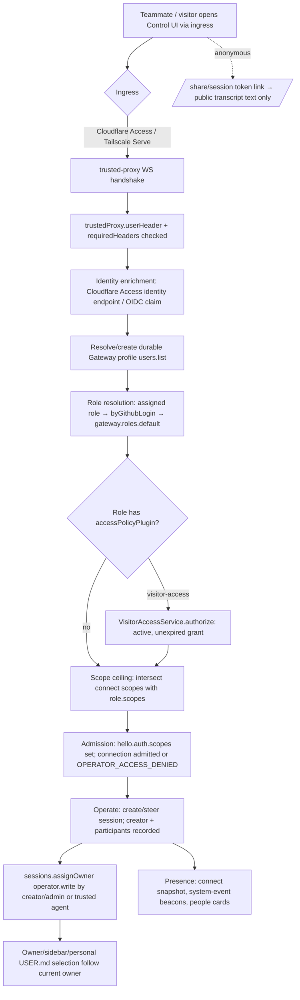

# Multi-user / shared-team core

## What it is / user-visible behavior

OpenClaw's "multiplayer" is **multi-user mode**: several trusted people operate one Gateway (agent). The docs are explicit that this is *not* a security boundary — "Everyone who can operate an agent can make it do anything that agent can do… not security boundaries" (`docs/concepts/multi-user.md:15`). Team operation is configuration, not a separate edition (`docs/start/teams.md:10`).

User-visible surfaces:
- Each session carries **three attribution layers** — immutable Creator, assignable Owner, and Participants history (`docs/concepts/multi-user.md:43`). Sidebar shows owner avatars, pair-stacks/+N participant counts, and owner filtering incl. **Involving me** (`docs/concepts/multi-user.md:131`, `:141`).
- Owners are reassigned like GitHub issue assignees from the session context menu (**Assign to me** / **Assign to…**) (`docs/concepts/multi-user.md:51`).
- Per-person **Gateway profiles** carry display name/avatar, appearance prefs, personal `USER.md`, and personal model accounts (`docs/concepts/user-model.md:112`, `:66`).
- **Presence**: who is online/watching/typing, with ephemeral never-persisted drafts (`docs/concepts/multi-user.md:145`, `docs/concepts/presence.md:112`).
- **Public session links**: creator/admin enables *Public access* on the normal `/chat/...` URL; signed-out readers get transcript text only (`docs/concepts/multi-user.md:27`).
- **Named operator roles** bound to profiles: which sessions they touch, which agents, scope ceiling, sandbox-required, optional model policy (`docs/gateway/operator-scopes.md:134`).
- **Visitor Access** plugin (internal): grants individual people access to `team.openclaw.ai` by managing one Cloudflare Access allow policy, expiring after 14 days by default (`extensions/visitor-access/README.md:3`).

The one-boundary rule: "A gateway is one trust domain" (`docs/start/teams.md:25`); mutually untrusted users need separate Gateways/OS users/hosts.

## End-to-end flow

Visitor grant lifecycle (invite → policy write → expiry sweep) is interleaved with admission: the `authorize` hook is consulted on every admission where the role names the plugin (`extensions/visitor-access/index.ts:54`), and expiry is enforced both by an hourly sweep and an in-memory abort timer (`extensions/visitor-access/index.ts:104`, `extensions/visitor-access/src/visitors.ts:242`).

## Mechanisms

**Gateway profile vs channel sender vs agent actor.** A durable Gateway profile is stored in the shared-state DB `user_profiles` table (`src/state/user-profiles.types.ts:136`), with a `merged_into` alias column and a nullable primary GitHub account. Unidentified operator connections on a single-user Gateway get one shared local **Owner** profile selected by `shouldUseGatewayOwnerProfile` — only when there is no authenticated user id and roles are unconfigured or auth was token/password (`src/gateway/gateway-owner-profile.ts:4`). With `gateway.roles` configured, that owner profile only applies to token/password (`docs/concepts/user-model.md:120`). Channel senders are a *separate* identity domain: an admin must explicitly attest a link via `users.linkChannelIdentity` (`docs/concepts/user-model.md:214`), and agent actors resolve from the configured agent identity. Participant identity keeps these namespaces distinct even when raw IDs match (`packages/gateway-protocol/src/schema/session-participant.ts:12`).

**Roles & scopes; admission.** Named roles are a closed schema: `sessions.others` ∈ none|view|suggest|write, `sandbox` inherit|required, `agents` (`"*"` or allowlist), `scopes` ceiling, optional `modelPolicy`, optional `accessPolicyPlugin` (`src/config/zod-schema.gateway.ts:82`). Effective role resolution order: explicit `users.setRole` assignment → `assignments.byGithubLogin` (case-insensitive) → `gateway.roles.default` (`src/gateway/operator-role-policy.ts:95`). Unknown/missing identity resolves to a deny-all definition (`src/gateway/operator-role-policy.ts:29`, `:143`). Operator scopes are a closed set (`operator.read/sessions.read/sessions.write/write/admin/pairing/approvals/questions/talk/talk.secrets`) with implication rules (`docs/gateway/operator-scopes.md:32`). Connection authority is resolved by first capping with `x-openclaw-scopes`, then unioning server-side `identityScopes` grants, then intersecting the role scope ceiling (`docs/gateway/operator-scopes.md:435`). When roles are configured, identity verification completes *before* WS admission and device/bootstrap tokens are rejected for operator connections (`docs/concepts/user-model.md:136`, `docs/gateway/operator-scopes.md:219`).

**Guest policy.** A role's `accessPolicyPlugin` (e.g. `"visitor-access"`) makes admission conditional on a plugin returning current authority; a denied connection gets `OPERATOR_ACCESS_DENIED` (`docs/gateway/operator-scopes.md:190`). The plugin contract is `{ authorize, resume }` returning `PluginGatewayAccessAuthority { grantId?, assertCurrent, signal }` (`src/plugins/gateway-access-policy.types.ts:6`). Visitor's restricted role predicate requires `accessPolicyPlugin === "visitor-access"`, `sessions.others === "view"`, `sandbox === "required"`, an explicit `modelPolicy`, an agent allowlist, and only `operator.sessions.*` scopes (`extensions/visitor-access/src/roles.ts:21`).

**Three ownership layers + migration.** Types: `SessionActor` (persisted identity, no display), `SessionCreatedActor` (adds human `source: profile|channel|unknown` or agent/system), `SessionOwnerAssignment { actor, assignedBy?, assignedAt? }` (`src/config/sessions/session-entry-provenance.ts:14`, `:19`, `:53`). Creator is write-once; only a `source:"profile"` human gets implicit creator access (`sessionCreatorProfileId`, `:22`). Personal `USER.md` selection = assigned human owner else human creator (`sessionPersonalProfileId`, `:59`). `sessions.assignOwner` is the write path; its handler requires an identified caller (trusted agent id or gateway-client human actor) and authorizes by session visibility (`src/gateway/server-methods/sessions-mutations.ts:344`, `:370`, `:380`); it is in `VISIBILITY_AUTHORIZED_METHODS` (`src/gateway/session-sharing-authorization.ts:71`). Storage: participants live in `session_participants` keyed `(session_key, identity_namespace, actor_id)` after agent schema 18, admission bounded at 32 (`docs/reference/database-schemas/agent-schema-history.md:330`, `packages/gateway-protocol/src/schema/session-participant.ts:9`). Creator-source discriminator arrived in agent schema 19 / state schema 14; `migrateLegacySessionCreator` maps direct `createdBy` → `source:"unknown"` and derives `profile`/`channel` from `createdVia` only when provable (`src/state/creator-namespace-migration.ts:6`, `docs/reference/database-schemas/agent-schema-history.md:318`). No transcript/profile-lookup backfill.

**Presence.** In-memory, ephemeral map; TTL 5 min, max 200 (`docs/concepts/presence.md:239`). `snapshotClientPresence` builds entries from live WS clients (connectionId, clientId, ip omitted for local, roles, person timing) (`src/gateway/server/client-presence.ts:27`); `refreshClientPresence` merges timing across an identity's live connections and coalesces activity broadcasts to 30 s (`:60`, `:10`). Presence identity is derived from the authenticated profile id (`presenceIdentity`, `:17`). Roster shared with `operator.read`; node/pairing-only connections get none (`docs/concepts/presence.md:112`). Watched-session refs are filtered per recipient by `sessions.list` visibility (`docs/concepts/presence.md:122`).

**Public session links & token model.** Publication is per-session and anchored to the creator/admin, not the owner (`docs/concepts/multi-user.md:27`). The route is `/{basePath}/share/session` (`src/gateway/control-ui-public-session.ts:20`). Tokens are opaque **AES-256-GCM** sealed locators: HKDF-derived key from the process Ed25519 device identity, AAD `openclaw.public-session-share-locator.aad.v1`, prefix `v1.` (`src/gateway/control-ui-public-session-token.ts:15`, `:87`, `:117`). The plaintext locator is exactly `{v, agentId, sessionKey, sessionId, shareId}` (`:33`, `:52`); `resolvePublicSessionShareToken` uses a read-only identity lookup so anonymous traffic never mints durable state (`:260`). Only GET/HEAD on secure ingress; CSP `default-src 'none'`; ETag/304; rate-limited admission (`src/gateway/control-ui-public-session.ts:36`, `:57`, `:85`). Disabling stops anonymous reads and does not revive older `/share/session` links (`docs/web/urls.md:278`). Note the *normal thread URL* is not a capability — current sharing state decides (`docs/web/urls.md:289`).

**Per-person model accounts.** Saved accounts are credential records owned by the Gateway profile, stored in the shared state DB (`state/openclaw.sqlite`) with no sidecar; pending sign-ins are memory-only (`docs/concepts/user-model.md:113`). Four concepts: saved account, new-chat default, chat selection, sign-in attempt (`docs/concepts/multi-user.md:74`). Creating a session with `operator.sessions.write` applies the saved new-chat default as a session-sticky pin; explicit selection/change needs `operator.write` (`docs/concepts/multi-user.md:121`, `:123`).

**Visitor-access plugin.** Config: `accountId`, `appId`, `apiToken`, `policyName` (default `Visitors (openclaw-managed)`), `defaultTtlDays` (14), `maxVisitors` (50) (`extensions/visitor-access/src/config.ts:4`). `VisitorAccessService` owns an in-memory grant map, a **serialized mutation queue** (`private pending`, `serialize()` — one queue owns policy read/modify/write plus its durable record because Cloudflare has no cross-store transaction) (`extensions/visitor-access/src/visitors.ts:281`), an abort-controller per live grant, and an expiry timer (`:227`, `:242`). Grant shape: `({email}|{githubAccountId})` + grantId/createdAt/expiresAt/… (`:19`). `invite` resolves the target (GitHub via `resolveGitHubAccount`), enforces `maxVisitors`, runs `access.assertInvitable`, writes the policy, then registers the durable grant; a lost provider response keeps `expiresAt: now` cleanup then mints a fresh grantId (`:355`, `:392`, `:408`). `revoke` expires records first, filters the policy, then deletes (`:453`, `:522`). `list` reports drift (`unmanaged` / `missing from policy`) with output caps (`:578`). `sweep` prunes expired policy targets, warns on unmanaged/missing, and mints grantIds for legacy records after confirming them through the provider read (`:682`). `VisitorPolicyClient` reads the Cloudflare Access `policies` endpoint, tolerates dashboard edits by starting each mutation from a fresh read, reconstructs `include` rules as `{email}` or `{oidc: {identity_provider_id, claim_name, claim_value}}`, and refuses OIDC rules outside the configured mapping (`extensions/visitor-access/src/cloudflare.ts:63`, `:72`, `:91`, `:136`, `:159`). The plugin registers the Gateway access-policy hooks and an hourly sweep service (`extensions/visitor-access/index.ts:54`, `:104`); tools require owner/admin (`extensions/visitor-access/src/tools.ts:27`).

**trustedProxy / cloudflareAccessOidc.** `trustedProxy` = `userHeader` (required) + optional `requiredHeaders`, `allowUsers`, `allowLoopback`, `deviceAutoApprove`, and `cloudflareAccessOidc` (`src/config/zod-schema.gateway.ts:331`). `cloudflareAccessOidc` requires an exact `*.cloudflareaccess.com` `issuer`, an `providerId`, and `githubAccountIdClaim` carrying a decimal numeric GitHub account ID (`:357`). GitHub-backed sign-in is accepted only after successful trusted-proxy auth with the Access email header + a required Access assertion header, and the Access identity endpoint's email must match the authenticated principal (`docs/concepts/user-model.md:126`). The visitor plugin reads that same mapping to invite by GitHub account (`extensions/visitor-access/index.ts:42`).

## Key contracts & data shapes

- Gateway methods: `sessions.assignOwner` (operator.write; identified caller; visibility-authorized) (`src/gateway/methods/core-descriptors.ts:556`, `src/gateway/session-sharing-authorization.ts:71`); `users.setRole` / `users.list` (`effectiveRole`+`roleSource`) (`docs/gateway/operator-scopes.md:167`, `:184`); `users.linkChannelIdentity` / `listChannelIdentities` / `unlinkChannelIdentity` (admin) (`docs/concepts/user-model.md:214`); `users.merge`/`linkEmail`/`linkAuthProfile`/`unlinkAuthProfile`/`listAuthLinks` (`docs/concepts/multi-user.md:117`, `docs/concepts/user-model.md:171`); `presence.query` RPC (`docs/concepts/presence.md:27`); `sessions.setInvolvement` (`src/gateway/server-methods/sessions-mutations.ts:232`).
- Error codes: `OPERATOR_ACCESS_DENIED` (role access policy denial), `SESSION_MUTATION_AUTHORIZATION_CHANGED` (`src/gateway/session-sharing-authorization.ts:98`).
- Config keys: `gateway.auth.mode: "trusted-proxy"`, `gateway.auth.identityScopes`, `gateway.auth.trustedProxy.{userHeader,requiredHeaders,allowLoopback,deviceAutoApprove,cloudflareAccessOidc}`, `gateway.roles.{default,assignments.byGithubLogin,definitions}`, `gateway.publicOrigin` (`docs/gateway/team-server.md:119`, `:142`).
- Visitor tool results: `visitor_invite`/`visitor_revoke`/`visitor_list` with `VisitorInviteDetails`/`VisitorRevokeDetails`/`VisitorListDetails` (`extensions/visitor-access/src/tools.ts:37`, `extensions/visitor-access/src/tool-results.ts`).
- Types: `SessionCreatedActor`, `SessionOwnerAssignment`, `SessionParticipantIdentity` (profile|agent|remote|observation|legacy), `MAX_SESSION_PARTICIPANTS = 32`, `SESSION_PARTICIPANT_LIMIT = 4` (wire preview) (`src/config/sessions/session-entry-provenance.ts:19`, `:53`; `packages/gateway-protocol/src/schema/session-participant.ts:6`).
- Public share token claims: `{v:1, agentId, sessionKey, sessionId, shareId}`; `shareId` = 48 hex chars; prefix `v1.` (`src/gateway/control-ui-public-session-token.ts:33`, `:68`).

## Tests & QA

- Visitor: `extensions/visitor-access/src/visitors.test.ts`, `visitors.authority.test.ts`, `cloudflare.test.ts`, `index.test.ts` (plugin-level).
- Ownership/roles: `src/gateway/server-methods/sessions-mutations.owner.test.ts`, `src/gateway/server.plugin-http-role-scopes.test.ts`, `src/gateway/operator-role-policy.test.ts`.
- Presence: `src/gateway/server/client-presence.test.ts`, `client-presence.activity.test.ts`, `src/gateway/server/presence-events.test.ts`, `src/gateway/server-request-context.presence.test.ts`.
- Public sessions: `src/gateway/control-ui-public-session*.test.ts` (per brief index — UNVERIFIED exact filenames), `control-ui-public-session-ingress.ts`.
- Channel identity/ownership: `src/gateway/server-channels.ownership.test.ts`, `server-plugin-user-profile.ts`.
- Operational verify steps in `docs/gateway/team-server.md:445` (two real accounts, observer restrictions, reconnect after role change, public/private link checks).

## Port notes to ROX

ROX already has identity/credential fabric (`packages/core/src/platform/identity`), meetings, an MCP/sources layer, and a 330-skill catalog. Concrete mapping:

1. **Identity model** — ROX should keep three namespaced actor kinds (`profile`|`channel`|`agent`) rather than flattening to one id, mirroring `SessionParticipantIdentity`. Persist a `user_profiles`-style table (id, display_name, avatar, merged_into, role, primary_github_account_id) in ROX's shared state store; reuse the existing identity package for GitHub/OIDC verification. Keep the **Owner** shared profile for single-user/dev and gate it on token/password only when roles are configured.
2. **Roles/scopes** — port `gateway.roles` shape into ROX config as a closed schema (sessions.others, agents, scopes, sandbox, modelPolicy, accessPolicyPlugin). Enforcement belongs in `packages/server-core` (HTTP/WS backend) + `packages/server`, with the ceiling intersected at WS admission. Expose assignments via a `users.setRole`-style IPC and close/refresh affected sockets on change. Emit an `OPERATOR_ACCESS_DENIED`-equivalent for denied connects.
3. **Ownership layers** — add `createdActor` (write-once, with human `source`), `owner {actor, assignedBy, assignedAt}`, and a bounded `participants` (≤32) to the ROX session record. Implement an `assignOwner` mutation gated on `operator.write` + visibility, invoked from the renderer session context menu; drive sidebar avatar/filter/personal-context selection from current owner else creator. Port the creator-namespace migration as an explicit one-shot upgrade with a stop-writers guard and alias-preserving merge.
4. **Presence** — implement a single in-memory presence map in `packages/server-core` (TTL 5 min, max 200), fed by WS connect snapshot + a `system-event`-style beacon, coalescing activity broadcasts to 30 s; filter watched-session refs per recipient by the same visibility rules as the session list. Render via React people cards; keep drafts ephemeral and out of the transcript/model context.
5. **Public session links** — port as an Electron **main-process** HTTP route (`/{basePath}/share/session`) with an AES-256-GCM sealed locator keyed by HKDF over the installation identity, GET/HEAD only, secure-ingress only, CSP `default-src 'none'`, ETag, and rate limiting. Share maintenance UI (enable/disable, copy link) in the renderer. Gate on creator/admin, separate from teammate visibility.
6. **Per-person model accounts** — store saved provider accounts keyed by profile in ROX state DB (no sidecar), memory-only pending sign-ins, session-sticky pin captured at admission; CLI + renderer share the same store. Map onto ROX's existing per-session model selection.
7. **Visitor-access** — port as an ROX server-side plugin/service (not a renderer feature): Cloudflare Access policy client, serialized mutation queue, TTL/expiry timer + hourly sweep, grant store keyed by email/`github:{accountId}`, and the `{authorize,resume}` access-policy hook. Wire GitHub invitations to the existing OIDC/`githubAccountIdClaim` mapping. Keep the "retain records until revocation succeeds / never auto-restore missing policy targets" invariants.
8. **trustedProxy** — ROX runs behind Electron/local by default; if a hosted ingress is added, port `trustedProxy.{userHeader,requiredHeaders,allowLoopback,deviceAutoApprove,cloudflareAccessOidc}` and the "identity verified before admission when roles configured" rule. Add an i18n string set (Russian-first) for role/denial/visitor messages.

## Risks & unknowns

- **Not a security boundary.** Both docs repeat this (`docs/concepts/multi-user.md:15`, `docs/start/teams.md:25`). ROX must not present ownership/roles as tenant isolation; mutually untrusted teams need separate Gateways/OS users.
- **Migration hazards.** Creator source for historical rows becomes `unknown` and is irrecoverable; participant first-input times become unknown; both require stop-writers + verified WAL-aware backup and are one-way (older builds refuse) (`docs/reference/database-schemas/agent-schema-history.md:322`, `:326`). Downgrades can drop secondary GitHub account links without a schema bump (`docs/concepts/user-model.md:144`).
- **Public-link token coupling.** Tokens are bound to the installation device identity; moving only an agent DB invalidates old links, and revocation can't recall downloaded copies (`docs/web/urls.md:283`). Redaction is best-effort.
- **Visitor plugin operational coupling.** `accountId`/`appId`/`policyName`/OIDC mapping must not be retargeted while grants exist (`extensions/visitor-access/README.md:43`); unmanaged policy entries are never auto-restored (`sweep`). Requires a Cloudflare API token with Access-policy write.
- **UNVERIFIED:** exact public-session test filenames; the precise `users.setRole` handler path (resolved by scope/name only, not read); the Sweep/initialize interplay under config hot-reload beyond what README/index.ts state; whether ROX's OMP RPC layer has an equivalent per-connection scope ceiling.