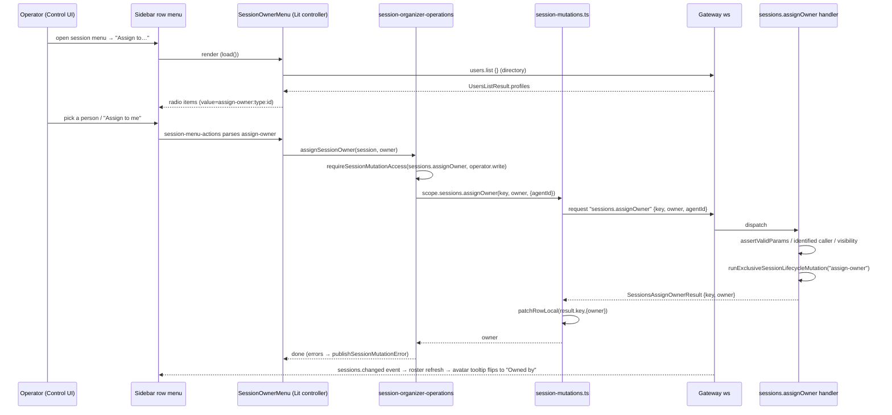

# Multi-user UI surfaces (OpenClaw → ROX)

## What it is / user-visible behavior

When a Gateway serves more than one human, the Control UI grows a set of
ownership/presence surfaces. With **fewer than two distinct owner identities and no session
having recorded outside participants** they stay hidden, so a single-user Gateway looks unchanged
(`docs/concepts/multi-user.md:152`). The visible pieces are:

- **Sidebar filter/sort popover** — one `Filter & sort` panel with a **Filters**
  section (Owners, Status, Show cron sessions, Show system sessions) and a
  **Display** section (Group by, Sort by, Hide empty groups, message previews)
  (`ui/src/components/app-sidebar-session-menu-renderers.ts:423`, `:499`, `:515`).
- **Owner avatars** on sidebars rows, chat headers, and the sharing menu, plus a
  pair-stack when participants exist (`ui/src/components/session-owner-chip.ts:31`).
- **Assign owner** submenu ("Assign to me" + directory people/agents)
  (`ui/src/components/session-owner-menu.ts:104`).
- **Sharing menu** in the chat header: visibility, public link, owner, members
  (`ui/src/pages/chat/components/chat-session-sharing.ts:149`).
- **Live presence** avatars (facepiles, Online sidebar section, people cards) and a
  **typing indicator** above the composer
  (`ui/src/components/viewer-facepile.ts:131`,
  `ui/src/pages/chat/components/chat-typing-indicator.ts:45`).
- **Settings → Profile → Connected accounts** for per-person model accounts
  (`ui/src/pages/profile/model-accounts.ts:41`).

Ownership and presence are **usability features, not security boundaries**
(`docs/concepts/multi-user.md:15`).

## End-to-end flow

## Mechanisms

### 1. Sidebar filter/sort semantics (mine / unassigned / drafts / organization)

OpenClaw's "filter" is **Owners + Status**; nothing called "unassigned" exists as a
filter (the word only appears in cloud-worker pool copy, e.g.
`ui/src/i18n/locales/en-settings.ts:425`). What the brief calls *mine/unassigned/
drafts/organization* maps onto:

- **mine** → the `Involving me` owner option and `sessionInvolvingMeFilterActive`.
  Set via `SessionOwnerFilterController.set(ownerId, involvingMe)`
  (`ui/src/components/session-owner-filter-controller.ts:57`), which stores the
  choice per gateway+user (`:64`) and refreshes the roster (`:71`). Semantics:
  sessions you own, prompted, or were explicitly mentioned in — evaluated by the
  Gateway against full participant history, matching only your authenticated
  profile identity (`docs/concepts/multi-user.md:135`). A per-session
  **Hide from Involving me** moves it only out of your own filtered list.
- **organization** → the **Group by** display choice. `SidebarSessionsGrouping =
  "category" | "person" | "project" | "none"` (`ui/src/lib/sessions/grouping.ts:197`),
  applied by `groupSidebarSessionRows` which emits `pinned`, named
  `category:*` zones, `ungrouped`, `groups`, `work`, and `catalog:*` sections
  (`ui/src/lib/sessions/grouping.ts:244`). **Sort by** is
  `created | updated | people` (`ui/src/components/app-sidebar-session-types.ts:537`);
  **Status** is a segmented `active | snoozed | archived | all`
  (`ui/src/components/app-sidebar-session-types.ts:543`).
- **drafts** → not a sidebar filter but the session-visibility `draft` state. A
  draft row renders a pencil indicator and `session-row-host--draft-owner` /
  `--draft-other` depending on `draftOwnedBySelf`
  (`ui/src/components/app-sidebar-session-row-render.ts:417`), and the sharing menu
  offers **Publish draft** (`ui/src/pages/chat/components/chat-session-sharing.ts:191`).
- **unassigned** as a concept is the *ungrouped* zone (`UNGROUPED_ID = ""`,
  `ui/src/lib/sessions/grouping.ts:24`) plus the always-present trailing
  `ungrouped` section; there is no owner-less "unassigned" filter.

The owner-filter projection itself is `applySidebarSessionOwnerFilter`
(`ui/src/components/app-sidebar-session-ownership.ts:48`). It supplies
`ownershipVisibility.{filters,avatars}` by scanning owners + participants for ≥2
distinct identities (`:68`); filters appear when *any* two identities exist
(agents included) while avatars require two **humans** (`:69-70`). Only an explicit
owner selection narrows the tree (`filterTree`, `:80`); "Involving me" membership is
Gateway-owned. The active-filter summary chip and Reset behaviour
(`ui/src/components/app-sidebar-session-filter-summary.ts:15`, `:78`) and the popover
renderer show the confirmed row structure
(`ui/src/components/app-sidebar-session-menu-renderers.ts:354`, `:370`, `:474`,
`:499`, `:515`, `:535`).

### 2. Owner avatar + "Assign to me / …" control flow and the gateway method

- The chip is `openclaw-session-owner-chip`, attribution label chosen from
  `sessionsView.createdBy | ownedBy | archivedBy`
  (`ui/src/components/session-owner-chip.ts:131`); participant stacking adds
  `withParticipant` / `withMoreParticipants` (`:167`). Self is built by
  `sessionSelfOwner` (`:17`).
- Row attribution picks `archived` when the status filter is archived, else
  `owned` when `owner.assignedAt !== undefined`, else `created`
  (`ui/src/components/app-sidebar-session-row-render.ts:187`).
- The submenu is `SessionOwnerMenu` (`ui/src/components/session-owner-menu.ts:30`).
  On open it loads the Gateway directory with `users.list`
  (`ui/src/components/session-owner-menu.ts:46`, `:49`), merges `selfUser` + configured
  agents, and emits radio items whose value is
  `assign-owner:${type}:${encodeURIComponent(id)}` (`:117`), label
  `sessionsView.assignToMe` for self (`:110`).
- `session-menu-actions.ts` decodes that value and emits
  `{ kind: "assign-owner", owner }` (`ui/src/components/session-menu-actions.ts:259`).
- Access is probed with `sessions.assignOwner` requiring `operator.write`
  (`ui/src/components/sidebar-menus-render.ts:265`); the action dispatches
  `host.sessionOrganizer.assignSessionOwner(session, action.owner)`
  (`ui/src/components/sidebar-menus-render.ts:396`).
- `SessionOrganizerController.assignSessionOwner`
  (`ui/src/components/session-organizer-controller.ts:143`) lazily loads
  `session-organizer-operations.runtime.ts`, which re-checks access then calls
  `scope.sessions.assignOwner(...)`
  (`ui/src/components/session-organizer-operations.runtime.ts:531`).
- `session-mutations.ts::assignOwner` sends the wire request
  `client.request("sessions.assignOwner", { key, owner, agentId })` and applies
  `patchRowLocal(result.key, { owner: result.owner })`
  (`ui/src/lib/sessions/session-mutations.ts:521`, `:543`).
- Gateway method `sessions.assignOwner` handler validates params, requires an
  **identified caller** (profile or trusted agent; `:380`), checks session
  visibility, and runs `assignSessionOwnerInWorker` under
  `runExclusiveSessionLifecycleMutation("assign-owner")`, retrying if the session
  changed (`src/gateway/server-methods/sessions-mutations.ts:344`, `:459`).
  Advertised at `operator.write` since `2026.8`
  (`src/gateway/methods/core-descriptors.ts:556`). Doc contract:
  `docs/concepts/multi-user.md:60`.

### 3. Participant history rendering (creator vs owner vs participants)

Three layers: immutable **creator** (`createdActor`), assignable **owner**
(defaults to creator, records who reassigned and when), and **participants**
(`docs/concepts/multi-user.md:43`). The transcript resolves sender identity from
`__openclaw.senderIdentity` and retained `participants`/`expandedParticipants`
(`ui/src/pages/chat/components/chat-transcript-identity.ts:31`). The chat header
shows an owner chip plus a facepile when there are ≥2 owners or any
`participantCount > 0` (`ui/src/pages/chat/chat-pane-header.ts:461`), excluding the
owner from live viewers (`:466`), rendered via
`openclaw-viewer-facepile` (`ui/src/pages/chat/components/chat-pane-header.ts:385`).
Person-renames update owner UI without rewriting participant history
(`docs/concepts/multi-user.md:47`).

### 4. Presence and typing indicators (transport + event names)

Transport is the Gateway WebSocket.

- **Presence event**: gateway snapshot applies `event.event === "presence"`
  (`ui/src/app/gateway-store.ts:271`); `presence.query` / `system-presence` are the
  read RPCs (`src/gateway/methods/core-descriptors.ts:691`, `:355`). UI projection is
  `projectPresencePayload` → `groupPresenceUsers`
  (`ui/src/lib/presence-users.ts:20`) with a 120 s active window (`:52`).
  Mutations flow through `presence.activity`
  (`ui/src/app/gateway-presence-activity.ts:38`).
- **Watched-session presence**: `sessions.viewers.set`
  (`ui/src/lib/session-viewer-presence.ts:11`, `:13`;
  descriptor `operator.read` at `src/gateway/methods/core-descriptors.ts:237`), bounded
  by `SESSION_VIEWER_PRESENCE_MAX_KEYS`.
- **Typing**: `handleSessionTypingEvent`
  (`ui/src/pages/chat/chat-pane-sharing.ts:424`) increments/decrements local actors;
  the event name is `session.typing`
  (`ui/src/pages/chat/chat-pane-lifecycle.ts:479`), validated by
  `SessionTypingEventSchema` (`packages/gateway-protocol/src/schema/sessions-suggestions.ts:83`).
  Outbound `sendTypingState` posts `client.request("session.typing", {...preview})`
  (`ui/src/pages/chat/chat-pane-sharing.ts:601`, `:626`); direct request needs
  `operator.write` (`src/gateway/methods/core-descriptors.ts:508`). Rendering:
  `ui/src/pages/chat/components/chat-typing-indicator.ts:45`. Draft previews are
  ephemeral and never persisted (`docs/concepts/multi-user.md:155`).

### 5. Public-link sharing UI flow + permission gating

Chat-header sharing menu (`renderChatSessionSharing`) supports visibility
(`shared | read-only | suggest | draft`,
`ui/src/pages/chat/components/chat-session-sharing.ts:50`), a public-access
enable/disable + copy-link pair (`:249`, `:257`), the owner row (`:273`), and a
searchable members list (`:298`). It only renders for
`sharingRole === "admin" | "owner"`
(`ui/src/pages/chat/components/chat-session-sharing.ts:127`).

Flow in `ChatPaneSharingActions`:
- Load evidence with `session.members.listEvidence` (read gate, `operator.read`)
  (`ui/src/pages/chat/chat-pane-sharing-actions.ts:27`, `:95`).
- Toggle public access with a danger confirm first, then
  `session.publicShare.set { sessionKey, expectedSessionId, enabled }` guarded by
  `operator.write` and exact-session revalidation
  (`ui/src/pages/chat/chat-pane-sharing-actions.ts:171`, `:199`, `:214`).
- Copy the public link by rebuilding a Control UI session path and
  `copyToClipboard` (`:250`).
- Visibility/member edits dispatch `session.visibility.set` /
  `session.members.add` / `session.members.remove` (`:293`, `:308`, `:323`).
Public access is unavailable for incognito/identity-less sessions
(`ui/src/pages/chat/chat-pane-header.ts:526`). Descriptors: `session.publicShare.set`
(`operator.write`, 2026.9), `session.members.listEvidence` (`operator.read`),
`session.visibility.set` (`operator.write`) — `src/gateway/methods/core-descriptors.ts:630`,
`:580`, `:499`.

### 6. Per-person model accounts (Settings → Profile → Connected accounts)

`ModelAccounts` Lit element (`ui/src/pages/profile/model-accounts.ts:41`) lists
accounts with `users.listModelAccounts { profileId, cursor }` (`:160`) and links
them via `users.linkAuthProfile` / `users.unlinkAuthProfile` /
`users.selectModelAccount` (`:220`). The sign-in wizard uses
`users.authConnect.catalog|start|status|answer|cancel` with serial polling
(`:248`, `:283`, `:333`, `:354`), gated by `operator.write` (and `operator.admin`
for manual linking, `:217`). Descriptor scopes:
`users.listModelAccounts` (`operator.read`), `users.linkAuthProfile`
(`operator.admin`), `users.unlinkAuthProfile` (`operator.write`)
(`src/gateway/methods/core-descriptors.ts:141-144`). Storage is identity-scoped
records in the Gateway state database (`state/openclaw.sqlite`) with credentials in
the secret store (`src/state/user-model-accounts.ts:1`,
`src/gateway/model-account-connect.ts:36`); `docs/concepts/multi-user.md:115`. The
profile page hosts the section (`ui/src/pages/profile/profile-page.ts:455`).

### 7. macOS WebChat

The native macOS chat window (`WebChatSwiftUI`) hosts either the native SwiftUI
surface or, when `NativeConversationView` runs in `.web` mode, the **Control UI**
document — `ControlUIDocumentHost.scopedDashboardScript`
(`apps/macos/Sources/OpenClaw/NativeConversationView.swift:100`) and
`ControlUIDocumentHost.appPath` (`:397`). The web document therefore carries the
*same* sidebar filter, owner-chip, sharing, presence and typing UI described above;
there is no separate native owner menu or share dialog.

macOS-native multi-user touchpoints:
- Sidebar people/presence comes from `MacGatewaySidebarPresence`, which consumes the
  `presence` WS event (`apps/macos/Sources/OpenClaw/MacGatewaySidebarPresence.swift:66`)
  and recovers via `request(method: "system-presence")` (`:101`), exposing
  `people`/`actions` through SwiftUI environment keys in `MacChatSurface`
  (`apps/macos/Sources/OpenClaw/WebChatSwiftUI.swift:781`).
- Self profile resolution uses `hello.snapshot.presence.first`
  (`apps/macos/Sources/OpenClaw/WebChatSwiftUI.swift:1142`).
- The Mac sends periodic `system-event` presence beacons tagged
  `system-presence-clear-last-input`
  (`apps/macos/Sources/OpenClaw/PresenceReporter.swift:14`, `:59`);
  `docs/concepts/presence.md:163`.

## Key contracts & data shapes

- Gateway methods: `sessions.assignOwner` (`operator.write`, 2026.8),
  `users.list` (`operator.read`), `session.members.listEvidence` (`operator.read`),
  `session.publicShare.set` / `session.visibility.set` / `session.typing`
  (`operator.write`), `sessions.viewers.set` (`operator.read`), `system-presence`
  / `presence.query` (`operator.read`), `users.listModelAccounts`
  (`operator.read`) / `users.linkAuthProfile` (`operator.admin`) /
  `users.unlinkAuthProfile` (`operator.write`) / `users.selectModelAccount` /
  `users.authConnect.{catalog,start,status,answer,cancel}`
  (`src/gateway/methods/core-descriptors.ts:134-144`, `:237`, `:355`, `:499`,
  `:508`, `:556`, `:580`, `:630`, `:691`).
- Request/response types (from `packages/gateway-protocol`):
  `SessionsAssignOwnerParams` / `SessionsAssignOwnerResult`, `SessionOwner`,
  `SessionCreatedActor`, `SessionParticipant`, `SessionParticipantIdentity`,
  `SessionVisibility` (`"shared" | "read-only" | "suggest" | "draft"`),
  `SessionPublicShareSetResult`, `SessionMembersListEvidenceResult`,
  `UsersListResult`, `UserProfileAuthLink`, `UserModelAccount`,
  `UsersAuthConnectCatalogResult` / `StartResult` / `StatusResult`.
  (`ui/src/components/session-owner-chip.ts:3-4`,
  `ui/src/pages/chat/components/chat-session-sharing.ts:50`,
  `ui/src/pages/profile/model-accounts.ts:3-12`.)
- Events: `presence`, `sessions.changed`, `session.typing`, `session.message`,
  `session.reaction`, `session.suggestion`, `chat.metadata.changed`,
  `gateway.suspension`, `shutdown` (`ui/src/app/gateway-store.ts:271`,
  `ui/src/pages/chat/chat-pane-lifecycle.ts:437`, `:473`, `:476`, `:479`).
- Sidebar state: `SidebarSessionStatusFilter = "active"|"snoozed"|"archived"|"all"`;
  `SidebarSessionSortMode`; `SidebarSessionsGrouping`; row field
  `draftOwnedBySelf?: boolean` (`ui/src/components/app-sidebar-session-types.ts:128`,
  `:260`, `:537`, `:543`).
- Presence fields: `instanceId`, `mode` (`ui|webchat|cli|backend|node|probe|test`),
  `watchedSessions`, `onlineSince`, `lastActivityAt` (`docs/concepts/presence.md:94`,
  `:107`). TTL 5 min, max 200 entries (`docs/concepts/presence.md:243`).

## Tests & QA

Vitest/browser tests exist for nearly every surface (not run here):
`ui/src/components/session-owner-chip.test.ts`,
`session-owner-chip.browser.test.ts`, `session-owner-menu`-driven
`session-menu.test.ts` / `session-people-search.browser.test.ts`,
`session-organizer-owner-assignment.test.ts`,
`session-menu-actions` coverage in `session-menu.test.ts:177`,
`app-sidebar-session-filter.browser.test.ts` (owner options `All owners |
Involving me | Ada (You) | Bob`, `:135`), `app-sidebar.people.test.ts`,
`presence-users.test.ts`, `session-viewer-presence.test.ts`,
`chat-pane-typing.test.ts`, `chat-pane-sharing` tests,
`ui/src/pages/profile/model-accounts.test.ts`,
`ui/src/e2e/profile-page.e2e.test.ts`, and e2e
`ui/src/e2e/chat-collaborator-scroll.real-gateway.e2e.test.ts`. Gateway-side:
`src/gateway/server-methods/sessions-mutations.owner.test.ts`,
`session-metadata.admission.test.ts`,
`src/gateway/server-methods/sessions-public-share.test.ts`.

## Port notes to ROX

ROX already has meetings + identity fabric + 330-skill catalog + Bun/Electron/React
stack; the port maps cleanly as follows.

1. **State + RPC layer (packages/server-core + packages/shared).** Add the five
   method families as server-core handlers with the same scope mapping:
   `sessions.assignOwner` (operator.write), `session.{visibility,publicShare}.set`,
   `session.members.{listEvidence,add,remove}`, `session.typing`,
   `sessions.viewers.set`, `presence.query`. Reuse ROX's existing OMP RPC transport
   in `packages/server` (WS) rather than inventing a new channel. Storage:
   owner/creator/participants already exist in ROX sessions; store `assignedAt` /
   `assignedBy` on the session record, mirroring `docs/concepts/multi-user.md:43`.
2. **Renderer (apps/electron/src/renderer, React 18).** Re-create the
   sidebar filter/sort popover as a React component tree mirroring
   `app-sidebar-session-menu-renderers.ts` (Owners, Status segmented, cron/system
   toggles; Group by / Sort by / Hide empty). Reuse ROX's existing sidebar session
   store; the projection rule (`applySidebarSessionOwnerFilter`) ports verbatim as a
   selector. Owner chip + pair-stack → a React `SessionOwnerChip`; the assign submenu
   → a `PeopleSearchMenu` fed by a `users.list`-equivalent directory call.
3. **Presence/typing.** Pipe the Gateway `presence` + `session.typing` events over
   the ROX WS bridge; render a typing indicator above the composer and facepile
   avatars in the header. Keep the 120 s active window constant and the 5-min/200-entry
   TTL semantics.
4. **Connected accounts.** Add a Profile page section calling ROX's identity/credential
   fabric (`packages/core/src/platform/identity`) for per-person model accounts;
   reuse the ROX secret store instead of `state/openclaw.sqlite`; keep the wizard states
   (`pending` / `failed` / `connected`) and serial polling.
5. **Electron main / IPC.** `apps/electron/src/main` only needs to forward the new
   events to the renderer over the existing preload IPC surface; no native
   involvement for owner/share/presence. Russian-first i18n replaces every
   `sessionsView.*`, `chat.sessionSharing.*`, `presence.*`, `profilePage.modelAccounts.*`
   key (`ui/src/i18n/locales/en.ts:807`).

## Risks & unknowns

- **Creator authority vs owner** — sharing authority stays with the immutable
  creator (`docs/concepts/multi-user.md:43`). ROX sessions must persist a write-once
  creator or the port silently changes who can share.
- **Involving me is Gateway-evaluated** across full participant history and only
  matches an authenticated profile id (`docs/concepts/multi-user.md:135`); a
  client-side port would diverge and cannot match channel-native sender ids.
- **Visibility semantics** (`read-only`/`suggest`/`draft`) are enforced server-side;
  porting only the menu without the enforcement would be a security regression.
- **Presence is best-effort/ephemeral** and explicitly not a security boundary
  (`docs/concepts/multi-user.md:15`); do not surface it as authorization.
- `UNVERIFIED:` the exact human-facing labels "mine/unassigned/drafts/organization"
  from the brief do not appear as a single OpenClaw filter set; they were mapped
  onto Involving me / ungrouped+draft visibility / Group by as documented above.
- `UNVERIFIED:` ROX's current owner/participant schema was not inspected here;
  whether `assignedAt`/`assignedBy` fields exist must be verified in
  `rox-one/rox-one` before implementation.