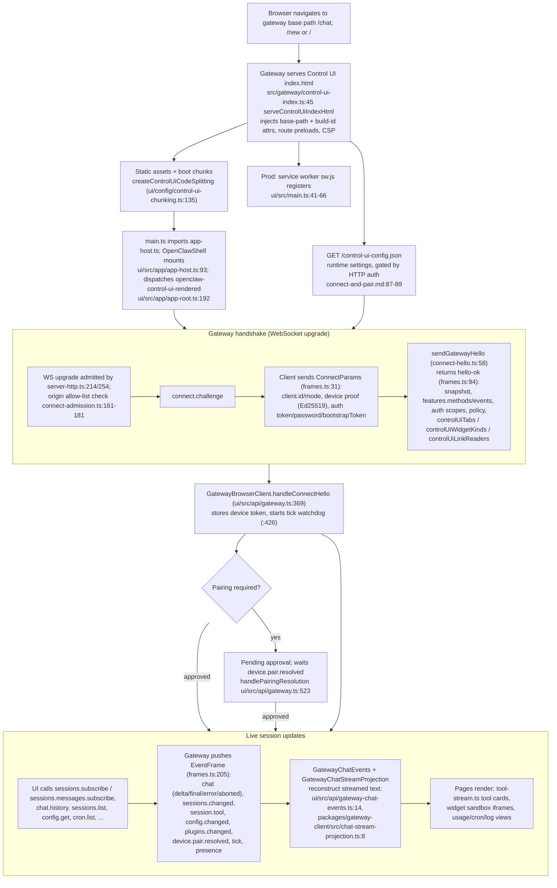

# Control UI (interactive web dashboard)

## What it is / user-visible behavior

The Control UI is OpenClaw's **Gateway-hosted web dashboard**: a Lit/TypeScript SPA
(`<openclaw-app>`, `ui/index.html:394`) served as static assets by the same HTTP server
that exposes the Gateway WebSocket. It ships an operator console with a sidebar of panels
(chat, sessions, agents, cron/automations, logs, usage, config/settings, devices, skills,
plugins, terminal, dashboards, systems, debug, …) enumerated by the route tree at
`ui/src/app-routes.ts:86` and the settings groups at `ui/src/app-navigation.ts:139`.

Behavior highlights (from `docs/web/control-ui/feature-reference.md:15`):
- Chat over the Gateway WS (`chat.history`, `chat.send`, `chat.abort`, `chat.inject`),
  streaming replies, tool-call cards, thinking/model controls (`feature-reference.md:20`).
- Operator console: health/status, live log tail (`logs.tail`), update run/status
  (`update.run`/`update.status`), cron (`cron.*`), devices, skills, plugins, exec approvals
  (`feature-reference.md:53`, `:118-128`).
- Config view/edit of `~/.openclaw/openclaw.json` with a schema-driven form and raw JSON5
  editor, base-hash guarded writes, and apply-and-restart (`feature-reference.md:63-92`).
- Browser-embedded dockable **panels** (Ask OpenClaw, Home, Terminal, Browser, GitHub reader)
  via `docs/web/control-ui/panels.md:16`, `:53-76`, `:147`, `:191`.
- Installable PWA plus Web Push (`manifest.webmanifest`, `ui/public/sw.js`), see
  `docs/web/control-ui/connect-and-pair.md:93-133`.

## End-to-end flow

## Mechanisms (mechanism → evidence)

### Build: bundling, chunking, boot manifest, preloads, locales

- The UI is a Vite/Rolldown build configured by `ui/vite.config.ts:666`
  (`controlUiViteConfig`); output goes to `dist/control-ui` and is served by the Gateway.
- **Stable code splitting** is a custom Rolldown `codeSplitting` graph:
  `controlUiStableChunkName` (`ui/config/control-ui-chunking.ts:55`) names vendor/runtime
  chunks (`lit-runtime`, `markdown-runtime`, `config-runtime`, `gateway-runtime`,
  `plugin-contracts-runtime`, `login-runtime`, …); `createControlUiCodeSplitting`
  (`:135`) adds `control-ui-core`/`control-ui-foundation` and the measured boot groups
  `control-ui-boot-{shared,new,chat}` (+ `-styles`). Exported as `controlUiCodeSplitting`
  (`:188`) and wired at `ui/vite.config.ts:740`.
- The **boot manifest** `ui/config/control-ui-boot-modules.json` lists the modules each
  boot route requests. It is *generated* by `ui/scripts/control-ui-boot-manifest.mts:213`
  (`main`), which builds without boot groups, drives real Chromium against a fixture server
  for cold and warm `/new` and `/chat` launches, and records reachable modules
  (`collectBootChunkPaths` `:89`, `routeModuleKeys` `:174`). Manifest keys are canonicalised
  by `controlUiBootManifestKey` (`ui/config/control-ui-chunking.ts:32`).
- **Preloads / boot assets**: `collectControlUiBootAssets`
  (`ui/config/control-ui-boot-preloads.ts:6`) walks the bundle graph for the initial shell,
  `chat`, `new`, and the login gate; `controlUiBootPreloadsPlugin` (`:78`) emits per-route
  `<template data-openclaw-route-preloads="chat|new">`. The Gateway activates only the
  requested route via `selectControlUiRoutePreloads`
  (`src/gateway/control-ui-route-preloads.ts:9`, attribute at `:1`).
- **Locales**: translation catalogs are exposed as Vite **virtual modules**
  `virtual:openclaw-control-ui-locale/<locale>` and `…-locale-config-hints/<locale>`
  (`ui/config/control-ui-locales.ts:13-14`); `controlUiLocaleModulesPlugin` (`:84`)
  materialises them from the source catalog + translation memory, and config-hint chunks get
  their own prefix (`controlUiLocaleConfigHintsChunkPrefix`, `control-ui-chunking.ts:53`,
  `:77`). Locale entry list: `scripts/lib/control-ui-i18n-config.ts:4`
  (`CONTROL_UI_LOCALE_ENTRIES`, incl. `ru`).
- **Precompression + offline shell + asset manifest**: `control-ui-build-output` in
  `ui/vite.config.ts:500-629` writes `.br`/`.gz` sidecars, injects a strict-CSP offline shell
  and build id into `sw.js`, and emits `CONTROL_UI_ASSET_MANIFEST_FILENAME`.
- **Boot attributes**: `main.ts` rewrites favicon/manifest hrefs via
  `inferControlUiPublicAssetPath` (`ui/src/main.ts:27-37`), registers the service worker
  (`:41-66`), and installs stale-chunk/missing-stylesheet recovery (`:38-39`).

### Serving: HTTP + static assets + index rewriting

- `serveControlUiIndexHtml` (`src/gateway/control-ui-index.ts:45`) selects route preloads,
  rewrites `./assets/` to the mount path (`:20`), stamps
  `data-openclaw-control-ui-base-path` / `…-build-id` / terminal + environment attributes
  (`:71-88`), sets the document CSP and `Cache-Control` (`:97-109`).
- CSP is computed per document: `buildControlUiCspHeader` (`src/gateway/control-ui-csp.ts:34`)
  hashes inline `<script>` via `computeInlineScriptHashes` (`:10`); `applyControlUiSecurityHeaders`
  (`:95`) sets `X-Frame-Options: DENY`, `nosniff`, `Referrer-Policy: no-referrer`,
  `Permissions-Policy` (camera=self, microphone=*).
- Static byte serving: `serveControlUiAsset` (`src/gateway/control-ui-static.ts:189`),
  precompressed representation negotiation (`:78`) with immutable cache
  (`:16`), and gzip/br HTML compression `sendControlUiHtmlBody` (`:233`).
- Route wiring lives in `src/gateway/server-http.ts`: base path `:176`, lazy loader
  `:354`, `handleControlUiHttpRequest` dispatch `:370`, plugin assets `:527`, media/outgoing
  `:680`, image routes `:689`, assistant media `:709`, avatar `:717`, final fallback `:720`.
  The HTTP handler itself is `handleControlUiHttpRequest` (`src/gateway/control-ui.ts:671`),
  with avatar `:529` and assistant media `:295`.
- Resource route shapes: assistant media `/__openclaw__/assistant-media`,
  agent avatar `/avatar`, user avatar `/api/users/<id>/avatar`
  (`src/gateway/control-ui-resource-routes.ts:7`, `:16`, `:24-25`;
  `src/gateway/control-ui-user-avatar-route.ts:3-4`).
- Exact asset bytes are resolved by `readControlUiFile` (`src/gateway/control-ui-file.ts:30`).
- The **runtime config endpoint** `/control-ui-config.json`
  (`src/gateway/control-ui-bootstrap-contract.ts:2`) is gated by gateway HTTP auth
  (`docs/web/control-ui/connect-and-pair.md:87-89`).

### Transport: WebSocket protocol used by the UI

- Frames are defined once in `packages/gateway-protocol/src/schema/frames.ts`:
  `ConnectParams` (`:31`), `HelloOk` (`:94`), `RequestFrame` (`:187`), `ResponseFrame`
  (`:196`), `EventFrame` (`:205`). `HelloOk.features.methods/events` are the advertised
  catalogs; the event catalog is `GATEWAY_EVENTS` (`src/gateway/server-methods-list.ts:33`).
- Handshake completion: `sendGatewayHello` (`src/gateway/server/ws-connection/connect-hello.ts:58`)
  builds the hello payload (`:160`), attaches `controlUiTabs`/`controlUiWidgetKinds`/
  `controlUiLinkReaders` (`:141-148`), and sends it as a `res` frame (`:315`).
- Client side: `GatewayBrowserClient` (`ui/src/api/gateway.ts:136`) wraps
  `GatewayProtocolClient`; connect plan built in `buildConnectPlan` (`:344`); requests go
  through `request` (`:588`) which routes via `GatewayChatEvents`
  (`ui/src/api/gateway-chat-events.ts:14`).
- The browser socket is created by `createBrowserGatewaySocket`
  (`ui/src/api/gateway-browser-socket.ts:83`) with a preauth opening timeout; dev transport
  rewrites the URL through `gatewayWebSocketTransportUrl` (`ui/src/dev-gateway.ts:30`).
- Method calls actually issued by the UI (grep over `ui/src`): `sessions.list` (401),
  `chat.send` (353), `chat.history` (311), `sessions.patch` (239), `config.get`/`config.set`
  (230/202), `models.list` (172), `sessions.describe`/`subscribe`/`usage`/`dispatch`/`create`,
  `plugins.*`, `cron.*`, `skills.*`, `push.web.*`, `browser.request`, `terminal.*`.
- Events consumed: the `chat` stream (`delta`/`final`/`error`/`aborted`), `sessions.changed`,
  `session.tool`/`session.message`/`session.typing`, `chat.metadata.changed`,
  `config.changed`, `plugins.changed`, `device.pair.resolved`, `node.pair.resolved`, `tick`,
  `presence`, `update.run.changed` (`server-methods-list.ts:33-98`).
- **Chat streaming reconstruction**: `GatewayChatStreamProjection.project`
  (`packages/gateway-client/src/chat-stream-projection.ts:11`) merges per-`runId` deltas with
  `mergeChatStreamMessage` (`packages/gateway-client/src/chat-stream-message.ts:4`); a missing
  baseline forces a reconnect (`gateway-chat-events.ts:66-70`).
- **Tool-call rendering**: `ui/src/pages/chat/tool-stream.ts` (`formatToolOutput` `:64`,
  throttled at `TOOL_STREAM_THROTTLE_MS` `:40`, limit `:38`) turns agent tool events into
  kind-aware rows (shell/edit/write diffs, operation counts) with approval reviews.

### Auth / pairing flow

- `openclaw dashboard` (`src/cli/program/register.maintenance.ts:321-333`; `--no-open`,
  `--json`, `--yes`) calls `dashboardCommand` (`src/commands/dashboard.ts:115`).
- Target resolution: `resolveControlUiHandoffTarget` (`src/commands/control-ui-handoff.ts:29`)
  picks port/bind/basePath/TLS, verifies a loopback alias, and computes a legacy JSON
  `dashboardUrl` with `#token=`.
- Browser delivery uses a **one-time pairing link**: `issueControlUiBrowserHandoff` (`:141`)
  mints a single-use device bootstrap token and returns
  `#bootstrapToken=…&…bootstrapProfile…&gatewayUrl=…` (`:148`), logged `expiresAtMs`.
- Readiness gating: `waitForControlUiDocument` (`:164`) HEAD-polls the served document
  (200 text/html ⇒ ready; 503+Retry-After ⇒ still preparing).
- Server admission checks origin (`checkGatewayWsBrowserOrigin`) and rejects with
  `CONTROL_UI_ORIGIN_NOT_ALLOWED` (`src/gateway/server/ws-connection/connect-admission.ts:161-181`).
- First connection then requires device pairing approval; the UI waits for
  `device.pair.resolved` (`handlePairingResolution`, `ui/src/api/gateway.ts:523`), with
  loopback auto-approval and Tailscale Serve exceptions
  (`docs/web/control-ui/connect-and-pair.md:60-62`, `:124-127`).
- Scope upgrade (read → admin) is a separate approval:
  `requestScopeUpgrade` (`ui/src/api/gateway.ts:596`), doc `connect-and-pair.md:49`.

### Offline / reconnect

- Backoff config lives in `GatewayBrowserClient` (`reconnect: initialMs 800, multiplier 1.7,
  maxMs 15000`, `ui/src/api/gateway.ts:262`), described in
  `docs/web/control-ui/offline-and-reconnect.md:154-171`.
- Tick watchdog: `startTickWatch` (`:426`) uses `policy.tickIntervalMs` ×2 as the silence
  budget and forces reconnect.
- Warm reload keeps a cached shell/transcript per Gateway+account
  (`offline-and-reconnect.md:36-69`); offline shell prep is bounded to verified build assets
  (`:92-105`); queued messages use a browser outbox with IndexedDB blobs (`:298-316`).

### Security model

- Browser CSP is always on and non-configurable (`docs/web/control-ui/security-model.md:41`,
  header built at `control-ui-csp.ts:34`).
- Avatar route requires gateway auth when configured
  (`security-model.md:83-93`); assistant media uses a two-step route with short-lived
  `mediaTicket` (`:142-152`); generated images go through `artifacts.download` (`:158-163`).
- Approval links are stable, non-authorizing documents with credentials never in the URL
  (`security-model.md:165-172`).

## Key contracts & data shapes

- `ConnectParams` (frames.ts:31): `client{id,version,platform,mode,instanceId,…}`,
  `role`, `scopes`, `device{id,publicKey,signature,signedAt,nonce}`,
  `auth{token?,bootstrapToken?,deviceToken?,password?,…}`, `locale`, `userAgent`.
- `HelloOk` (frames.ts:94): `type:"hello-ok"`, `protocol`, `server{version,buildId,bootId,
  controlUiBuildSource,connId}`, `features{methods[],events[],capabilities[]}`, `snapshot`,
  `controlUiUrl?`, `controlUiTabs?`, `controlUiWidgetKinds?`, `controlUiLinkReaders?`,
  `pluginSurfaceUrls?`, `auth{method,role,scopes,deviceToken?,recoveryScope?,…}`,
  `policy{maxPayload,maxBufferedBytes,tickIntervalMs,attachments?,…}`.
- `EventFrame` (frames.ts:205): `{type:"event",event,payload?,seq?,stateVersion?,
  recipientProfileId?}`.
- Plugin Control UI contributions: `ControlUiPluginTabSchema` (`plugins.ts:92`),
  `ControlUiPluginWidgetKindSchema` (`plugins.ts:106`),
  `ControlUiLinkReaderDescriptorSchema` / `…MetadataSchema`
  (`packages/gateway-protocol/src/schema/control-ui-link-reader.ts:17`, `:5`).
- Gate helpers: `isGatewayMethodAdvertised` (`ui/src/lib/gateway-methods.ts:11`) and
  `canCallGatewayMethod` (`:42`) combine connection phase + advertised method + operator scope.
- Gateway events catalog: `GATEWAY_EVENTS` (`src/gateway/server-methods-list.ts:33`).

## Tests & QA

- Build/unit tests: `ui/src/app/vite-config.node.test.ts`, `vite-build.node.test.ts`,
  `ui/config` chunking tests (`ui/src/app/control-ui-chunking.test.ts`), and
  `ui/src/app-route-paths.test.ts` / `app-routes.test.ts`.
- HTTP serving tests: `src/gateway/control-ui.http.test.ts`,
  `server-http.control-ui.test.ts`, `control-ui-csp.test.ts`,
  `control-ui-asset-manifest.test.ts`, `control-ui-link-readers.test.ts`.
- Browser/e2e suites: `ui/src/e2e/*.e2e.test.ts` (e.g. `warm-boot.e2e.test.ts`,
  `about.e2e.test.ts`) plus per-page `*.browser.test.ts`.
- Handshake/client tests: `ui/src/api/gateway.node.test.ts`,
  `gateway-chat-events.node.test.ts`, `gateway-browser-socket.test.ts`.
- CLI: `src/cli/attach-cli.action.test.ts`, `session-ref.test.ts`,
  `program.smoke.test.ts` (`dashboard` URL forms).
- Completeness rubric: `.agents/skills/claw-score/references/completeness/browser-control-ui-and-webchat.md`
  (Browser Realtime Talk, Access/Trust, Configuration, Browser UI, WebChat, Remote WebChat,
  Operator Console). NOTE: the rubric's “Browser Realtime Talk” (`talk.client.create` /
  `talk.session.create` / `talk.session.appendAudio`) is a broader surface than the panel
  inventory exercised by this slice — `UNVERIFIED:` the Talk realtime code paths were not read.

## Port notes to ROX

ROX (`rox-one/rox-one`) already has Electron main/preload/renderer, `packages/server` +
`packages/server-core`, `packages/shared`, Bun 1.3.14, React 18/Tailwind v4, and OMP RPC for
sessions. Map OpenClaw's split as follows:

1. **Serving / static host** — OpenClaw ships `ui/` inside the gateway dist and serves it from
   the HTTP server (`src/gateway/server-http.ts:720`). In ROX, `packages/server` (HTTP/WS)
   should serve the built renderer assets for the dashboard surface, and
   `apps/electron/src/main` should host it for the desktop app. Reuse the *file-based* ideas:
   base-path rewriting, build-id attribute, route-scoped modulepreload (`control-ui-index.ts:20`,
   `control-ui-route-preloads.ts:9`), precompressed `.br`/`.gz` sidecars, and an
   asset manifest with SHA-256 entries.

2. **Build pipeline** — Port the *concept*, not Vite specifics: measured boot manifest
   (`ui/scripts/control-ui-boot-manifest.mts`), stable vendor chunk naming
   (`control-ui-chunking.ts:55`), virtual locale modules (`control-ui-locales.ts:84`), and
   stale-chunk reload (`ui/src/main.ts:38`). ROX is Bun-based; if it keeps Vite this is a
   near-direct port, otherwise translate the chunk-group policy to Bun's bundler. Locales:
   ROX is Russian-first, so make `ru` the default catalog and keep the virtual-module split
   (base vs config-hints) to avoid bloating startup.

3. **Transport / protocol** — OpenClaw uses a bespoke WS frame protocol
   (`frames.ts:31/94/205`) with a method+event catalog. ROX runs sessions via OMP RPC
   (`apps/electron/src/main`, `packages/server-core`, `packages/pi-agent-server`). Port the
   *pattern*: a hello/snapshot frame advertising `methods[]`/`events[]`, per-session subscribe
   (`sessions.messages.subscribe`), streamed chat deltas reconstructed client-side
   (`chat-stream-projection.ts`), and capability gating via `canCallGatewayMethod`
   (`gateway-methods.ts:42`). Do **not** reimplement the WS protocol wholesale; map the
   Control-UI method inventory onto OMP RPC methods in `packages/server-core`.

4. **Panels** — The 40+ pages under `ui/src/pages/*` map cleanly onto React route components
   under `apps/electron/src/renderer` (and `apps/webui` for browser). Highest-value first:
   chat (streaming + tool cards), sessions/sidebar, settings/config schema form, cron,
   logs, usage, devices, terminal, dashboards. ROX already has a 330-skill catalog and
   identity fabric — the Skills/Devices panels should call into
   `packages/core/src/platform/identity` rather than mirror OpenClaw's device-pairing store.

5. **Auth/pairing** — OpenClaw's one-time bootstrap handoff
   (`control-ui-handoff.ts:141`), device Ed25519 identity, origin allow-list
   (`connect-admission.ts:161`), and scope upgrade (`gateway.ts:596`) should be expressed
   against ROX's existing identity/credential fabric (`packages/core/src/platform/identity`).
   Keep the *security properties*: single-use short-lived handoff, credential never in the URL,
   origin allow-listing, per-route auth on `/avatar` and media.

6. **CSP / security** — Port `buildControlUiCspHeader` verbatim in spirit
   (`control-ui-csp.ts:34`): nonce/hash for inline scripts, `frame-ancestors 'none'`,
   `object-src 'none'`, `connect-src` `'self' ws: wss: data: blob:` plus provider/portal hosts
   (`api.openai.com`, `tweakcn.com`, portal host — `:55-63`), `img-src` `'self' data: blob: https:`
   (`:87`).
   Add the media-ticket pattern (`security-model.md:142-152`) so media URLs never carry the
   reusable gateway credential.

7. **Offline/reconnect** — Port the reconnect backoff + tick watchdog
   (`ui/src/api/gateway.ts:262`, `:426`), warm-reload boot record, and browser outbox
   (`offline-and-reconnect.md:298`) onto ROX's IPC/session store. Electron has native
   navigation events (`app-host.ts` uses `native-web-chrome`), so the “back/forward/restore”
   hooks map to Electron's `will-navigate`/history APIs.

8. **Widgets** — OpenClaw renders plugin/agent HTML widgets in a sandboxed iframe
   (`ui/src/lib/widget-sandbox-host.ts:28`). In ROX/Electron, use an isolated
   `<webview>`/`BrowserView` or sandboxed iframe with a strict CSP proxy; keep the
   load-notice (10s) and hard-timeout (30s) budgets.

## Risks & unknowns

- **Scale of the surface.** >760 e2e files and 40+ pages under `ui/src`; this doc samples the
  architecture, not every panel. Porting panel-by-panel is a large multi-quarter effort.
- **Protocol coupling.** UI ships *inside* the gateway dist and shares
  `packages/gateway-protocol` schemas with no independent versioning
  (`control-ui-contract.ts:38-39`). ROX must decide its own versioning boundary between
  renderer and `server-core`.
- **Bespoke WS protocol vs OMP RPC.** Reusing OpenClaw's frames would duplicate ROX's OMP
  transport; mapping method names is likely cleaner but means re-deriving the event catalog.
- `UNVERIFIED:` Browser Realtime Talk (WebRTC/relay audio) code paths were not read.
- `UNVERIFIED:` exact `control-ui-startup-budget-baseline.json` enforcement logic.
- `UNVERIFIED:` the precise set of `controlUiTabs`/`controlUiWidgetKinds` produced by plugins
  at runtime (only the schemas and hello wiring were read).
- Tailwind v4 vs OpenClaw's Web Awesome/Lit components: ROX should keep React/Tailwind and
  re-express visual tokens, not port Web Awesome.