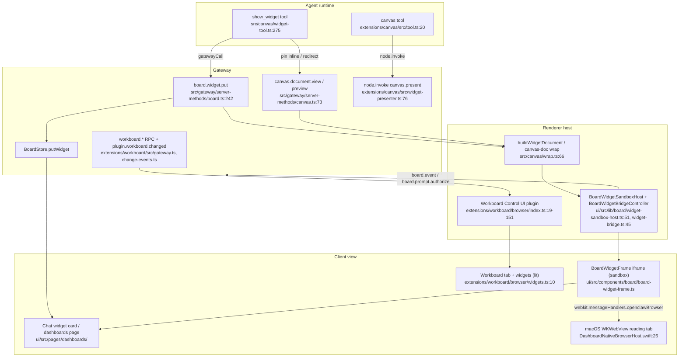

# b2 — Canvas, Workboard, embedded browser, WebChat

## What it is / user-visible behavior

Four distinct "dashboard" surfaces exist; they are *not* the same thing:

1. **Control UI** — the `ui/` Lit web app served by the Gateway; the host that everything else plugs into. Workboard is a Control UI plugin; dashboards/canvas widgets render here.
2. **Workboard** — an optional Kanban + Sessions board bundled but *disabled by default*. It adds a `/workboard` route/tab to the Control UI, agent-owned cards, a rule-based **Sessions board**, and three native session-dashboard widgets (`workboard:card|board|mini`). Cards link to Gateway sessions/runs/PRs; a headless Gateway-side plugin keeps state and lifecycle in sync so nothing depends on an open browser tab (`docs/plugins/workboard.md`).
3. **Canvas / A2UI widgets** — agent-authored visual content. Two flavors: (a) the classic **Canvas** plugin that presents hosted widget documents on paired macOS panels (`canvas.present|hide|navigate` node commands), and (b) the core `show_widget` tool that streams HTML/SVG/registered-source widgets inline into a chat message or pins them to a session **dashboard** as sandboxed iframe documents.
4. **macOS embedded browser** — reading tabs (WKWebView) hosted *inside* a Dashboard window for external sites. They deliberately do **not** share the dashboard's privileged webview: separate `WKWebsiteDataStore`, no injected auth/scripts/handlers (`apps/macos/Sources/OpenClaw/DashboardBrowserTab.swift:27-34`).
5. **WebChat** — the native SwiftUI chat that talks *directly* to the Gateway WebSocket; no embedded browser, no local static server (`docs/web/webchat.md:9`). In the macOS app it is one of two experiences ("Web" = Control UI embedded; "Native (Experimental)" = SwiftUI chat), chosen per-window (`docs/platforms/mac/webchat.md:10-16`).

The Workboard plugin id is `workboard` (`extensions/workboard/index.ts:24-27`); Canvas is `canvas` (`extensions/canvas/index.ts:22-26`). Both register Control UI descriptors/widgets through the plugin SDK.

## End-to-end flow

Plain text: **agent emits widget** (`show_widget` / `canvas`) → **Gateway materializes it** (wrap + store or host a canvas document) → **renderer host** builds a sandboxed iframe/document with the bridge bootstrap → **client view** (chat card / dashboards page / Workboard lit widget / macOS reading tab) renders it, with bridge calls proxied back through the Gateway.

## Mechanisms

### Workboard API/browser split & data sources

- **Gateway-side plugin entry** registers a SQLite store, change-event service, automation nudge, sessions-board service, lifecycle sync, Control UI tab+widget descriptors, all `workboard.*` RPC methods, the `/workboard` slash command, agent tools, and CLI (`extensions/workboard/index.ts:28-149`). Lifecycle hooks `gateway_start`, `gateway_stop`, `subagent_ended`, `agent_end` are wired so terminal card outcomes persist regardless of any browser (`extensions/workboard/index.ts:87-108`).
- **RPC layer** registers every method through `api.registerGatewayMethod(method, handler, { scope })` with `READ_SCOPE="operator.read"` / `WRITE_SCOPE="operator.write"` (`extensions/workboard/src/gateway.ts:28-29,130-151`). Examples: `workboard.cards.list` returns `{unchanged:true, revision}` when `sinceRevision` matches epoch+revision+boardId (`extensions/workboard/src/gateway.ts:161-170`); mutations accept `expectedUpdatedAt` for CAS conflicts (`extensions/workboard/src/gateway.ts:178-204`); Sessions board uses `sessionsBoard.read/update/move` and rechecks caller authority immediately before the write (`extensions/workboard/src/gateway.ts:263-296`, `72-93`). Claim tokens are redacted from every card result (`redactClaimToken`, `extensions/workboard/src/gateway.ts:105-107`).
- **Change events**: the plugin emits `plugin.workboard.changed` via `gatewayEvents.emit("changed", change, {scope:"operator.read"})`, subscribes `store.subscribeChanges`, announces the epoch, and polls `reconcileExternalChanges()` once/second (`extensions/workboard/src/change-events.ts:37-59`). Event constant `WORKBOARD_CHANGED_EVENT = "plugin.workboard.changed"` (`packages/workboard-contract/src/index.ts:240`); shape `WorkboardChange = {epoch, revision, cardsRevision?, sessionsRevision?}` (`:242-247`).
- **Contract package** `@openclaw/workboard-contract` is the single source of truth shared by plugin and Control UI: statuses/priorities/engines/attempt/link/proof/template/diagnostic/notification enums and `WorkboardBoardIdPattern` (`packages/workboard-contract/src/index.ts:1-60`), board metadata/summary types (`:299-321`), and the sessions-board spec/types (`packages/workboard-contract/src/sessions-board.ts:11-66`) including `createDefaultWorkboardSessionsBoardSpec()` with its six default columns (`:68-...`). Only `"."` is exported (`package.json`).
- **Data sources**: cards live in a plugin-owned SQLite store (`WorkboardStore.openSqlite`, `extensions/workboard/index.ts:29-31`; `src/store*.ts`). The Sessions board fuses Gateway-owned **run state** + **observer health** + **pull-request state** and returns `WorkboardSessionsBoardRead` with revision and warning (`packages/workboard-contract/src/sessions-board.ts:36-66`). Dispatch starts Gateway subagent workers, not OS processes (`extensions/workboard/src/dispatcher.ts:237`, `docs/plugins/workboard.md`).
- **Browser side** is a `defineControlUiPlugin` (`extensions/workboard/browser/index.ts:19`). It binds the host, creates a shared `WorkboardCapability` state object, registers the `/workboard` page (lazy), navigation entries per board with pin/delete actions, a session-header accessory, and the three widgets (`extensions/workboard/browser/index.ts:106-151`). Board nav labels disambiguate name collisions with `(cards)`/`(sessions)` (`:43-46`).
- **Live refresh** in the browser coalesces changes: `handleWorkboardChanged` normalizes the payload, compares epoch/revision, marks `liveRefreshPending`, and `runPendingRefresh` skips work while the document is hidden or a card write is in flight, retrying after 1s (`extensions/workboard/browser/lib/workboard/live-refresh.ts:126-148`, `38-101`). `WorkboardCatalog` re-loads the board catalog on connect and on changed events, with a 2s retry (`extensions/workboard/browser/catalog.ts:56-65,85-114`).
- **Widgets** are public/first-party: `createWorkboardWidget` renders `mini`/`card`/`board` with lit, acquiring a scoped runtime lease only while presented and honoring `canMutate && host.connection.canWrite` (`extensions/workboard/browser/widgets.ts:10-58`). The agent pins them via the `dashboard` tool's `content:{kind:"plugin", pluginKind, props}` (docs `Session-board widgets`).

### Canvas host + A2UI widget system

- **Canvas plugin entry** conditionally registers: the A2UI board-widget **content kind** (`registerBoardWidgetContentKind`), the prefix HTTP route `A2UI_PATH = "/__openclaw__/a2ui"` with `auth:"plugin"` and `nodeCapability:{surface:"canvas"}`, the node-panel **widget presenter**, an `node.invoke` policy for `canvas.present|hide|navigate` (macOS default), and the agent `canvas` tool (`extensions/canvas/index.ts:28-45`). Host enablement is `canvas.host.enabled` unless `OPENCLAW_SKIP_CANVAS_HOST` is truthy (`extensions/canvas/src/config.ts:32-37`).
- **Widget declaration / validation**: `canvasA2UIBoardWidgetKind` declares `kind:"a2ui"`, the two bundle resource paths, `validateSource`, and `composeDocument` (`extensions/canvas/src/board-widget.ts:32-59`). `validateSupportedA2UIJsonl` parses one-action-per-line JSONL, enforces unversioned strict v0.8 vs versioned v0.9 (v0.9 validated by `A2uiMessageSchema` from `@a2ui/web_core/v0_9`), and rejects mixed versions (`extensions/canvas/src/a2ui-jsonl.ts:16-99`). `composeDocument` emits a boot script (`globalThis.openclawA2UIBoot`), an `<openclaw-a2ui-host>` element, and the version-appropriate renderer bundle (`extensions/canvas/src/board-widget.ts:15-58`).
- **A2UI asset serving**: `handleA2uiHttpRequest` resolves an on-disk A2UI root across several candidate dirs (source, dist chunk, entry path, cwd), caches the realpath with a 10s null-retry, and serves via `resolveFileWithinRoot` (TOCTOU-safe) with `Cache-Control: no-store` (`extensions/canvas/src/host/a2ui.ts:19-82`, `extensions/canvas/src/host/a2ui-route.ts:14-81`). `readPublicA2uiResource` lets the board widget kind fetch a registered bundle without request authority (`extensions/canvas/src/host/a2ui.ts:84-103`).
- **Presenter to a device panel**: `createCanvasWidgetPresenter` targets `node_panel`, picks an eligible connected node (prefer local Mac), and invokes `CANVAS_PRESENT_COMMAND` with the hosted document URL (`extensions/canvas/src/widget-presenter.ts:24-102`).
- **Agent canvas tool**: `createCanvasTool` resolves a node via `listNodes` + `resolveCanvasNodeFromList`, then `callGatewayTool("node.invoke", ...)` with a transport timeout grace, mapping `present|hide|navigate` to node commands (`extensions/canvas/src/tool.ts:20-92`; schema `extensions/canvas/src/tool-schema.ts:9-29`).

### Streaming widgets into chat / dashboards (core `src/canvas`)

- The core agent tool is **`show_widget`** (`src/canvas/widget-tool.ts:315`). Its schema distinguishes inline `widget_code` vs a native `report` (requires `pin=true`), plus `kind`, `name`, `pin`, `tab`, `size`, `presentation.target/frame`, `after`, and `capabilities.{netOrigins,tools}` (`src/canvas/widget-tool.ts:56-148`).
- On execute it validates size per kind, resolves a registered content kind from the plugin registry, then either pins through **`board.widget.put`** with `content:{kind:"plugin"|"registered"|"html"}` (`src/canvas/widget-tool.ts:473-497`) or, if there is a rendering route, hosts a canvas document via `createCanvasDocument(... surface:"assistant_message", cspSandbox:"scripts")` and returns either `kind:"widget"` (channel message) or `kind:"canvas"` with `view:{id,url,boardWidgetName}` and `presentation.sandbox:"scripts"` (`src/canvas/widget-tool.ts:538-635`).
- **Hosting canvas documents**: `createCanvasDocument` writes `index.html` + `manifest.json` under `resolveCanvasDocumentsDir()` = `<stateDir>/canvas/documents`, sanitizes the id/logical paths, sets `entryUrl`, and prunes scoped documents past a per-scope cap (`src/canvas/documents.ts:71-98,145-213`). `handleCanvasDocumentHttpRequest` serves them from the fs-safe root at `CANVAS_DOCUMENTS_PATH = /__openclaw__/canvas/documents`, applying a CSP sandbox header for script-enabled HTML (`src/canvas/serve.runtime.ts:43-100`, `src/canvas/documents.ts:5`).
- **Wrapping**: `buildWidgetDocument(title, widgetCode, {connectOrigins})` produces a full HTML document with an inline `default-src 'none'` CSP, a size reporter, theme callback, and a message-channel **bridge bootstrap** that precedes widget code (`src/canvas/wrap.ts:66-162,269`).
- **Gateway materialization**: `board.widget.put` (scope `operator.write`) rejects non-script `canvas-doc`, resolves `mcp-app`/`registered` content kinds, and wraps raw HTML with `buildWidgetDocument` before storing on the board (`src/gateway/server-methods/board.ts:242-373`). The view side authorizes a per-widget ticket and re-composes registered content (`src/gateway/board-widget-view.ts:16-70`). `canvas.document.view`/`canvas.document.preview` return `{html, sandboxUrl, sandboxPort, sandboxOrigin?}` from the shared isolated sandbox host (`src/gateway/server-methods/canvas.ts:73-120`).
- **Sandbox**: `buildBoardWidgetSandboxPath` builds the sandbox host path (`blockDescendantFrames`, media/resource domains, granted `netOrigins` as connect domains) and `buildBoardWidgetContentSecurityPolicy` emits `default-src 'none'; sandbox allow-scripts` with `connect-src 'none'` unless granted (`src/gateway/board-sandbox.ts:18-51`). View tickets have a 20-minute TTL and are bound to sessionKey/agentId/name/revision/viewGeneration (`src/gateway/board-view-ticket.ts:14-...`).

### macOS embedded browser

- **Host/tabs**: `DashboardNativeBrowserHost` keeps `[Tab]` (each wrapping a `DashboardBrowserTab`), `downloads[tabId]`, and `presentations[scope]`, pushes a debounced `DashboardBrowserState` (revision + per-tab state) to the UI, and maps a web-space rect onto the dashboard frame (`DashboardNativeBrowserHost.swift:26-105,193-212,287-323,335-377`). Tabs are created above the dashboard webview with a shared `WKWebsiteDataStore` and are hidden until presented (`:143-162`).
- **Tab identity**: `DashboardBrowserTab` models a navigation-identity alias so the opened-link reuse survives redirects but retires on a new navigation; KVO on `canGoBack/canGoForward/isLoading/url/title` drives state pushes (`DashboardBrowserTab.swift:9-114`).
- **Message handler**: `DashboardBrowserMessageHandler` (`static name = "openclawBrowser"`) is a `WKScriptMessageHandlerWithReply`; `decode` parses `open`/`navigate`/`present`/`release-scope`/`inspect` and the `back|forward|reload|stop|close|snapshot|download` action enum, with strict URL/rect/number validation (`DashboardBrowserMessageHandler.swift:50-151`). The host document rejects untrusted frames before dispatch and replies `{ok,error}` (`DashboardWindowController+NativeBrowser.swift:5-55`), and publishes JS state via `__OPENCLAW_NATIVE_BROWSER__` + an `openclaw:native-browser-state` CustomEvent (`:57-71`). The wire contract lives in `ui/src/app/native-browser-bridge.ts` (`postMessage` → `webkit.messageHandlers.openclawBrowser`, `:200-283`).
- **Session store**: `DashboardBrowserSessionStore` owns one `WKWebsiteDataStore(forIdentifier:)` per saved Gateway profile, with a revision-gated `Lease` that validates the `GatewayBrowserSession` before preparing controllers/publishing cookies, and emits dense cookie content-rule lists; profile changes serialize replacement so a stale cookie write cannot restore the previous account (`DashboardBrowserSessionStore.swift:8-140`). WebKit retains cookies/redirects/auth/quarantine for downloads (`DashboardBrowserDownload.swift:60-62`).
- **Downloads**: `DashboardBrowserDownload` uses `WKDownloadDelegate`; `decideDestinationUsing` shows an `NSSavePanel` and stages bytes in an item-replacement directory, committing only on success so a cancel/failure never truncates an existing file (`DashboardBrowserDownload.swift:7-154`).
- **Alerts**: `DashboardAlertPresenter` shows `NSAlert`s as a window sheet when a visible window exists, otherwise a floating `NSPanel` hosting a SwiftUI view; it coalesces identical informational alerts and settles completions when the host closes (`DashboardAlertPresenter.swift:61-133`).
- **Context menus**: `DashboardWebView` strips new-window/download context-menu items (`DashboardWebView.swift:4-37`).

### Web chat window lifecycle & event/live paths

- `WebChatManager` owns the fleet of Gateway windows (`gatewayWindows: [UUID: GatewayWindowInstance]`, `gatewayWindowOrder`), opens/dedupes a window per `DashboardGatewayTarget`, tracks key/front window, and closes windows when a profile changes (`apps/macos/Sources/OpenClaw/WebChatManager.swift:37-104,344-404`). `WebChatRoute` converts a session key + agent id into a Control UI dashboard path (or `nil` for bare global/unknown) and encodes `~dot`/`~dotdot`/`~key` segments (`WebChatRoute.swift:22-70`).
- The WebChat data plane is Gateway WS RPC/events: `chat.history`, `chat.message.get`, `chat.send`, `chat.abort`, `chat.inject`, plus `question.list`/`question.resolve`, events `chat`, `agent`, `presence`, `tick`, `health`, `question.requested`, `question.resolved` (`docs/platforms/mac/webchat.md:542`). The macOS app embeds the Control UI for the Web experience and falls back to the Swift view when the web pane is unsupported (`docs/platforms/mac/webchat.md:46-55`).
- Workboard's browser live path is `host.onEvent(WORKBOARD_CHANGED_EVENT, payload => catalog.handleGatewayEvent(...))` plus the capability subscription `workboard.subscribe(host.ui.invalidate)` (`extensions/workboard/browser/index.ts:146-150`).

## Key contracts & data shapes

- Constants/enums: `WORKBOARD_STATUSES`, `WORKBOARD_PRIORITIES`, `WORKBOARD_EVENT_KINDS`, `WORKBOARD_DIAGNOSTIC_KINDS`, `WORKBOARD_TEMPLATE_IDS`, `WORKBOARD_CHANGED_EVENT` (`packages/workboard-contract/src/index.ts:3-60,240`).
- Types: `WorkboardCard`, `WorkboardChange {epoch,revision,cardsRevision?,sessionsRevision?}`, `WorkboardBoardMetadata {kind?:"cards"|"sessions", sessions?}`, `WorkboardBoardSummary`, `WorkboardSessionsBoardRead`, `WorkboardSessionsBoardSpec {columns, scope?, agentSessionKey?}` (`packages/workboard-contract/src/index.ts:242-321`, `sessions-board.ts:36-66`).
- Gateway RPC methods (all `workboard.*`): read = `cards.list/export/diagnostics/stats/runs`, `boards.list`, `sessionsBoard.read`, attachment/notification reads; write = card create/captureSession/update/move/delete/comment/link/linkDependency/proof/artifact/claim/heartbeat/release/promote/reassign/reclaim/complete/block/unblock/start/dispatch/bulk/archive/specify/decompose, `boards.upsert/archive/delete`, `sessionsBoard.update/move`, notification subscribe/advance (`extensions/workboard/src/gateway.ts:161-388`).
- Workboard change events: `plugin.workboard.changed` (`{epoch,revision,cardsRevision?,sessionsRevision?}`) emitted with `scope:"operator.read"` (`extensions/workboard/src/change-events.ts:37-43`).
- Canvas: tool name `canvas` (`extensions/canvas/src/tool-schema.ts:23-29`), core tool name `show_widget` (`src/canvas/widget-tool.ts:315`), A2UI boot global `globalThis.openclawA2UIBoot`, custom element `<openclaw-a2ui-host>`, paths `A2UI_PATH="/__openclaw__/a2ui"`, `CANVAS_DOCUMENTS_PATH="/__openclaw__/canvas/documents"` (`extensions/canvas/src/host/a2ui-shared.ts:1-3`, `src/canvas/constants.ts:4-5`).
- Canvas node capability: `{surface:"canvas", scopeKey:"canvas:canvas"}` with stale plugin-owned duplicates removed (`src/canvas/constants.ts:8-33`).
- Board widget content kinds: `"html"`, `"registered"`, `"plugin"`, `"mcp-app"`, `"canvas-doc"` handled by `board.widget.put` (`src/gateway/server-methods/board.ts:256-343`); widget ticket TTL `BOARD_VIEW_TICKET_TTL_MS` (`src/gateway/board-view-ticket.ts:14`).
- macOS bridge: handler name `"openclawBrowser"`; requests `open/navigate/present/release-scope/inspect` + actions `back|forward|reload|stop|close|snapshot|download`; state global `window.__OPENCLAW_NATIVE_BROWSER__` and event `openclaw:native-browser-state` (`DashboardBrowserMessageHandler.swift:13-24,52`, `DashboardWindowController+NativeBrowser.swift:62-66`).

## Tests & QA

- Workboard: `extensions/workboard/index.test.ts`, `index.lifecycle.test.ts`, `browser/index.test.ts`, `browser/index.lazy.test.ts`, `browser/catalog.test.ts`, `browser/widgets.test.ts`, `browser/lib/workboard/live-refresh.test.ts`, `session-links.test.ts`, `extensions/workboard/browser/test/{host,dom-host,dom.setup,host.setup}.ts` build a DOM host harness.
- Contract: `packages/workboard-contract/src/sessions-board.test.ts`.
- Canvas: `extensions/canvas/index.test.ts`, `extensions/canvas/src/host/a2ui.test.ts`, `extensions/canvas/src/a2ui-jsonl.test.ts`, `extensions/canvas/src/widget-presenter.test.ts`, `extensions/canvas/src/board-widget.test.ts`, `extensions/canvas/src/tool.test.ts`, `extensions/canvas/scripts/{copy-a2ui,bundle-a2ui}.test.ts`; core `src/canvas/*.test.ts` (widget-tool content-kinds/grants/prompt/presenter/report/scheduled/script-syntax, `serve.runtime.test.ts`, `documents.test.ts`, `wrap.test.ts`), `src/canvas/widget-script-syntax.test.ts`.
- UI: `ui/src/lib/board/widget-sandbox-host.test.ts`, `ui/src/components/board/board-widget-frame{,.resilience}.test.ts`, `board-view.test.ts`, `ui/src/pages/dashboards/dashboard-preview.test.ts`, plus e2e `ui/src/e2e/chat-widget-sandbox.real-gateway.e2e.test.ts`.
- macOS: not covered by this doc's read set — `UNVERIFIED:` Swift unit tests exist for alert presenter (`#if DEBUG _testPendingAlerts`) but were not enumerated.

## Port notes to ROX

- **Workboard → ROX server-core + Electron renderer.** The Gateway RPC layer maps cleanly onto ROX `packages/server-core` HTTP/WS handlers with an `operator.read`/`operator.write` scope analogue, and `packages/workboard-contract` becomes a `packages/shared/src/workboard/*` type module consumed by both the backend and the React renderer. The SQLite store (plugin-owned, background worker) maps to a ROX server-side store; card↔session linkage should use ROX's existing session/task model instead of re-inventing run registries. Port the `expectedUpdatedAt` CAS and claim-token redaction verbatim — they are cheap and remove real races.
- **Browser plugin → React feature.** `defineControlUiPlugin` + `host.ui.register{Page,Navigation,Widget,Accessory}` + `host.request`/`host.onEvent` have direct ROX analogues: a React route under the Electron renderer, an IPC bridge in `apps/electron/src/preload`, and a WS subscription for `plugin.workboard.changed`. The lit-widget `mini/card/board` renderers become React components; keep the "one capability object + subscribe/invalidate" pattern rather than per-component fetching.
- **Canvas/A2UI → ROX IPC + Bun server.** `show_widget` → ROX agent tool; `board.widget.put`/`canvas.document.view` → server-core endpoints; canvas documents under `<stateDir>/canvas/documents` → ROX `~/.rox` state (note ROX already has `~/.rox`). The sandboxed iframe + postMessage bridge maps onto Electron `<webview>`/sandboxed iframe with a preload bridge; replicate `buildWidgetDocument`'s "bridge bytes precede widget code" rule and the `default-src 'none'; sandbox allow-scripts` CSP, since ROX runs widgets inside a Chromium renderer with real network reach.
- **macOS embedded browser → Electron.** WKWebView tabs → Electron `WebContentsView`/`BrowserView` tabs with per-profile `session.fromPartition` ("persist:..." per saved Gateway). Port: navigation-identity alias to avoid duplicate tabs, deferred `dialogDeferred` under `--no-activate` automation, staged-then-commit downloads (`DashboardBrowserDownloadDestination`), the `openclawBrowser`-style message bridge keys (must be namespaced + origin-checked), and the revision-gated session lease so a stale cookie write can't restore a previous account. `DashboardAlertPresenter` coalescing → an Electron alert queue that never opens nested modal loops.
- **WebChat windows**: `WebChatManager`'s window fleet + `WebChatRoute` path encoding → Electron `BrowserWindow` registry keyed by saved profile, with a route builder emitting ROX Control-UI chat URLs; keep the "direct WS, no local static server" invariant.

## Risks & unknowns

- **Two parallel widget systems.** Classic Canvas (`canvas.*`, node-panel presentation) and core `show_widget`/board widgets overlap; ROX should decide whether to port both or collapse to the board-widget path. Porting only `show_widget` loses paired-device presentation; porting only Canvas loses inline chat widgets.
- **A2UI version split.** v0.8 is unversioned/strict and v0.9 is schema-validated; a mixed file is rejected. Any ROX implementation must pin the bundle version and keep the strict validator, or accept silently-wrong renders.
- **Sandbox escape surface.** Widgets run script with a message-channel bridge that proxies `board.event` (`:103`), `board.prompt.authorize` (`:149`), and `board.data.read`/`board.action` (`:180-187`) (`ui/src/lib/board/widget-bridge.ts`). The `canvas.*` node commands are a separate path (classic Canvas node panel), not part of this bridge. The CSP degrades to `connect-src 'none'`/`sandbox allow-scripts`, but the bridge is the real trust boundary — ROX must re-implement the ticket binding (sessionKey/revision/viewGeneration/TTL) rather than a static origin check.
- **Download staging & item-replacement** semantics are macOS-specific; Electron's `will-download` has different resume/cancel semantics — re-verify no partial file is committed.
- **`UNVERIFIED:`** I did not read every workboard `src/*` file (store internals, dispatcher, lifecycle-sync, tools, workspace-access) or `WebChatSwiftUI.swift`/`DashboardWindowController.swift` line by line; claims about them rest on the docs and the entry-point wiring I read. `UNVERIFIED:` macOS Swift test inventory. `UNVERIFIED:` whether ROX has an existing iframe-sandbox host that can be reused instead of porting `WidgetSandboxHost`.