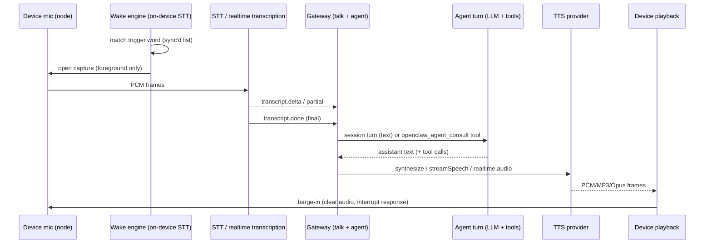

# Voice + realtime in OpenClaw

OpenClaw treats "voice" as **three separable planes** that share one event vocabulary and one
provider-plugin registry seam:

1. **Realtime talk** — full-duplex speech handled by a voice model (OpenAI Realtime / GPT-Live,
   Google Gemini Live) either in the **client** (WebRTC) or on the **gateway** (relay / backend
   WebSocket). `src/talk/provider-types.ts:324-359`
2. **Classic STT→LLM→TTS** — native on-device speech recognition feeding a normal agent turn, with
   TTS playback (`talk.speak` / core TTS). `docs/nodes/talk.md:12-19`
3. **Telephony (voice-call plugin)** — carrier calls via Twilio/Telnyx/Plivo, with either an
   OpenAI/Gemini realtime WS bridge or the streaming STT/TTS ("streaming") path.
   `extensions/voice-call/README.md:3-10`

All three emit the same **Talk event** stream (`TALK_EVENT_TYPES`), so observers/UI consume one
model regardless of plane. `src/talk/talk-events.ts:7-36`

## What it is / user-visible behavior

- **Talk mode** on macOS/iOS/Android/Watch: continuous listen → transcribe → model turn → speak,
  with wake words ("openclaw", "claude", "computer" by default), barge-in, and voice directives in
  replies. `docs/nodes/talk.md:19-21`, `docs/nodes/voicewake.md:29`
- **Browser Talk** (`talk.client.create`) starts a client-owned `webrtc`/`provider-websocket`
  realtime session; `talk.session.create` starts a gateway-owned `gateway-relay` session.
  `docs/nodes/talk.md:15`, `src/gateway/talk/handlers/client-create.ts:107-143`
- **Transcription-only** clients get live captions via `mode: "transcription"`.
  `docs/nodes/talk.md:17`, `src/gateway/talk/transcription-relay.ts:188-324`
- **Voice wake** is one global, Gateway-owned word list synced to every node; nodes only toggle it
  locally and run on-device recognition while foregrounded. `docs/nodes/voicewake.md:9-14,63-68`
- **Voice calls**: outbound `voicecall.initiate`/`initiate_call`, inbound with allowlist, per-call
  briefs, reports, live transcripts, voicemail detection. `extensions/voice-call/README.md:113-214`

## End-to-end flow

Two entry doors: **realtime** (provider model answers directly, delegating work via the
`openclaw_agent_consult` tool — `src/gateway/talk/session-config.ts:262-269`) and **classic**
(Gateway runs a normal agent turn; device speaks via `talk.speak`).

## Mechanisms

### Realtime provider registry (plugin seam)
- `listRealtimeVoiceProviders` / `getRealtimeVoiceProvider` resolve `realtimeVoiceProviders` from
  plugin manifests; unknown ids stay normalized. `src/talk/provider-registry.ts:16-53`
- `resolveConfiguredRealtimeVoiceProvider` picks a configured provider, applying agent scope, surface
  (`browser-session`/`gateway-relay`/`bridge`), default model and required capabilities.
  `src/talk/provider-resolver.ts:104`
- The plugin contract is `RealtimeVoiceProviderPlugin`: `createBridge` (backend WS), optional
  `createBrowserSession` (WebRTC/SDP), `isConfigured`, `resolveConfig`.
  `extensions/openai/realtime-voice-provider-factory.ts:340-544`

### Bridge contract + session lifecycle
- `RealtimeVoiceBridge` = `connect/sendAudio/sendUserMessage/submitToolResult/handleBargeIn/close`,
  with optional `outputAudioMode: "continuous"` for GPT-Live. `src/talk/provider-types.ts:324-359`
- `RealtimeVoiceSessionLifecycle` is the shared state machine
  (`idle → connecting → ready → retry-wait → terminal`) with connect-attempt timeouts, bounded retry
  and a bounded pending-audio queue (320 chunks / 1 MiB). `src/talk/realtime-session-lifecycle.ts:70-110,134-190,275-323`
- OpenAI `OpenAIRealtimeBridge extends OpenAIRealtimeEvents implements RealtimeVoiceBridge`
  negotiates a backend WS, reconnects up to 5× with exponential backoff, and translates server
  events into `onAudio/onTranscript/onToolCall/onResponseDone`. `extensions/openai/realtime-voice-bridge.ts:42-186,510-575`
- `OpenAIRealtimeProtocol` builds `session.update` (turn detection, tools, noise reduction), owns
  response create/cancel serialization, and playback "marks" for truncation.
  `extensions/openai/realtime-voice-protocol.ts:116-143,321-402`
- Server events consumed: `response.output_audio.delta`, `...audio_transcript.(delta|done)`,
  `conversation.item.input_audio_transcription.(delta|completed|failed)`, `response.function_call_arguments.*`.
  `extensions/openai/realtime-voice-events.ts:83-175`

### Barge-in / interrupt
- Capability flags `supportsBargeIn`, `handlesInputAudioBargeIn`; `resolveRealtimeVoiceBargeIn`
  defaults to `interruptResponseOnInputAudio` and forces `false` for `continuous` output.
  `src/talk/provider-types.ts:217-230`, `src/talk/realtime-session-policy.ts:96-109`
- OpenAI barge-in cancels the response and sends `conversation.item.truncate` per playback item,
  gated by `minBargeInAudioEndMs` (default 250 ms) to reject echo. `extensions/openai/realtime-voice-protocol.ts:232-319`, `extensions/openai/realtime-voice-session-policy.ts:103`
- Google Live has no `response.cancel`; only Extended-Thinking models support client-content
  interrupt (a bracketed "stop speaking" user turn). `extensions/google/realtime-voice-model-contract.ts:70-99`, `extensions/google/realtime-voice-provider.ts:597-614`

### Gateway-relay session (audio stays on the Gateway)
- `createTalkRealtimeRelaySession` builds a harness bridge, fragments output into 960-byte
  (20 ms @ 24 kHz PCM16) frames, and broadcasts `audio`/`clear`/`mark`/`transcript`/`toolCall`
  to the owning conn. Output ownership arbitrates who plays audio. `src/gateway/talk/relay/session-create.ts:61-305`
- `RealtimeVoiceAudioOutputPort` lets an owner bind a call-bound audio sink instead of the host
  callbacks. `src/talk/provider-types.ts:324-331`, `src/talk/audio-output-port.ts`
- Relay sessions: 30-minute TTL (`src/gateway/talk/relay/state.ts:27`), capacity-bounded, tool-call ledger, forced-consult dedupe.
  `src/gateway/talk/relay/session-create.ts:41,636-650`

### Client-owned session (`talk.client.create`)
- Validates `mode=realtime`, `brain=agent-consult`; rejects camera frames for gateway-control,
  `managed-room` in the browser, and `gateway-relay` here. `src/gateway/talk/handlers/client-create.ts:107-144`
- Resolves the provider, builds instructions from `talk.realtime` + agent context, injects the
  `openclaw_agent_consult` / `openclaw_agent_control` / describe-view tools, calls
  `provider.createBrowserSession`, then mints `voiceSessionId` + registers voice selection.
  `src/gateway/talk/handlers/client-create.ts:160-514`, `src/gateway/talk/session-config.ts:26-36`
- OpenAI browser WebRTC returns an ephemeral `clientSecret` + `offerUrl`
  `https://api.openai.com/v1/realtime/calls` and strips server-only headers (CORS).
  `extensions/openai/realtime-voice-provider-factory.ts:303-337`

### Gateway-owned control over a client media session
- `gateway-control-v1` capability lets the Gateway own task/transcript while the client owns media:
  a sideband bridge is created over a call id and bound via `bindControl` (or legacy `bindBridge`).
  `src/talk/provider-types.ts:272-306`, `extensions/openai/realtime-voice-provider-factory.ts:181-266`
- `createTalkClientGatewayControlOwner` + `createTalkRealtimeRunControlOwner` handle consult
  start/cancel/steer. `src/gateway/talk/client-gateway-control.ts`, `src/gateway/talk/realtime-run-control.ts`

### Agent consult (delegation) + primary/secondary transcripts
- Wake-name gating (leading/trailing, fuzzy Levenshtein) strips the name before routing and keeps
  dictation from triggering. `src/talk/activation-name.ts:78-121`
- `resolveRealtimeVoiceSessionPolicy` derives consult policy, tool policy (owner vs safe-read-only),
  wake-name policy (`always|automatic|never`) and auto-respond. `src/talk/realtime-session-policy.ts:30-83`
- Provider final user transcript can force a consult (`consultRouting: force-agent-consult`).
  `src/gateway/talk/relay/session-create.ts:474-485`

### TTS pipeline
- Provider registry: `listSpeechProviders`/`getSpeechProvider`; providers expose
  `synthesize`, `streamSynthesize`, `synthesizeTelephony`, `listVoices`, `parseDirectiveToken`,
  `resolveTalkConfig/Overrides`. `src/tts/provider-types.ts`, `src/tts/provider-registry.ts`
- Buffered: `synthesizeSpeech` → `executeTtsProviderAttempts` with fallback chain.
  `src/tts/tts-synthesis.ts:201-256`
- Streaming: `streamSpeech`/`textToSpeechStream` requires `streamSynthesize`; captures a provider
  stream into an owned transport and releases the provider on close. `src/tts/tts-streaming.ts:12-98`
- Voice selection: `resolveTtsProvider` precedence = prefs → persona → config → voice-model refs →
  auto-select order. `src/tts/tts-provider-resolution.ts:334-419`; `resolveVoiceProviderCandidates`.
  `src/tts/voice-models.ts:105-158`
- Directives: `[[tts:*]]` DSL + persisted `voiceText/voiceProvider/voiceId` facts; a streaming
  cleaner hides tags. `src/tts/directives.ts:96-158,257-272`
- Text prep/summary: `summarizeText` (bounded target length, `strictReasoningTags`).
  `src/tts/tts-core.ts:91-210`
- OpenAI provider: `openaiTTS()` POSTs `/audio/speech` with `response_format` chosen by
  target (opus for voice-note, mp3, wav for Groq, pcm for telephony). `extensions/openai/tts.ts:85-195`
- Telephony: `createTelephonyTtsProvider` runs core TTS with a call-scoped override, then converts
  PCM/mulaw to 8 kHz mu-law for the carrier. `extensions/voice-call/src/telephony-tts.ts:57-120`

### STT / realtime transcription
- `RealtimeTranscriptionSession` = `connect/sendAudio/close/isConnected` with
  `onPartial/onTranscript/onSpeechStart` callbacks. `src/realtime-transcription/provider-types.ts:19-39`
- Generic `WebSocketRealtimeTranscriptionSession` owns reconnection (retry supervisor, stability
  reset at 30 s, bounded queues) and delegates URL/framing/parsing to providers.
  `src/realtime-transcription/websocket-session.ts:20-71,80-93`
- Gateway transcription relay: 30-min TTL, ≤2 sessions/conn, ≤64 global; browser sends g711_ulaw@8k;
  emits `ready/partial/transcript/speechStart/error/close` + Talk events.
  `src/gateway/talk/transcription-relay.ts:25-34,188-324,344-411`
- Telephony STT: Twilio Media Streams → `MediaStreamHandler` → transcription session, with
  pending-connection caps, TTS queue, playback marks. `extensions/voice-call/src/media-stream.ts:104-120,133-292`

### Voice wake + sync
- Global list persisted in Gateway state DB `config_machine_state` keys `voicewake.triggers` /
  `voicewake.routing`; `voicewake.set` normalizes (≤32 triggers, ≤64 UTF-16 units) and broadcasts
  `voicewake.changed`. `src/gateway/server-methods/voicewake.ts:7-31`, `src/infra/voicewake.ts:12`, `docs/nodes/voicewake.md:16-61`
- Node gating: gateway accepts talk routing if a node advertises `talk` cap or `talk.*` commands.
  `src/gateway/talk/nodes.ts:9-18`
- Device-side: macOS `VoiceWakeRuntime` (actor, own AVAudioEngine + Speech recognizer,
  noise-floor RMS, cooldown); iOS `VoiceWakeManager` (suppression reasons, restart delay);
  Android on-device `SpeechRecognizer`, foreground-only, pauses when another audio owner is active.
  `apps/macos/Sources/OpenClaw/VoiceWakeRuntime.swift:10-60`, `apps/ios/Sources/Voice/VoiceWakeManager.swift:45-121`, `apps/android/app/src/main/java/ai/openclaw/app/voice/VoiceWakeManager.kt:1-80`, `docs/nodes/voicewake.md:63-68`

### Voice-call channel
- Providers: `mock`, `plivo`, `telnyx`, `twilio`; `VoiceCallProvider` interface covers
  `verifyWebhook`, `parseWebhookEvent`, `initiateCall`, `answerCall`, `hangupCall`, `playTts`,
  `sendDtmf`, `startListening`, `getCallStatus`. `extensions/voice-call/src/providers/base.ts:19-76`, `extensions/voice-call/src/runtime.ts:87-146`
- Twilio: Programmable Voice + Media Streams; `playTts` prefers stream TTS, TwiML `<Say>` only as
  fallback when no active stream; webhook HMAC verification + replay keys.
  `extensions/voice-call/src/providers/twilio.ts:76-240,586-635`
- Inbound/outbound via `CallManager` (state DB, timers, stale-call reaper) and
  `VoiceCallWebhookServer`; callbacks/voicemail/allowlist handled in `manager/*`.
  `extensions/voice-call/src/manager.ts:48-231`, `extensions/voice-call/src/webhook.ts`
- Realtime on calls: `RealtimeCallHandler` mints one-use stream tokens, runs the realtime bridge,
  maps provider final transcripts to forced consults, and detects hangup. `extensions/voice-call/src/webhook/realtime-handler.ts:111-160`, `extensions/voice-call/src/runtime.ts:266-418`
- Gateway RPC: `voicecall.initiate|steer|continue|speak|dtmf|end|status|start` + `voice_call` tool.
  `extensions/voice-call/index.ts:302-598`

### Provider specifics
- **OpenAI**: models `gpt-realtime-2.1(-mini)`, `gpt-realtime-2`, GPT-Live family; GA voices
  alloy/ash/ballad/coral/echo/sage/shimmer/verse/marin/cedar; transports webrtc + gateway-relay;
  input transcription `gpt-4o-mini-transcribe`. `extensions/openai/realtime-voice-session-policy.ts:62-119`
- **Google Gemini Live**: `@google/genai` `live.connect` with `sessionResumption`,
  `contextWindowCompression`, VAD `automaticActivityDetection`; model-contract gates
  (3.1/3.8, async function calling, continuation, client-content interrupt).
  `extensions/google/realtime-voice-provider.ts:284-316,415-555`, `extensions/google/realtime-voice-model-contract.ts:16-99`
- **Realtime "meeting" engines** share a `openclaw/plugin-sdk/meeting-runtime` seam
  (`startMeetingRealtimeEngine`) implemented in `src/meeting-bot/realtime-engine.ts`, used by the
  Google bridge in meeting mode. `extensions/google/realtime-voice-meeting.test.ts:1-6`, `src/meeting-bot/realtime-engine.ts`

### Cost / latency controls
- Audio bounded everywhere: 1 MiB pending audio queues, 960-byte output frames, `MAX_AUDIO_BASE64_BYTES`
  512 KiB in/64 KiB speeches, WS `maxPayload` 16 MiB, `maxBufferedAmount` 1 MiB.
  `src/talk/realtime-session-lifecycle.ts:1-4`, `src/gateway/talk/relay/session-create.ts:61-62`, `src/gateway/talk/transcription-relay.ts:29-30`
- Session TTLs: relay 30 min, transcription 30 min, browser sessions 30 min/60 s offer token, ≤8
  concurrent realtime sessions per Gateway. `src/gateway/talk/transcription-relay.ts:25`, `docs/nodes/talk.md:131-132`
- Timeouts: TTS default (`DEFAULT_TTS_TIMEOUT_MS`), telephony 8000 ms, connect 10 s, reconnect 5×.
  `src/tts/tts-settings.ts`, `extensions/voice-call/src/telephony-tts.ts:16`, `extensions/openai/realtime-voice-bridge.ts:43-47`
- Wake gating avoids turns: wake-name policy `automatic` requires the name only with >1 human
  participant. `src/talk/realtime-session-policy.ts:85-90`

### Gateway vs nodes (who runs what)
- **Gateway**: provider registry & resolution, relay sessions + audio framing, transcription relay,
  agent-consult/delegation, tool policy, TTS synthesis (core + telephony), voice-call runtime,
  wake-word storage/broadcast, agents/sessions/state. `src/gateway/talk/*`, `extensions/voice-call/*`
- **Nodes/clients**: microphone capture, on-device wake recognition, native speech recognition,
  WebRTC/Opus media for client-owned sessions, playback (PCM/MP3/system/MLX), voice overlays,
  local Voice Wake toggle. `apps/macos/Sources/OpenClaw/AppVoiceRuntime.swift:16-177`, `docs/nodes/talk.md:12-17`
- GPT-Live/Codex credentials stay on the Gateway for gateway-owned WebRTC; backend WS keeps the
  Platform key server-side. `docs/nodes/talk.md:166-186`

## Key contracts & data shapes

- **Talk events**: `TALK_EVENT_TYPES` (`session.*`, `turn.*`, `capture.*`, `input.audio.*`,
  `transcript.*`, `output.text.*`, `output.audio.*`, `tool.*`, `usage.metrics`, `latency.metrics`,
  `health.changed`); turn/capture-scoped events require `turnId`/`captureId`.
  `src/talk/talk-events.ts:7-36,68-102`
- **`TalkEvent`** `{ sessionId, mode, transport, brain, provider, id, type, turnId, captureId, seq,
  timestamp, final, callId, itemId, parentId, payload }`; `TalkMode`, `TalkTransport`, `TalkBrain`
  from gateway protocol. `src/talk/talk-events.ts:40-60`
- **`TalkSessionController`**: `ensureTurn/startTurn/endTurn/cancelTurn/startOutputAudio/finishOutputAudio`.
  `src/talk/talk-session-controller.ts:33-46`
- **`RealtimeVoiceBridgeCallbacks`**: `onAudio`, `getPlaybackState`, `onClearAudio(reason:"barge-in")`,
  `onMark`, `onTranscript(role,text,isFinal,{textMode})`, `handleDelegationInput`, `onEvent`,
  `onResponseDone(outcome)`, `onToolCall`, `onReady/onError/onClose`.
  `src/talk/provider-types.ts:185-213`
- **Audio formats**: `{ g711_ulaw, 8000, 1 }` | `{ pcm16, 24000, 1 }`.
  `src/talk/provider-types.ts:15-55`
- **Tools**: `openclaw_agent_consult`, agent-control, describe-view.
  `src/talk/agent-consult-tool.ts:65-260`, `src/gateway/talk/handlers/client-create.ts:197-203`
- **TTS**: `SpeechSynthesisResult { audioBuffer, outputFormat, fileExtension, voiceCompatible }`,
  `SpeechSynthesisStreamResult { audioStream, release }`, `SpeechTelephonySynthesisResult { ..., sampleRate }`.
  `src/tts/provider-types.ts:55-79`
- **Voice-call**: `voicecall.*` RPC, `voice_call` tool actions, `brief` schema (≤8000 JSON chars).
  `extensions/voice-call/index.ts:302-598`, `extensions/voice-call/src/call-brief-schema.ts`, `extensions/voice-call/README.md:119-157`

## Tests & QA

- Realtime protocol/barge-in/reconnect: `extensions/openai/realtime-voice-bridge-*.test.ts`,
  `realtime-voice-response-control.test.ts`, `realtime-voice-provider-routing.test.ts`,
  `realtime-voice-terminal-outcomes.test.ts`.
- Google model contract/meeting: `extensions/google/realtime-voice-meeting.test.ts`,
  `realtime-voice-transcript-finality.test.ts`, `realtime-voice-provider.test.ts`.
- Talk core: `src/talk/*.test.ts` (lifecycle, policy, activation-name, consult, controller, events,
  audio-codec, client-voice-session digest/confirmation suites).
- TTS: `src/tts/*.test.ts` (streaming resources, runtime routing/personas/models, summary, directives).
- Gateway talk: `src/gateway/talk/**/*.test.ts` and `handlers/*`.
- Transcription: `src/realtime-transcription/websocket-session.test.ts`.
- Voice-call: `extensions/voice-call/**/*.test.ts` (webhook, manager, media-stream, twilio, realtime
  handler lifecycle, voicemail); CLI `openclaw voicecall setup|smoke`.
  `docs/plugins/voice-call.md:62-85`
- Client: `apps/macos/Tests/OpenClawIPCTests/VoiceWake*.swift`,
  `apps/ios/Tests/VoiceWake*.swift`, `apps/android/app/src/test/.../voice/*.kt`.

## Port notes to ROX

ROX already has meetings (`packages/server-core/src/meetings/*`) and `packages/shared/src/meeting-agents/*`,
identity/credential fabric, and a skill catalog; the port should reuse these seams.

- **Event vocabulary first.** Port `TALK_EVENT_TYPES` + `createTalkEventSequencer`/
  `createTalkSessionController` into `packages/shared` as the single spoken-session event model, so
  Electron renderer, `packages/server-core`, and future mobile clients share it. Ground: `src/talk/talk-events.ts`, `src/talk/talk-session-controller.ts`.
- **Provider registry as a plugin capability.** ROX has a "sources/MCP" registry; add
  `realtimeVoiceProviders` + `speechProviders` capability keys (same shape as
  `resolvePluginCapabilityProviders`). Ground: `src/talk/provider-registry.ts`, `src/tts/provider-registry.ts`.
- **Realtime transport split.** In Electron: renderer can own WebRTC (`talk.client.create`-equivalent
  IPC) while main owns the relay/backend WS (`talk.session.create`-equivalent). Keep credentials in
  main (`packages/core/src/platform/identity`) and hand the renderer only ephemeral tokens/offers;
  mirror `gateway-control-v1` (sideband bridge bound to a call id). Ground: `src/gateway/talk/handlers/client-create.ts`, `extensions/openai/realtime-voice-provider-factory.ts:181-337`.
- **One bridge state machine.** Port `RealtimeVoiceSessionLifecycle` + `createRealtimeVoiceAudioQueue`
  (bounded, reconnect, pending-audio) as `packages/shared`; OpenAI and Google bridges both consume it.
  Ground: `src/talk/realtime-session-lifecycle.ts`, `extensions/openai/realtime-voice-bridge.ts`.
- **TTS pipeline in server-core.** `synthesizeSpeech`/`streamSpeech` + provider-resolution precedence
  (prefs→persona→config→voice-model) map cleanly onto a Bun service; device playback stays in the
  renderer (WebAudio) / main (native). Ground: `src/tts/tts-synthesis.ts`, `src/tts/tts-streaming.ts`, `src/tts/tts-provider-resolution.ts`.
- **STT relay.** Reuse `WebSocketRealtimeTranscriptionSession` (reconnect + bounded queues) behind a
  server-core WS endpoint; browser sends g711_ulaw@8k / pcm16@24k. Ground: `src/realtime-transcription/websocket-session.ts`, `src/gateway/talk/transcription-relay.ts`.
- **Voice wake** = `~/.rox` config key + WS broadcast (`voicewake.changed`-equivalent); on-device
  recognition only, foreground-gated; route triggers to sessions/agents. Ground: `src/gateway/server-methods/voicewake.ts`, `docs/nodes/voicewake.md:16-68`.
- **Voice calls** → a server-core plugin-equivalent service (Bun) hosting the webhook server + tunnel
  and a `CallManager`; Twilio/Telnyx/Plivo adapters as provider modules; telephony TTS reuses core
  TTS then converts to 8 k mu-law. Ground: `extensions/voice-call/src/runtime.ts`, `extensions/voice-call/src/media-stream.ts`, `extensions/voice-call/src/telephony-tts.ts`.
- **Agent consult** maps onto OMP RPC: expose `openclaw_agent_consult`/control as OMP tool calls that
  start/cancel/steer a session run, with a spoken-confirmation gate for mutating tools.
  Ground: `src/gateway/talk/relay/session-create.ts:487-548`, `src/talk/client-voice-confirmation-policy.ts:23-33`.
- **Observability**: port Talk event metrics (`event-metrics`, `observability`, `diagnostics`) and
  Voice-call reports/live-transcript into ROX telemetry. Ground: `src/talk/observability.ts`, `src/talk/event-metrics.ts`.

## Risks & unknowns

- **Provider drift**: OpenAI/Google realtime wire details (GA vs GPT-Live vs Gemini 3.x) are
  version-gated by hard-coded model-contract switches; porting must keep model→contract mapping and
  test live. `UNVERIFIED:` exact current validity of each model id at ROX ship time.
- **Credential ownership**: gateway-owned WebRTC + OAuth/SDP exchange is subtle; getting token
  ownership wrong leaks credentials to the renderer. Mitigate by mirroring the single-use offer broker.
  `docs/nodes/talk.md:166-186`
- **Client-native divergence**: macOS/iOS/Android each reimplement wake + native speech + playback;
  ROX's Electron renderer will need its own equivalents (WebAudio + Web Speech / native modules),
  and the gateway side cannot assume node capabilities beyond the `talk.*` command set.
- **Telephony requires public webhooks + tunnels** (Twilio/Telnyx/Plivo); that is infra the ROX
  desktop model must host or delegate. `extensions/voice-call/src/runtime.ts:469-511`
- **`UNVERIFIED:`** ROX meeting-runtime equivalence: OpenClaw's `meeting-runtime` plugin-sdk seam is
  implemented in `src/meeting-bot/*`; whether ROX's meeting stack can host realtime engines the same
  way needs its own look at `packages/server-core/src/meetings/*`.
- **`UNVERIFIED:`** exact cost/latency budgets for GPT-Live "continuous audio" mode (no
  per-response boundaries) vs GA response mode in ROX's billing/telemetry.