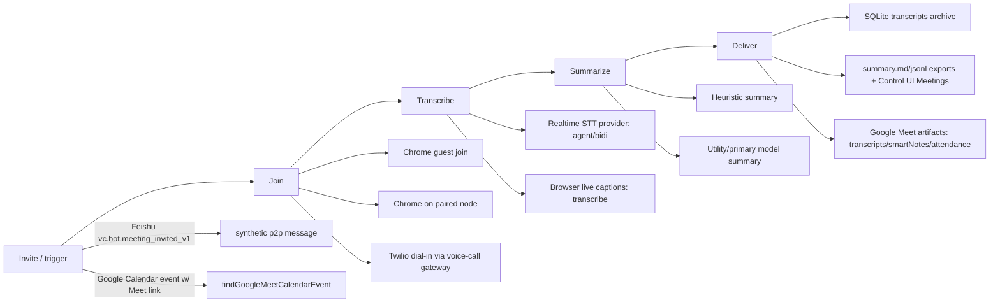

# Meetings — how OpenClaw puts an agent into a live call, transcribes it, and ships notes

## What it is / user-visible behavior

OpenClaw ships **four meeting plugins** that let an agent take part in a video call:

| Plugin | Entry id | Join mechanism | Extra |
| --- | --- | --- | --- |
| Google Meet | `google-meet` | Chrome browser guest, Chrome on a paired node, **or** Twilio phone dial-in | Can **create** meetings (Meet API or signed-in browser) and read Meet/Drive/Calendar artifacts via OAuth |
| Microsoft Teams meetings | `teams-meetings` | Chrome browser guest (work `teams.microsoft.com/l/meetup-join/...` and consumer `teams.live.com/meet/...`) | Guest join only |
| Zoom | `zoom-meetings` | Chrome browser guest via the Zoom Web App | Guest join only |
| Slack huddles | `slack-huddles` | Dedicated signed-in Slack user in Chrome | Not in this slice's evidence |

Shared behavior is documented in `docs/plugins/meeting-plugins.md:11-24` and confirmed in code: all four share **one audio engine, three modes, and the durable-notes pipeline**.

**Modes** (`docs/plugins/meeting-plugins.md:33-41`; `src/meeting-bot/meeting-modes.ts:3-23`):
- `agent` — realtime transcription is routed to the configured OpenClaw agent; regular OpenClaw TTS speaks the reply.
- `bidi` — a realtime voice model (e.g. GPT-Live/Cove) listens and answers directly, delegating to the agent via `openclaw_agent_consult`.
- `transcribe` — observe-only; exposes a bounded live-caption transcript and starts no virtual-audio bridge.

User-visible surfaces: CLI (`openclaw googlemeet join …`, `openclaw teamsmeetings join …`, `openclaw zoommeetings join …`; `docs/plugins/meeting-plugins.md:193-198`), Gateway methods `googlemeet.*` / `teamsmeetings.*` / `zoommeetings.*` (`extensions/google-meet/src/plugin-registration.ts:64-78`; `src/meeting-bot/plugin-entry.ts:178`), agent tools `google_meet` / `teams_meetings` / `zoom_meetings` (`extensions/google-meet/index.ts:247-253`; `src/meeting-bot/browser-plugin.ts:224-234`), and an agent tool/CLI to browse stored notes (`docs/cli/transcripts.md:12-18`, `:38-49`).

## End-to-end flow

## Mechanisms

### 1. Trigger surfaces (invite / calendar)

- **Feishu VC invite**: `createFeishuVcMeetingInvitedHandler` (`extensions/feishu/src/monitor.vc-meeting-invited-handler.ts:108-118`) subscribes to `vc.bot.meeting_invited_v1` (`extensions/feishu/src/monitor.account.ts:369-375`). It validates a 9-digit `meeting_no` (`:11`, `:135-147`), refuses to act unless `vcAutoJoin` is set (`:129-131`), then **synthesizes a p2p message** whose text instructs the agent to join (`:154-157`) and dispatches it through the normal message handler with a dedupe claim/adoption lifecycle (`:182-215`). It never calls a join API itself.
- **Google Calendar**: `findGoogleMeetCalendarEvent` (`extensions/google-meet/src/calendar.ts:204-214`) lists events on `primary` (or a given calendar) via `events.list` (`:143-177`), extracts a Meet URI from `hangoutLink`, `conferenceData.entryPoints[type=video]`, location, or description (`:99-111`), and ranks the currently-running/next event (`:121-133`). Consumed by `googlemeet.calendarEvents` and `--today` artifact queries (`extensions/google-meet/index.ts:95-105`; `extensions/google-meet/src/cli-artifact-commands.ts:27-56`).
- **Direct**: agent tool / CLI / Gateway method with an explicit URL (`extensions/google-meet/index.ts:128-139`; `docs/plugins/meeting-plugins.md:191-198`).
- **Transcript auto-start**: `transcripts.autoStart[]` config entries (providerId + locator) are normalized at `src/transcripts/config.ts:27-59`.

### 2. How the bot joins, per provider

- **Chrome / Chrome-node (Teams, Zoom, Google Meet, Slack huddles)**: browser automation. The shared `openMeetingWithBrowser` (`src/meeting-bot/browser-controller.ts:106`) drives the OpenClaw Chrome profile; `recoverMeetingBrowserTab` (`:309`) finds the tracked tab. Per-platform page scripts implement the click path (e.g. Zoom: "Join from browser", guest name, camera off, mic config, Join, Leave — `docs/plugins/zoom-meetings.md:27-29`). Real per-provider adapters: `GOOGLE_MEET_PLATFORM_ADAPTER` (`extensions/google-meet/src/transports/google-meet-platform-adapter.ts`), `TEAMS_MEETINGS_PLATFORM_ADAPTER` (`extensions/teams-meetings/src/transports/teams-meetings-platform-adapter.ts:29-81`), `ZOOM_MEETINGS_PLATFORM_ADAPTER` (`extensions/zoom-meetings/src/transports/zoom-meetings-platform-adapter.ts:18-78`). Chrome can run on the Gateway host or a **paired node** via node command `googlemeet.chrome` / `teamsmeetings.chrome` / `zoommeetings.chrome` (`docs/plugins/meeting-plugins.md:121-128`; `extensions/teams-meetings/src/transports/teams-meetings-platform-adapter.ts:60-61`).
- **Twilio dial-in (Google Meet only)**: `GoogleMeetRuntime.#joinTransport` builds a dial plan and delegates the phone leg to the voice-call plugin gateway (`extensions/google-meet/src/runtime.ts:351-418`; `extensions/google-meet/src/voice-call-gateway.ts:88-97`). A Meet URL never carries dial-in details, so `dialInNumber` (+pin/DTMF) must be supplied (`extensions/google-meet/src/runtime.ts:360-365`).
- **Official APIs (Google Meet create/artifacts only)**: `GoogleMeetRuntime.createViaBrowser` (`extensions/google-meet/src/runtime.ts:230-239`) or API `spaces.create` (`extensions/google-meet/src/meet-api.ts:282-305`); `createAndJoinMeetFromParams` joins the created URI (`extensions/google-meet/src/create.ts:123-147`). Teams/Zoom explicitly do **not** create meetings, dial in, or use vendor SDKs (`docs/plugins/meeting-plugins.md:24`; `docs/plugins/zoom-meetings.md:11-13`).
- **Desktop control**: none. Participation is browser automation or a phone call; the platform-policy section is explicit that automation "does not bypass platform or organizer policy" (`docs/plugins/meeting-plugins.md:207-218`).

Lifecycle is centralised in `MeetingSessionRuntime` (`src/meeting-bot/session-runtime.ts:51`): `join` serialises per transport+URL via a keyed lock (`:243-251`), reuses or ends conflicting sessions and transfers the single browser-tab owner (`:449-570`), and `leave`/cleanup coalesces retries (`:572-656`). Sessions are created by `createMeetingSession` (`src/meeting-bot/session-factory.ts:5`).

### 3. Live transcription pipeline

Two independent paths:

- **Realtime audio (agent/bidi)**: `startMeetingRealtimeEngine` (`src/meeting-bot/realtime-engine.ts:99-115`) builds a realtime-voice session over an audio transport; provider resolution defaults `realtime.transcriptionProvider` to `openai` (`src/meeting-bot/plugin-config.ts:172`; `extensions/google-meet/src/config.ts:281-297`; `src/meeting-bot/realtime-engine-support.ts:69`). Agent delegation runs through `consultMeetingAgent` (`src/meeting-bot/agent-consult.ts:92-121`). Echo control: `MEETING_AGENT_TRANSCRIPT_DEBOUNCE_MS=900`, `MEETING_OUTPUT_ECHO_SUPPRESSION_TAIL_MS=3000`, `MEETING_TRANSCRIPT_ECHO_LOOKBACK_MS=45000` (`src/meeting-bot/realtime-engine.ts:95-98`).
- **Browser live captions (all modes persist these; `transcribe` exposes them live)**: a page-injected `MutationObserver` scrapes the platform's own caption DOM — `GOOGLE_MEET_CAPTION_OBSERVER_SOURCE` (`extensions/google-meet/src/transports/google-meet-caption-observer-source.ts:7-228`), installed at `:203-213`, scrape loop at `:92-187`. It mints per-line **source identity** (`{id, epoch, revision, finalized, ownEcho}`) and **observation provenance** (observer/session/epoch/speaker/self) to distinguish own echo from participant speech (`src/meeting-bot/session-types.ts:16-32`; `src/meeting-bot/observation-provenance.ts:10-33`). Speaker handling therefore comes from the platform caption row (speaker label + `data-is-self`), not from diarisation.

Chunking/cursors: `MeetingSessionTranscriptStore` (`src/meeting-bot/session-transcript-store.ts:72`) dedupes snapshot revisions against an epoch+tail-key cursor (`:14-18`, `:281-341`), keeps a bounded tail (`TRANSCRIPT_CURSOR_TAIL=64`, `:33`) and caps retained lines at `TRANSCRIPT_MAX_LINES=2000` (`:34`, `:368-372`), retaining only `ENDED_TRANSCRIPTS_MAX=4` ended sessions (`:32`, `:254-279`). The durable bridge polls every `CAPTURE_INTERVAL_MS=5000` (`src/meeting-bot/transcripts-bridge.runtime.ts:30`, `:161-180`).

### 4. Live participation vs note-taking

- **Participation** is a first-class, replay-safe action channel: `MeetingParticipation` (`src/meeting-bot/participation.ts:44`) mints UUID `sourceId`s from caption observations (`:110-213`), claims each `requestId` with a SHA-256 fingerprint (`:16-33`, `:289-345`), supports one correction per claim (`:361-388`), and returns `rejected | unsupported | uncertain` with "do not retry" semantics (`:446-450`). Observations never grant action authority (`src/meeting-bot/session-runtime.ts:13`, `src/meeting-bot/session-types.ts:44-57`). `GoogleMeetRuntime` registers a `meeting-participation` keyed state store (`extensions/google-meet/src/runtime.ts:96-121`).
- **Note-taking** runs regardless of talk-back mode: `MeetingSessionDurableTranscripts` (`src/meeting-bot/session-durable-transcripts.ts:20`) starts/stops the bridge per session (`:84-122`), honours `transcripts.enabled` and reconciles on config reload (`:42-78`, `:39`), and retries finalization with exponential backoff 1s→60s (`:17-18`, `:186-229`).

### 5. Recap/summary generation + delivery

- Third-party agent/tool contract: **Google Meet artifacts** — `fetchGoogleMeetArtifacts` (`extensions/google-meet/src/meet.ts:199-280`) lists `participants / recordings / transcripts / smartNotes` and optionally resolves transcript entries and linked Google Doc bodies; `fetchGoogleMeetAttendance` (`:282-318`) merges participant sessions and decorates late/early-leave; Drive Doc export at `extensions/google-meet/src/drive.ts:24-40`.
- Summaries: `MeetingSessionDurableTranscripts` hands each utterance to `createTranscriptSummaryUpdates` (`src/transcripts/capture-summary.ts:218-220`) which regenerates **every ~5 minutes** (`LIVE_SUMMARY_INTERVAL_MS = 5*60_000`, `:41`, timer at `:250-275`) and finalizes on stop via `persistTranscriptSummary` (`:195-199`, called from `transcripts-bridge.runtime.ts:331`). Summaries are produced by `summarizeTranscriptsWithModel` (utility model then primary, 48k input / 1500 tokens / 20s budget, JSON `{overview, decisions, actionItems, risks}` — `src/transcripts/summary-model.ts:17-35`, `:84-189`) with a **deterministic heuristic fallback** (`summarizeTranscripts`, regex-based decisions/action-items/risks — `src/transcripts/summary.ts:22-26`, `:79-103`) and markdown rendering (`:110-138`).
- Delivery/store: `TranscriptsStore` under `$OPENCLAW_STATE_DIR/transcripts` with the canonical SQLite archive at `$OPENCLAW_STATE_DIR/state/openclaw.sqlite` (`src/meeting-bot/transcripts-bridge.runtime.ts:63-65`; `docs/cli/transcripts.md:20-30`). `openclaw transcripts list|show|path` materialise `metadata.json / transcript.jsonl / summary.json / summary.md` (`docs/cli/transcripts.md:24-30`, `:85-96`); the Control UI "Meetings" reader browses and searches the same archive (`docs/cli/transcripts.md:38-68`). Subscribers can attach/detach to a live capture via the transcript-source provider (`extensions/google-meet/index.ts:119-126`; `src/meeting-bot/transcripts-bridge.runtime.ts:373-473`).
- Artifact bundle export: `googlemeet export` writes artifacts + attendance + raw JSON (+ optional zip) to a folder (`extensions/google-meet/src/cli-artifact-commands.ts:129-168`).

### 6. Retention

`transcripts.enabled: false` disables durable notes globally but an explicit `transcribe` session keeps its bounded live tail (`docs/plugins/meeting-plugins.md:54-66`). Retained in-memory snapshots: 4 ended sessions, 2000 lines each; eviction sets `session.transcriptEvicted` (`src/meeting-bot/session-transcript-store.ts:32-34`, `:262-276`). Participation sources expire after 120s and cap at 1024 live sources / 10 000 identities (`src/meeting-bot/participation.ts:13-14`, `:135-136`, `:186-198`); the persisted attempt store is capped at 10 000 entries with `reject-new` overflow (`extensions/google-meet/src/runtime.ts:100-104`).

### 7. Provider auth/config surfaces

- **Google Meet OAuth** (browser-independent, for API/artifacts): PKCE auth-code flow with scopes `meetings.space.created|readonly|settings`, `meetings.conference.media.readonly`, `calendar.events.readonly`, `drive.meet.readonly` (`extensions/google-meet/src/oauth.ts:21-28`, `:44-63`), local callback on port 8085 with manual paste fallback (`:14`, `:226-260`), cached-access-token fast path + refresh (`:152-195`). Config keys `oauth.clientId/clientSecret/refreshToken/accessToken/expiresAt` with `OPENCLAW_GOOGLE_MEET_*` env fallbacks (`extensions/google-meet/src/config.ts:298-318`). API scopes enforced per call in `requestGoogleMeetApi` (`extensions/google-meet/src/meet-api.ts:201-226`, `:8-12`).
- **Browser profile / node**: `chrome.browserProfile`, `chromeNode.node`, `chrome.guestName`, `chrome.audioBackend` (`auto|blackhole-2ch|pipewire-pulse`), `chrome.audioInput/OutputCommand`, barge-in thresholds (`extensions/google-meet/src/config.ts:242-263`; `extensions/google-meet/openclaw.plugin.json` uiHints). Teams/Zoom expose the same `chrome`/`chromeNode`/`realtime` block (`extensions/teams-meetings/openclaw.plugin.json`, `extensions/zoom-meetings/openclaw.plugin.json`).
- **Realtime providers**: `realtime.transcriptionProvider`, `realtime.voiceProvider`, `realtime.model`, `realtime.providers.<id>.apiKey`, `realtime.agentId`, `realtime.toolPolicy` (`safe-read-only|owner|none`) (`extensions/google-meet/src/config.ts:281-297`; plugin manifests; secret path declared as `realtime.providers.*.apiKey`).
- **Twilio / voice-call**: `twilio.defaultDialInNumber|defaultPin|defaultDtmfSequence`, `voiceCall.enabled|gatewayUrl|token|requestTimeoutMs|introMessage` (`extensions/google-meet/src/config.ts:267-280`).
- **Feishu**: `vcAutoJoin` per account (`extensions/feishu/src/config-schema.ts:259`; `extensions/feishu/src/monitor.account.ts:528`).

## Key contracts & data shapes

- `MeetingSessionRecord<TTransport, TMode>`: `id, url, transport, mode, agentId, state, transcriptEvicted?, browserLeft?, createdAt, updatedAt, participantIdentity, realtime, notes` (`src/meeting-bot/session-types.ts:115-133`).
- `MeetingTranscriptLine`: `{ at?, speaker?, text, provenance?, source? }`; `MeetingTranscriptSnapshot`: `{ droppedLines, epoch?, lines, pendingLines? }` (`src/meeting-bot/session-types.ts:49-65`).
- `MeetingBrowserHealth` / `MeetingPluginChromeHealth`: `inCall, micMuted, manualAction, speechReady/BlockedReason, captions*, audioInput/OutputRouted, providerConnected, realtimeReady, bridgeClosed …` (`src/meeting-bot/session-types.ts:78-171`).
- `MeetingObservationProvenance` = `{observer, observationId?, sessionId?, epoch?, observedAt?, speaker?, self: self|other|unknown}`; `MeetingCaptionSource` = `{id, epoch, revision, finalized, ownEcho?}` (`src/meeting-bot/session-types.ts:16-32`).
- Modes `"agent" | "bidi" | "transcribe"`; transports `"chrome" | "chrome-node" | "twilio"` (Google Meet) / `"chrome" | "chrome-node"` (Teams, Zoom) (`src/meeting-bot/meeting-modes.ts:3-5`; `extensions/google-meet/src/config.ts:20-22`; `src/meeting-bot/plugin-entry.ts:26`).
- Gateway methods: `googlemeet.{join,create,status,transcript,participate,participationContext,leave,speak,setup,testSpeech,testListen,recoverCurrentTab,latest,calendarEvents,artifacts,attendance,export,endActiveConference}` (`extensions/google-meet/src/plugin-registration.ts:64-78`; `extensions/google-meet/index.ts:128-245`); shared `{join,leave,status,transcript,speak,setup,testSpeech,testListen}` (`src/meeting-bot/plugin-entry.ts:271-326`).
- Transcript provider registration: `api.registerTranscriptSourceProvider({id, aliases, name, sourceKinds:["live-caption"], start, stop})` (`extensions/google-meet/index.ts:119-126`); Google Meet source id `google-meet` (`extensions/google-meet/openclaw.plugin.json` `contracts.transcriptSourceProviders`), Teams `teams`, Zoom `zoom`.
- `TranscriptsStore` artifacts: `metadata.json`, `transcript.jsonl`, `summary.json`, `summary.md` (`docs/cli/transcripts.md:24-30`).
- Google Meet API types: `GoogleMeetSpace`, `GoogleMeetConferenceRecord`, `GoogleMeetParticipant`, `GoogleMeetTranscriptEntry`, `GoogleMeetArtifactsEntry`, `GoogleMeetAttendanceRow`, `GoogleMeetSmartNotesListResult` (`extensions/google-meet/src/meet-api.ts:22-130`).
- `MeetingDurableTranscriptsOptions` bridge contract `{enabled, start, stop, ingest, attach, detach}` (`src/meeting-bot/transcripts-bridge.runtime.ts:88-474`; types at `src/meeting-bot/transcripts-bridge.ts`).

## Tests & QA

- Meeting-bot unit/integration tests sit next to sources: `session-runtime.*.test.ts`, `session-transcript-store.test.ts`, `participation.test.ts`, `transcripts-bridge.test.ts`, `realtime-engine.*.test.ts`, `node-host.audio.test.ts`, `browser-audio-capture-source.test.ts`, `output-loopback-verifier.test.ts` (all under `src/meeting-bot/`).
- Per-provider: Google Meet has `google-meet.live.test.ts`, `index.transcripts.test.ts`, `participation-runtime-registration.test.ts`, `transports/google-meet-captions.test.ts`, `cli-artifacts.test.ts`, `oauth.test.ts`, `calendar.test.ts`, `drive.test.ts`, `realtime.process.test.ts`; Teams has `teams-meetings-caption-capture.test.ts`, `teams-meetings-audio-routing.test.ts`, `teams-meetings-caption-ownership.test.ts`; Zoom has `zoom-meetings-platform-adapter.test.ts`, `runtime-setup.test.ts`.
- Feishu: `monitor.vc-meeting-invited-handler.test.ts`.
- Docs give manual verification: `openclaw <plugin> setup` must pass, `transcribe` observe-only smoke reports an in-call session, talk-back verification is only trusted when the command-pair bridge correlates an output waveform fingerprint with audio returning on the virtual mic (`speechOutputVerified`) (`docs/plugins/meeting-plugins.md:191-205`).
- Provider-local: Google Meet Media API is **Developer Preview**, gated by `preview.enrollmentAcknowledged` (`extensions/google-meet/src/meet.ts:320-341`; `src/meeting-bot/...` manifest uiHint).

## Port notes to ROX

ROX already has meetings (`packages/server-core/src/meetings/*`, `packages/shared/src/meeting-agents/*`, e2e). Concretely:

1. **Reuse ROX's existing meeting package for lifecycle; port the OpenClaw session runtime shape.** `MeetingSessionRuntime`'s keyed `transport:url` lock, single-browser-tab ownership transfer, and leave/cleanup retry semantics (`src/meeting-bot/session-runtime.ts:243-268`, `:449-570`) belong in `packages/server-core/src/meetings` as a transport-agnostic orchestrator; platform I/O stays behind an adapter interface modelled on `MeetingPlatformAdapter.create` (`src/meeting-bot/platform-adapter.ts:384-419`).
2. **Transport selection = documented capability matrix, not vendor SDK.** Implement `chrome | chrome-node | twilio(dial-in)` for Google Meet and `chrome | chrome-node` for Teams/Zoom; do **not** claim Zoom/Teams meeting creation, dial-in, SDK, or recording. Surface `manualAction` (login/lobby/passcode/CAPTCHA) verbatim to the ROX UI.
3. **Electron placement.** Chrome automation + native virtual audio (BlackHole 2ch / PipeWire-Pulse) must run in the **Electron main** process (`apps/electron/src/main`), with the audio host selectable as "this machine" or a remote node. Expose it to the renderer over preload/IPC and to the web UI over the `packages/server` WS/HTTP surface; map OpenClaw's Gateway methods onto ROX's existing OMP-RPC request envelopes.
4. **Transcription.** Two sources: realtime STT provider (agent/bidi) and browser-caption scraping (observe/transcribe). The caption scraper is platform-specific DOM automation — implement it as one adapter per platform (`google-meet`/`teams`/`zoom` `*-page-scripts.ts`), with the dedupe cursor, bounded tail, and per-line provenance/ownEcho identity exactly as in `session-transcript-store.ts` and `session-types.ts:16-32`. Without provenance+ownEcho you will echo the agent's own TTS back into notes.
5. **Notes pipeline is core, not plugin.** Port `capture-summary.ts` (5-minute cadence, lane serialisation, `TranscriptsSummaryChangedError` invalidation), `summary-model.ts` (utility-then-primary, strict JSON schema, 20s budget), and `summary.ts` heuristic fallback into a ROX core transcripts package; persist to ROX's store and expose list/show/export + a Meetings reader UI. Keep `transcripts.enabled` as a global kill switch that still preserves an explicit observe-only session's bounded tail.
6. **Participation idempotency** (`participation.ts`) is worth porting as-is if ROX wants the agent to react in-call (emoji/reply/correct): fingerprint dedupe, one-correction rule, "uncertain → do not retry", and the rule that caption observations never authorise actions.
7. **Google Meet OAuth + artifacts** map cleanly onto ROX's identity/credential fabric (`packages/core/src/platform/identity`): PKCE flow, refresh-token storage as a secret, per-call scope enforcement, and the artifacts/attendance/export CLI as ROX endpoints. Gate Media API usage behind an explicit preview acknowledgement.
8. **Feishu invite trigger**: port `createFeishuVcMeetingInvitedHandler` as a synthetic-message dispatcher (default-off `vcAutoJoin`), reusing ROX's dedupe/adoption lifecycle; the handler must not call a join API directly.
9. **Retention**: no audio/video recording anywhere. Port the in-memory caps (4 ended sessions × 2000 lines, 120s/1024 participation sources) and `transcriptEvicted` signalling.
10. **Russian-first i18n**: all user-facing strings here are collected in message maps (`src/meeting-bot/browser-plugin.ts:138-172`, `extensions/google-meet/src/runtime.ts:134-153`) — port as ROX i18n keys rather than inline text.

## Risks & unknowns

- **Chrome automation fragility**: join/caption flows depend on platform DOM (`*-page-scripts.ts`, caption selectors). Platform redesigns and A/B UI variants break them; live validation exists only for Zoom Web App (`docs/plugins/zoom-meetings.md:31-37`) and Google Meet (`google-meet.live.test.ts`). UNVERIFIED: current Teams/Zoom caption selector stability.
- **Native audio dependency**: `agent`/`bidi` through Chrome require BlackHole 2ch (macOS) or PipeWire-Pulse (Linux) plus `sox`/`pactl`; unsupported hosts must be blocked up-front (`extensions/google-meet/src/plugin-registration.ts:120-147`). Porting to Electron main adds the same host requirement.
- **Google Meet API is Developer Preview** and gated by `preview.enrollmentAcknowledged`; scopes are broad (`drive.meet.readonly`, `calendar.events.readonly`). UNVERIFIED: whether ROX/its users can enrol in the Workspace Developer Preview Program (blocker for artifacts on real accounts).
- **Caption dependence**: `transcribe` mode and durable notes rely on the platform exposing captions; availability depends on meeting platform, account, language, and host policy (`docs/plugins/meeting-plugins.md:54-66`). No captions ⇒ empty notes.
- **No diarisation/speaker resolution** beyond the platform's caption speaker label; merging duplicate participants in attendance is display-name/user-based only (`extensions/google-meet/src/meet.ts:163-197`).
- **Consent/policy**: automation does not bypass admission, sign-in, or recording restrictions; operators must self-authorize and disclose (`docs/plugins/meeting-plugins.md:207-218`). ROX must reproduce those guardrails, especially for the Twilio dial-in path.
- UNVERIFIED: Slack huddles internals (extension present but out of this slice's evidence); exact `slackhuddles.*` method set and account setup.