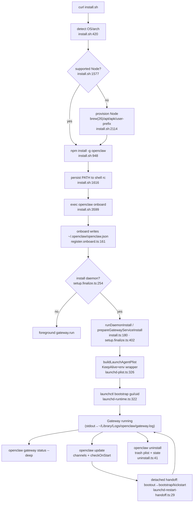

# E1 — Install, onboarding, and daemon lifecycle

## What it is / user-visible behavior

OpenClaw is a Node/Bun CLI (`openclaw`) plus an always-on **Gateway** agent host. The
operator journey:

1. `curl -fsSL https://openclaw.ai/install.sh | bash` installs Node if needed, then
   `npm install -g openclaw` (`scripts/install.sh:53`, `:948`).
2. The installer chains into `openclaw onboard` on a fresh profile
   (`scripts/install.sh:3599`).
3. Onboarding writes `~/.openclaw/openclaw.json` and, when the operator accepts
   (or passes `--install-daemon`), installs a per-user **launchd LaunchAgent**
   `ai.openclaw.gateway` at `~/Library/LaunchAgents/ai.openclaw.gateway.plist`
   (`src/daemon/constants.ts:5`, `src/daemon/launchd-service-files.ts:42`).
4. The LaunchAgent keeps the Gateway alive (RunAtLoad + KeepAlive) and restarts it
   after crashes; `openclaw gateway start|stop|restart|status|install|uninstall`
   drive it (`src/cli/daemon-cli/register-service-commands.ts:77`).
5. `openclaw update` upgrades the install and safely restarts the managed service;
   `openclaw doctor` reports/repairs drift (foreign launchd jobs, port conflicts,
   runtime mismatches), and `openclaw uninstall` reverses everything
   (`src/commands/uninstall.ts:41`).

On Linux the same surface uses a systemd user unit; on Windows a Scheduled Task.
macOS specifics are launchd-first with GUI-domain (`gui/<uid>`) bootstrap.

## End-to-end flow

## Mechanisms

### 1. install.sh — Node provisioning, npm global install, PATH

- Re-execs under `/bin/bash` on macOS to dodge a Bash 5.3 heredoc deadlock, then
  `set -euo pipefail` (`scripts/install.sh:4-22`).
- Supported runtime contract: Node **24.16+ or 26.1+**; macOS default major 26 via
  Homebrew plain `node`, Linux LTS default major 24 (`scripts/install.sh:67-78`).
- `node_version_components_are_supported` / `node_binary_is_supported` also require a
  WAL-reset-safe SQLite in the binary (`scripts/install.sh:1557-1597`).
- `check_node` reuses a supported Node; otherwise `install_node` runs
  `brew install node` + `brew link --overwrite --force` on macOS
  (`scripts/install.sh:2012-2031`, `:2114-2126`). RPM/unsafe-SQLite distros get a
  user-space runtime under `~/.openclaw/tools/node/bin` via a downloaded
  `install-cli.sh` (`scripts/install.sh:2089-2111`).
- Global package install builds an explicit `npm … install -g` argv, strips
  `before`/`min-release-age` config, and verifies lifecycle scripts completed
  (`scripts/install.sh:948-988`).
- PATH: `prepend_path_dir` mutates this session, `persist_shell_path_prepend` writes
  an idempotent `export PATH=…` line into the right rc file (`.zshrc`/`.zprofile`,
  `.bashrc`/`.bash_profile`, fish `conf.d/openclaw.fish`) with symlink/ownership
  guards (`scripts/install.sh:1599-1614`, `:1616-1678`).
- Finalize stage warns when npm global bin or `~/.local/bin` is missing from the
  login shell PATH (`scripts/install.sh:3447-3457`), runs `doctor --fix` on
  upgrade/config-present, restarts a detected daemon, then `exec`s onboard
  (`scripts/install.sh:3480-3500`, `:3520-3528`, `:3580-3605`).

### 2. `openclaw onboard --install-daemon`

- Flags: `--install-daemon` / `--no-install-daemon` / `--skip-daemon` (skip wins),
  plus `--daemon-runtime node|bun` (`src/cli/program/register.onboard.ts:14-23`,
  `:161-164`).
- The resolved `installDaemon?: boolean` rides on `OnboardOptions`
  (`src/commands/onboard-types.ts:95`); any non-guided option (incl.
  `installDaemon`) forces the **classic** wizard (`src/commands/onboard.ts:408-418`).
- `ensureGatewayServiceForOnboarding` decides: explicit flag → use it; Linux without
  user systemd → false; quickstart → true; otherwise prompt (`src/wizard/setup.finalize.ts:252-266`).
  On Linux it first offers systemd user **linger** (`:239-250`).
- Install path: `resolveGatewaySetupRuntime` → `prepareGatewayServiceInstall` →
  `installation.install()`, recording `{status:"ready", action:"installed"}`
  (`src/wizard/setup.finalize.ts:388-425`). Resume (`loadedAction:"resume"`) starts
  the existing service instead of re-installing (`:288-303`).
- Dashboard/readiness can also install on demand: `ensureDashboardGatewayReady`
  calls `runDaemonInstall` when no service exists, else `runDaemonStart`
  (`src/commands/gateway-readiness.ts:118-141`).

### 3. LaunchAgent plist, env pinning, KeepAlive, authority, legacy cleanup

- Label: default `ai.openclaw.gateway`; profiles → `ai.openclaw.<profile>`;
  `OPENCLAW_LAUNCHD_LABEL` overrides, validated `[A-Za-z0-9._-]+`
  (`src/daemon/constants.ts:51-57`, `src/daemon/launchd-label.ts:5-18`).
- Plist location per-user: `~/Library/LaunchAgents/<label>.plist`
  (`src/daemon/launchd-service-files.ts:42-48`).
- Policy constants embedded by `buildLaunchAgentPlist`: `RunAtLoad:true`,
  `KeepAlive:true`, `ExitTimeOut`, `ProcessType:Interactive`,
  `ThrottleInterval:10` (crash-loop backoff), `Umask:0o077`, `StandardInPath:/dev/null`
  (`src/daemon/launchd-plist.ts:20-28`, `:326-363`). `StandardOutPath`/`StandardErrorPath`
  both point at one file because darwin diagnostics reads only stdout
  (`src/daemon/launchd-service-files.ts:442-445`).
- Env pinning: environment lives in an owner-only (`0600`) generated env file under
  `<state>/service-env/<label>.env`, loaded by an `0700` `#!/bin/sh` wrapper placed
  into `ProgramArguments` (`["/bin/sh", wrapper, envFile, …cmd]`)
  (`src/daemon/launchd-service-files.ts:86-184`). The wrapper validates the header
  and exits 78 on tamper. `NODE_OPTIONS` may be written empty to block inherited
  supervisor preload/heap flags (`src/daemon/launchd-plist.ts:200-204`).
- Publish/replace is transactional with snapshot rollback of plist + env + wrapper
  bytes/modes (`src/daemon/launchd-service-files.ts:202-357`,
  `src/daemon/launchd-install.ts:105-258`).
- Activation: `bootstrapLaunchAgentOrThrow` does `launchctl enable` then
  `bootstrap gui/<uid> <plist>`, retrying EIO pending-teardown within the ExitTimeOut
  budget; unsupported GUI domain (SSH/headless) yields the "requires a logged-in
  macOS GUI session" error (`src/daemon/launchd-runtime.ts:300-431`).
  `guid/<uid>` = `resolveLaunchAgentGuiDomain` (`:300-305`).
- Authority: `assertExternalLaunchAgentMutation` refuses install/uninstall from inside
  the service (`src/daemon/launchd-install.ts:87-103`); `assertNoSystemLaunchDaemonOwnership`
  refuses to touch a label owned by `/Library/LaunchDaemons`
  (`src/daemon/launchd-system.ts:22`, used at `launchd-service-files.ts:370-372`).
  `assertGatewayServiceUpdateCurrent` fences writes mid-update
  (`src/daemon/service-update-authority.ts`).
- Resume/start: `recoverInstalledLaunchAgent` re-bootstraps an installed-but-unloaded
  agent after start/restart (`src/cli/daemon-cli/launchd-recovery.ts:11-42`,
  `src/cli/daemon-cli/lifecycle.ts:270-283`).
- Legacy cleanup: Doctor classifies legacy user services (darwin user services, or
  known legacy systemd names like `clawdbot-gateway`) and removes only recognized
  units (`src/daemon/constants.ts:35`, `src/commands/doctor-gateway-legacy-services.ts:6-37`).
  The node-service label `ai.openclaw.node` is recognized and excluded from the
  foreign-job scan so legitimate node LaunchAgents aren't reaped
  (`src/daemon/constants.ts:29`, `src/daemon/launchd-foreign-jobs.ts:51-61`).

### 4. `gateway start/stop/status/install/restart/uninstall`

- Registered via `addGatewayServiceCommands`; subcommands `status|install|uninstall|start|stop|restart`
  with shared flags (`--json`, `--force`, `--port`, `--runtime`, `--runtime-path`,
  `--wrapper`); `stop --disable` persists suppression of KeepAlive/RunAtLoad
  (`src/cli/daemon-cli/register-service-commands.ts:77-199`, esp. `:158-162`).
- `runDaemonInstall` merges safe invocation env (preserving `NODE_EXTRA_CA_CERTS`,
  dropping TLS-disable/proxy/loader overrides), resolves runtime pin, blocks
  no-auth non-loopback installs, defaults `gateway.mode=local`, resolves a token,
  then installs (`src/cli/daemon-cli/install.ts:117-177`, `:180-583`).
- `runDaemonStart` recovers an unloaded LaunchAgent and repairs a stale definition
  via `repairLoadedGatewayServiceForStart`, which refuses to repair when the
  invoking shell's state dir/config/port differ from the installed service
  (`src/cli/daemon-cli/lifecycle.ts:262-304`, `src/cli/daemon-cli/start-repair.ts:79-138`).
- `runDaemonStop` requires `--force` in non-interactive shells; with `--disable`
  it also stops a not-loaded agent (`src/cli/daemon-cli/lifecycle.ts:307-357`).
  Stop waits out the launchd exit/port-release budget
  (`src/daemon/launchd-stop.ts:46-93`).
- Health: `runDaemonRestart` proves listener health before reporting success
  (`src/cli/daemon-cli/lifecycle.ts:360+`, `restart-health.ts`).

### 5. Doctor diagnostics

- Foreign launchd jobs: `findForeignLaunchdJobs` scans `ai.openclaw.*` labels not
  owned by the current gateway/node profile; classifies `keepAlive` and literal
  straight-line `openclaw gateway restart|start|stop` invocations, marking
  `safeToRemove` (`src/daemon/launchd-foreign-jobs.ts:15-99`). Doctor reports them
  and, only with `--fix` + default install identity + service repair allowed, removes
  confirmed jobs (`src/commands/doctor-foreign-launchd-jobs.ts:22-84`).
- Port conflicts: `noteGatewayPortDiagnostics` flags `busy` when listeners are not
  expected Gateway listeners, printing `formatPortDiagnostics`
  (`src/commands/doctor-gateway-daemon-flow.ts:187-204`); stop also refuses to claim
  success on a busy-but-unowned port (`src/cli/daemon-cli/lifecycle.ts:130-140`).
- Node runtime mismatch: Doctor/install compare the recorded service Node against
  `SUPPORTED_NODE_VERSIONS`; unsupported/missing recorded Node triggers an automatic
  refresh or a "System Node … not found" note (`src/cli/daemon-cli/install.ts:381-422`,
  `src/commands/doctor-gateway-services.ts:398`, `src/daemon/runtime-paths.ts:414`).
- Supervisor drift / system ownership: `inspectSystemLaunchDaemonOwnership` surfaces
  loaded/installed same-label system daemons as `unknown`/refusal
  (`src/daemon/launchd-system.ts:22-36`, `src/daemon/launchd-runtime.ts:500-517`).

### 6. Update mechanism (channels, checkOnStart, safe respawn)

- Channels: `stable | extended-stable | beta | dev`; `channelToNpmTag` maps stable→
  `latest`, others to their own dist-tag (`src/infra/update-channels.ts:7-50`).
  `resolveEffectiveUpdateChannel` picks channel from config → git tag/branch →
  installed version → default (`:131-175`).
- `checkOnStart`: startup update scheduler bails when `cfg.update.checkOnStart===false`
  or `OPENCLAW_NO_AUTO_UPDATE`, and only auto-applies on stable/beta/dev when not
  externally supervised (`src/infra/update-startup.ts:268-336`).
- Safe respawn: macOS restarts run through `scheduleDetachedLaunchdRestartHandoff`,
  a detached `/bin/sh` that waits for the caller PID to exit, re-checks system-daemon
  ownership, then `bootout`+`bootstrap` (reload) or `kickstart -k`/`bootstrap`
  fallback (`src/daemon/launchd-restart-handoff.ts:29-215`). After an update a
  not-loaded installed agent is recovered (`src/cli/update-cli/update-command-launch-agent-recovery.ts:13-57`).

### 7. State dir, logs, uninstall

- State dir: `$OPENCLAW_STATE_DIR` else `~/.openclaw` (profile suffix `-<profile>`);
  config `openclaw.json` (`src/daemon/paths.ts:37-48`, `src/config/paths.ts:35`,
  `:212`).
- Logs: state-dir `logs/gateway.log`/`gateway-restart.log` for CLI/audit; launchd
  supervisor stdout/stderr → `~/Library/Logs/openclaw/gateway[-profile].log`
  (`src/daemon/restart-logs.ts:26-49`, `:51-78`).
- Uninstall: `openclaw uninstall` with scopes `service|state|workspace|app`
  (`--all`, `--dry-run`, `--yes`); stops the service first, then removes state and
  optionally the app (`src/commands/uninstall.ts:41-212`). The launchd uninstall
  bootouts then moves the plist to `~/.Trash` (`src/daemon/launchd-install.ts:32-79`).

## Key contracts & data shapes

- Launchd label: `ai.openclaw.gateway` / `ai.openclaw.<profile>` (`GATEWAY_LAUNCH_AGENT_LABEL`, `resolveGatewayLaunchAgentLabel`).
- Node-service label: `ai.openclaw.node` (`resolveNodeLaunchAgentLabel`).
- `LAUNCH_AGENT_POLICY = { RunAtLoad, KeepAlive, ExitTimeOut, ProcessType, ThrottleInterval, Umask, StandardInPath }` (`src/daemon/launchd-plist.ts:20`).
- `LAUNCH_AGENT_ENV_WRAPPER_SHELL = "/bin/sh"`; env file header `# Generated by OpenClaw. Do not edit while the gateway service is installed.`
- Env-var selector keys: `OPENCLAW_STATE_DIR`, `OPENCLAW_CONFIG_PATH`, `OPENCLAW_PROFILE`, `OPENCLAW_GATEWAY_PORT`, `OPENCLAW_LAUNCHD_LABEL`, `OPENCLAW_SYSTEMD_UNIT`, `OPENCLAW_WINDOWS_TASK_NAME` (`src/daemon/constants.ts:11-19`).
- `UpdateChannel = "stable" | "extended-stable" | "beta" | "dev"`; `DEFAULT_PACKAGE_CHANNEL="stable"`, `DEFAULT_GIT_CHANNEL="dev"`.
- `UninstallScope = "service" | "state" | "workspace" | "app"`.
- `ForeignLaunchdJob = { label, program, keepAlive, gatewayActions[], safeToRemove, plistPath?, diagnostic? }`.
- State files: `~/.openclaw/openclaw.json`, `~/.openclaw/service-env/<label>.env`, `~/.openclaw/logs/gateway.log`, `~/Library/LaunchAgents/<label>.plist`, `~/Library/Logs/openclaw/gateway.log`.

## Tests & QA

- `src/cli/daemon-cli/install.*.test.ts`, `launchd-recovery.test.ts`, `lifecycle*.test.ts`,
  `install.integration.test.ts`, `install.wrapper.integration.test.ts`.
- `src/daemon/launchd-*.test.ts` (plist, install, runtime, stop, system, foreign jobs).
- `src/commands/doctor-foreign-launchd-jobs.test.ts`, `doctor-gateway-services.*.test.ts`,
  `doctor-platform-notes.disabled-launchagent.test.ts`.
- `src/infra/update-channels.test.ts`, `update-startup.test.ts`,
  `update-command-launch-agent-recovery` covered by update-cli tests.
- `docs/platforms/mac/bundled-gateway.md:424-438` smoke check: `openclaw --version` +
  `openclaw gateway --port 18999 --bind loopback` + `gateway call health`.

## Port notes to ROX

Map onto Electron main / `packages/server-core` / Bun, replacing launchd with ROX's
process model:

1. **Installer → Electron packaging.** ROX ships a desktop app (Electron 39 + Bun),
   so the "curl | bash" + npm-global + PATH-rc-rewrite flow is mostly unnecessary.
   Keep only: (a) a Node/Bun capability probe equivalent to `node_binary_is_supported`
   (SQLite WAL-safety + version floor) in `packages/server-core/src/runtime/*`;
   (b) the "provision user-space runtime under `<state>/tools/`" pattern for hosts
   that lack a supported runtime, implemented via Bun `which`/download in main.
2. **Onboarding → renderer wizard + IPC.** ROX already has a guided onboarding flow.
   Port the *decision* logic of `ensureGatewayServiceForOnboarding`: an
   `installDaemon` tri-state option, quickstart=install default, and the
   externally-supervised skip. Expose `onboard.options.installDaemon` over IPC to
   `apps/electron/src/main`.
3. **LaunchAgent → OS service abstraction.** Introduce `packages/server-core/src/service/`
   with a platform-agnostic `GatewayService` interface (install/start/stop/restart/
   status/uninstall/readCommand/isLoaded) mirroring `src/daemon/service-types.ts`.
   Implement `darwin` (launchd), `linux` (systemd user), `win32` (Task Scheduler) and
   an `app-managed` backend where Electron main owns the child (like the macOS app's
   bundled-Bun hosting). Reuse the plist builder contract: policy constants, env-file
   wrapper, 0600 env file, transactional publish+rollback.
4. **Service authority/status.** Port `assertGatewayServiceUpdateCurrent`,
   `assertExternalLaunchAgentMutation`, `assertNoSystemLaunchDaemonOwnership`, and
   the start/restart "installed vs ambient target mismatch" refusal into
   `server-core`; surface via `openclaw gateway status --deep` equivalents exposed on
   ROX's HTTP/WS backend (`packages/server`), consumed by renderer status panel.
5. **Doctor/metadata.** ROX's config dir is `~/.rox`; port `~/.openclaw` layout as
   `<roxState>/logs/gateway.log`, `<roxState>/gateway.json` (config), `<roxState>/service-env/`.
   Port foreign-job detection only if ROX later manages launchd jobs; otherwise keep
   the port-conflict and runtime-mismatch diagnostics.
6. **Update.** ROX should adopt the channel model (stable/beta/dev) + `checkOnStart`
   gating for its Bun/Electron updater, and the detached-handoff idea (spawn a helper
   that waits for the old PID before relaunching) instead of launchd `kickstart`.
7. **Conventions:** Bun-first (no npm-global), Electron auto-update instead of
   `curl install.sh`, Russian-first strings for all user-facing installer/doctor text.

## Risks & unknowns

- **launchd GUI domain:** activation requires a logged-in Aqua session; SSH/headless
  fails (`src/daemon/launchd-runtime.ts:307-320`). ROX app-managed hosting avoids this
  but must still handle "attach to existing service" and operator-owned definitions.
- **Plist/env corruption** is treated as first-class: wrapper-header mismatch exits 78
  and requires `gateway install --force`. Porting without the transactional
  publish/rollback (`launchd-service-files.ts`) risks bricking the service.
- **Ownership fences** (`/Library/LaunchDaemons`, update-in-progress) are subtle;
  a naive port could fight an operator's custom daemon.
- **UNVERIFIED:** exact macOS-side TCC/permission prompts referenced by
  `macos-gateway-host.md:13` were not read in this slice (no source file touched).
- **UNVERIFIED:** `install-cli.sh` Node-download internals were not opened; only its
  invocation from `install.sh:2097` is evidenced.
- **UNVERIFIED:** "legacy node cleanup" doc phrasing maps to (a) legacy systemd unit
  names (`clawdbot-gateway`) and (b) `ai.openclaw.node` job exclusion from foreign-job
  scans; no dedicated `ai.openclaw.node` *removal* routine was found in this slice.
- **UNVERIFIED:** `doctor-platform-notes.ts` launchctl-env-override and
  disabled-LaunchAgent notes were inferred from test filenames, not read.