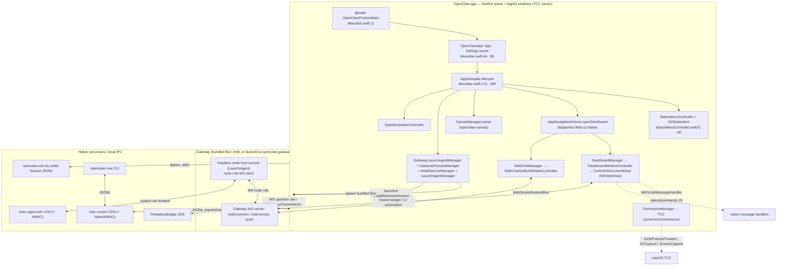

# E2 — macOS companion app

## What it is / user-visible behavior

`OpenClaw.app` is a **single menu-bar-resident SwiftUI/AppKit app** that also owns all
TCC-facing work (notifications, screen recording, microphone, speech, camera,
AppleScript/accessibility). It is not a thin channel client: it bundles a private Bun
runtime and, on a fresh profile, **hosts the Gateway as a child process** and connects
to it *as a node* (`docs/platforms/mac/xpc.md:10`, `docs/platforms/mac/bundled-gateway.md:24`).

User-visible surfaces:

- **Menu-bar status item** shows the current agent work state and health; a root menu
  carries Context (recent sessions), Devices (`node.list` only), Usage/cost, Gateways
  (per-Gateway health + primary marker), Quick Chat, Settings, Connection, About
  (`docs/platforms/mac/menu-bar.md:15`).
- **Dock menu** mirrors Open Dashboard / Settings and every Gateway in the catalog
  (`docs/platforms/mac/menu-bar.md:30`).
- Two embedded experiences, switched in **Dashboard → Settings → This Mac → App**:
  - **Web (default)**: the Gateway's Control UI in a `WKWebView` window
    (`docs/platforms/mac/webchat.md:10`).
  - **Native (Experimental)**: a native chat window + sidebar that still renders the
    Control UI chat pane inside a web view (`docs/platforms/mac/webchat.md:30`).
- **Onboarding** window on first run ("This Mac" setup prepares the bundled runtime,
  starts the Gateway, verifies readiness) (`docs/platforms/mac/bundled-gateway.md:67`).
- **Canvas / widget panel**: a borderless native panel that presents hosted widget
  documents, disabled from always `Dashboard → Settings → This Mac → Capabilities`
  (`docs/platforms/mac/canvas.md:27`).
- **Permission prompts**: permission state lives in Dashboard → Settings → This Mac →
  Permissions; Grant requests access, Open System Settings routes a confirmed denial
  (`docs/platforms/mac/permissions.md:15`).
- **Auto-update**: Sparkle drives app updates; the **Updates** tab of This Mac holds
  update preferences (`docs/platforms/mac/menu-bar.md:24`).

Because grants are bound to code signature + bundle ID + path, the app is meant to run
as a signed release from `/Applications/OpenClaw.app` (`ai.openclaw.mac`) with the fixed
dev ID `ai.openclaw.mac.debug` (`docs/platforms/mac/permissions.md:49`).

## End-to-end flow

## Mechanisms

### App shell, scenes, menu bar

- **Entry point is not a SwiftUI `WindowGroup`.** `@main enum OpenClawProcessMain`
  first routes private maintenance commands through `OpenClawProcessEntrypoint.run`
  (`CloudWorkerHost`, `ElevationExclusiveRename`, `ElevationFilesystemSync`) and only
  then calls `OpenClawApp.main()` (`apps/macos/Sources/OpenClaw/MenuBar.swift:11`,
  `:30`).
- `struct OpenClawApp: App` installs `@NSApplicationDelegateAdaptor(AppDelegate.self)`
  and holds `AppStateStore.shared` (`MenuBar.swift:44`, `:70`). `body: some Scene`
  declares exactly one scene — a `Settings` scene hosting `ConnectionWindow`
  ("Connection" is a standard macOS settings window) — plus `.commands` groups that
  replace `.newItem`, `.appSettings`, `.appInfo`, install `SidebarCommands`, a
  `Navigate` menu, and `DashboardGatewayCommands` (`MenuBar.swift:83`, `:95`, `:99`).
- All real windows are AppKit `NSWindowController`s (e.g. `DashboardWindowController`,
  `WebChatSwiftUIWindowController`), not SwiftUI windows; menu-bar + Dock menus are
  hand-built `NSMenu`s. The app keeps running with no windows
  (`applicationShouldTerminateAfterLastWindowClosed → false`, `MenuBar.swift:284`).
- `AppDelegate.applicationDidFinishLaunching` is the composition root: it admits the
  primary app launch (`GatewayEndpointStore.admitPrimaryAppLaunch`, `MenuBar.swift:314`),
  starts `GatewayConnectivityCoordinator`, `DockIconManager`, the
  `StatusMenuController` (`MenuBar.swift:324`), applies `ConnectionModeCoordinator`
  (`:342`), boots the node runtime (`MacNodeModeCoordinator.shared.start()`, `:355`),
  and starts the interactive service list — pairing prompters, exec-approvals prompt
  server, `MacControlServer`, Quick Chat, voice/cookie sync (`:356`–`:368`).
- `applicationWillTerminate` stops those services and closes Dashboard/WebChat
  (`MenuBar.swift:401`); `applicationShouldTerminate` performs bounded async cleanup
  (hosted gateway, tunnels, MLX, node mode) behind a `terminateLater` deadline
  (`MenuBar.swift:426`, `:439`).
- **Status item**: `StatusMenuController` owns an `NSStatusItem` created with
  `NSStatusBar.system.statusItem(withLength: .squareLength)` and a rendering
  `StatusMenuRenderer` (`StatusMenuController.swift:9`, `:60`,
  `StatusMenuRenderer.swift:88`); it observes `WorkActivityStore`/`ControlChannel`
  and coalesces refreshes while the menu is open (`docs/platforms/mac/menu-bar.md:42`).
- **Navigation dispatch**: `AppNavigationActions.openDashboard` routes to
  `WebChatManager` when `nativeExperienceEnabled`, else `DashboardManager`; the
  switching logic (hide old experience windows, keep drafts, reopen same Gateway) is
  `experienceDidChange` (`AppNavigationActions.swift:8`, `:20`).

### Gateway discovery + pairing/connect from the app

- **Discovery** is Bonjour + wide-area DNS-SD in a separate `OpenClawDiscovery` module:
  `GatewayDiscoveryModel` starts a `GatewayDiscoveryBrowserSession` which instantiates
  `NWBrowser` (`apps/shared/OpenClawKit/Sources/OpenClawKit/GatewayDiscoveryBrowserSession.swift:27`;
  `GatewayDiscoveryModel.swift:79`, `:108`), uses
  `NetService` resolution for host/port + TXT (`:476`), and `WideAreaGatewayDiscovery`
  queries the wide-area `_openclaw-gw._tcp` domain (`WideAreaGatewayDiscovery.swift:55`,
  `:64`).
- **Endpoint construction is security-hardened**: `GatewayDiscoveryHelpers.directUrl`
  deliberately ignores unauthenticated TXT hints (tailnetDns/lanHost/gatewayPort) and
  builds `wss://` or loopback/trusted-plaintext `ws://` only from the resolved SRV +
  A/AAAA endpoint (`GatewayDiscoveryHelpers.swift:26`, `:39`).
- **Connection mode resolution**: `ConnectionModeResolver.resolve` prefers
  `gateway.mode` (`local`/`remote`) in config, then a configured remote URL, then the
  stored `UserDefaults` mode, then onboarding state → `.unconfigured`
  (`ConnectionModeResolver.swift:15`). `ConnectionModeCoordinator.apply` then starts or
  stops the local gateway, the node LaunchAgent service, and the remote control tunnel
  per mode (`ConnectionModeCoordinator.swift:30`, `:63`, `:92`).
- **SSH tunnel / remote**: remote mode calls `GatewayEndpointStore.ensureRemoteControlTunnel`
  before reconfiguring `ControlChannel` (`ConnectionModeCoordinator.swift:99`,
  `GatewayEndpointStore.swift:398`); `RemoteTunnelManager` owns tunnel lifetime
  (`RemoteTunnelManager.swift:5`) and `PortGuardian` reaps orphaned tunnels.
- **Pairing**: the app is a *pairing approver*, not only a client. `NodePairingApprovalPrompter`
  polls `node.pair.list`, decodes `node.pair.requested` / `node.pair.resolved` events,
  dedupes echoed resolutions, and can auto-approve local/SSH-proven nodes
  (`NodePairingApprovalPrompter.swift:19`, `:181`, `:242`, `:253`, `:285`);
  `DevicePairingApprovalPrompter` does the device side (`DevicePairingApprovalPrompter.swift:10`).
  Prompts funnel through `PairingApprovalCenter` (`PairingApprovalCenter.swift:12`).
- **Browser sign-in**: saved "browser" Gateways use `GatewayBrowserSignInCoordinator`
  (`GatewayBrowserSignInCoordinator.swift:7`), the same path the CLI's `gateway.add`
  drives over the app control socket.

### How the app talks to the gateway (WS protocol client)

- `actor GatewayConnection` is the app's operator-role WS client. It holds a
  `GatewayChannelActor` and wraps it with lease/fencing machinery (`GatewayConnection.swift:14`,
  `:134`, `:1005`) so a superseded route or server lease cancels late completions.
- The wire client lives in `OpenClawKit`: `public actor GatewayChannelActor`
  (`apps/shared/OpenClawKit/Sources/OpenClawKit/GatewayChannel.swift:10`) does connect /
  `connect.challenge` / device-auth, keepalive, watchdog, tick, backoff, and
  request/response demultiplexing (`:62`, `:65`, `:66`). Transport is abstracted by
  `WebSocketSessioning` / `WebSocketSessionBox`, defaulting to `URLSessionWebSocketTask`
  — the same type injected for tests and for `GatewayTLSPinningSession`
  (`apps/shared/OpenClawKit/Sources/OpenClawKit/GatewayWebSocketTransport.swift:152`,
  `:179`; `GatewayConnection.swift:382`).
- The **node** side is a separate WS client: `actor GatewayNodeSession` handles
  `node.invoke` bridge requests, and the app answers them with `BridgeInvokeRequest` /
  `BridgeInvokeResponse` frames (`apps/shared/OpenClawKit/Sources/OpenClawKit/GatewayNodeSession.swift:49`,
  `BridgeFrames.swift:3`, `:34`). The app connects role `node` with
  `clientId: "openclaw-macos"`, `clientMode: "node"` (`NodeMode/MacNodeModeCoordinator.swift:559`,
  `:568`).
- A **fleet** of per-profile connections exists for saved Gateways:
  `actor MacGatewayConnectionFleet` (`MacGatewayProfiles.swift:682`).
- `ControlChannel` is the observation layer over `GatewayConnection` — it exposes
  connection state, health requests, `routeWorkActivity`, heartbeat/profile-accent
  push handling (`ControlChannel.swift:259`, `:636`, `:733`).

### Embedded surfaces and their IPC (message handler)

- **Dashboard (Web experience)**: `DashboardManager` (`DashboardManager.swift:12`)
  creates/reuses `DashboardWindowController` (`DashboardWindowController.swift:67`).
  The controller builds a `ControlUIDocumentHost` (`ControlUIDocumentHost.swift:8`)
  whose `WKWebViewConfiguration.userContentController` receives a set of
  `WKScriptMessageHandler`s (`DashboardWindowController.swift:151`):
  `link`, `notifications`, `gateways`, `commands` (shared `DashboardMessageHandler`),
  the update handler (only when the updater is available /
  `shouldEnableUpdateBridge`), `DashboardAppLinkMessageHandler`,
  `DashboardDeviceSettingsMessageHandler`, and `DashboardBrowserMessageHandler`
  (`DashboardWindowController.swift:164`–`:186`).
- **Native auth bridge**: every document gets
  `ControlUINativeGatewayAuthMessageHandler.name = "OpenClawNativeGatewayAuth"`
  registered in `.page` content world (`ControlUIDocumentHost.swift:60`,
  `ControlUINativeGatewayAuthMessageHandler.swift:6`). It lets the Control UI request
  native device credentials instead of embedding token/password into the page.
- **Native browser IPC**: `DashboardBrowserMessageHandler.name = "openclawBrowser"`
  (`DashboardBrowserMessageHandler.swift:52`) decodes a typed
  `DashboardBrowserRequest` — `.open/.navigate/.present/.releaseScope/.inspect` and
  `DashboardBrowserAction` (`back, forward, reload, stop, close, snapshot, download`)
  (`:61`, `:14`, `:8`). The comment pins the wire keys to the web side
  `ui/src/app/native-browser-bridge.ts` (`:4`); the actual `WKWebView` hosting is
  `DashboardNativeBrowserHost` (`DashboardNativeBrowserHost.swift:26`) with per-scope
  session state in `DashboardBrowserSessionStore` (`DashboardBrowserSessionStore.swift:8`).
- **Device settings IPC**: `DashboardDeviceSettingsMessageHandler`
  (`DashboardDeviceSettingsMessageHandler.swift:8`) serves permission toggles/status,
  refreshing on app activation, permission-change and CLI-installed notifications but
  never poll-starting TCC (`:29`–`:42`).
- **Native chat (Native experience)**: `WebChatManager` (`WebChatManager.swift:37`)
  binds a `DashboardGatewayTarget` to a connection and opens either the primary
  embedded web pane (`presentChat`) or a `WebChatSwiftUIWindowController`
  (`WebChatManager.swift:221`, `:263`, `WebChatSwiftUI.swift:888`). Session-observer
  visibility is reference-counted per connection (`WebChatManager.swift:12`, `:528`).
- **Canvas panel**: `CanvasManager.show/hide/hideAll` own the borderless `CanvasPanel`
  and present hosted docs through the app-local custom URL scheme
  `openclaw-canvas` handled by `CanvasScheme` (`CanvasManager.swift:8`, `:27`,
  `CanvasScheme.swift:3`); rendering is render-only in the panel
  (`docs/platforms/mac/canvas.md:21`).

### Node capability model + TCC permission prompts

- Two capability vocabularies: the **IPC** `Capability` enum (`notifications`,
  `accessibility`, `screenRecording`, `microphone`, `speechRecognition`, `camera`,
  `location`) in `apps/macos/Sources/OpenClawIPC/IPC.swift:6`, and the **node** capability
  strings `OpenClawCapability` (`canvas`, `browser`, `camera`, `screen`, `computer`,
  `voiceWake`, `talk`, `location`, `device`, `watch`, `photos`, `contacts`, `calendar`,
  `reminders`, `motion`, `health`) in `OpenClawKit/Capabilities.swift:3`.
- **What the node advertises** is computed at connect time:
  `MacNodeModeCoordinator.resolvedCaps` always adds `canvas` + `screen`, conditionally
  adds `camera`, `computer` (only when Computer Control is enabled *and* the provider is
  Peekaboo), `location`, and remote-only Codex/Claude catalogs
  (`NodeMode/MacNodeModeCoordinator.swift:1219`, `:1229`, `:1235`, `:1238`);
  `resolvedCommands` adds `canvas.present/hide/navigate`, `screen.snapshot/record`,
  `system.notify`, camera/computer commands (`:1250`).
- **Permission map**: `advertisedPermissions(PermissionManager.authorizationStatus())`
  drops `.unknown` states (unknown ≠ denial, so a later grant is not a false upgrade)
  and emits `{capability: granted}` into `GatewayConnectOptions.permissions`
  (`NodeMode/MacNodeModeCoordinator.swift:1208`, `:568`).
- **Prompting**: `PermissionManager.ensure(_:interactive:)` switches per capability and,
  when interactive AND the launch plan allows activation, issues the TCC prompt
  (`PermissionManager.swift:61`, `:62`). Specific mechanisms: accessibility via
  `AXIsProcessTrustedWithOptions(["AXTrustedCheckOptionPrompt": true])`
  (`:112`); screen recording via a `PermissionsService` (`requestScreenRecordingPermission`
  + live probe, `:121`); camera/mic via `AVCaptureDevice.requestAccess` (`:128`);
  speech recognition and location have their own paths (`:150`, `:165`). Denied
  cases route to System Settings via `SystemSettingsURLSupport`.
- **TCC persistence discipline**: grants are tied to signature+bundle+path; the app must
  be a real signed build, and ad-hoc signatures lose grants each rebuild
  (`docs/platforms/mac/permissions.md:49`, `docs/platforms/mac/signing.md:14`).
  `DeviceSettingsPermissions` maps `CapabilityAuthorizationStatus.notGranted →
  .notDetermined` because macOS's binary checks cannot distinguish denial from
  first-request (`DeviceSettingsPermissions.swift:30`).
- Screen recording and accessibility show **Not granted** until confirmed and only
  offer Grant before a confirmed denial, then Open System Settings
  (`docs/platforms/mac/permissions.md:22`).

### LaunchAgent management from the app (install/start/stop, runtime pin, resume)

- **Gateway LaunchAgent**: `GatewayLaunchAgentManager.set(enabled:port:...)` is the app
  entry point. It refuses when the connection mode is remote (unless
  `allowUnconfigured`) or the `disable-launchagent` marker exists, captures a
  `ServiceAuthority`, and dispatches a daemon command (`GatewayLaunchAgentManager.swift:192`,
  `:109`). Enable runs `install --force --port 
` (+ `--allow-unconfigured`, runtime
  pin) (`:316`); disable runs `uninstall` (`:285`).
- **Runtime pin**: when installing fresh with a bundled runtime, the app appends
  `--runtime bun --runtime-path <bun>` (`:316`), and presence of the operator's runtime
  pin is read from the shared SQLite state DB under a scoped key
  `"daemon-runtime-pin:" + SHA256(["gateway","darwin",label,configPath])`
  (`GatewayLaunchAgentManager+RuntimePin.swift:6`, `:14`).
- **Resume**: pause removes the plist but retains the service command intent under
  `resumeCommandKey = "gatewayNodeResumeCommand"` (`GatewayLaunchAgentManager+ServiceResume.swift:4`,
  `:7`); `retainedServiceIntent` re-validates that the executable is `node`/`bun` and
  lives inside the state dir before re-arming (`:28`, `:44`). Credentials are *not* in
  the resume record — they stay in core's generated service-env file which uninstall
  retains (`:16`).
- **Service authority / race fencing**: `ServiceAuthority` holds SHA-256
  `ServiceDefinitionDigest`s of plist + env file + wrapper, and `currentError()` refuses
  to dispatch if any changed (`GatewayLaunchAgentManager+ServiceAuthority.swift:6`,
  `:15`, `:36`).
- **App-level login agent** (separate from the gateway service): `LaunchAgentManager`
  writes `~/Library/LaunchAgents/ai.openclaw.mac.plist` with
  `ProgramArguments = [<bundle>/Contents/MacOS/OpenClaw]`, `RunAtLoad = true`, PATH and
  config/state env, and launchd stdout/stderr paths, then drives
  `/bin/launchctl` (`LaunchAgentManager.swift:5`, `:148`, `:157`, `:160`). Plist
  inspection (ProgramArguments, `OPENCLAW_GATEWAY_TOKEN/PASSWORD`, generated env files)
  is `LaunchAgentPlist.snapshot` (`Launchctl.swift:16`, `:34`).
- **Node host service**: `NodeServiceManager.start/stop/restart` manages the
  fixed-label `ai.openclaw.node` LaunchAgent that connects the headless node host to the
  Gateway (`NodeServiceManager.swift:4`, `:12`, `:16`; label at `Constants.swift:10` — unlike
  the gateway label, it does *not* interpolate the app profile, `Constants.swift:5-7`).
- **Hosting**: `GatewayProcessManager` decides app-hosted (parent-child bundled Bun)
  vs attach vs external, and `startAppHostedGateway`/`shutdownAppHostedGateway` manage
  the child with a stdin lifeline (`GatewayProcessManager+Hosting.swift:277`, `:381`);
  `setActive` / `stop` are the toggles (`GatewayProcessManager.swift:206`, `:607`).

### Auto-update and signing/notarization expectations

- **Sparkle**: `SparkleUpdaterController` wraps `SPUStandardUpdaterController` behind
  the `UpdaterProviding` protocol, with `DisabledUpdaterController` for debug/dev runs
  (`AppLifecycleSupport.swift:74`, `:93`, `:111`). Update availability is exposed via a
  `@Observable UpdateStatus` and a Sparkle delegate that sets `isUpdateReady`
  (`:95`, `:189`).
- **Channel gating**: the app resolves the Gateway's effective update channel via
  `update.status` and maps it to Sparkle channels —
  `allowedSparkleChannels(forGatewayUpdateChannel:)` returns `["beta"]` for
  `beta`/`dev`, `["extended-stable"]` for `extended-stable`, else `[]`; and
  `bestValidUpdate(in:for:)` filters appcast items so an `extended-stable` Gateway
  never leaves its train (`AppLifecycleSupport.swift:212`, `:233`, `:243`).
- **Signing expectations** (packaging, not app runtime): `scripts/package-mac-app.sh` →
  `scripts/codesign-mac-app.sh`; Node engine bounds are enforced; the app bundles the
  pinned OpenClaw Bun fork + full package + Control UI; a real signing identity is
  required by default; Info.plist is stamped with `OpenClawBuildTimestamp`,
  `OpenClawGitCommit`, `OpenClawRuntimeBuildID`; JIT entitlements go only to
  `runtime/bin/bun` (and bundled Claude executables); Team ID audit fails closed
  (`docs/platforms/mac/signing.md:10`, `:12`, `:14`, `:18`, `:19`). The build timestamp /
  commit surface in the native **About** tab (`:18`).
- `PostAppUpdateReceiptStore.record` writes a receipt when Sparkle is about to install
  (`AppLifecycleSupport.swift:258`), consumed on next launch by `PostUpdateController`
  (`MenuBar.swift:350`).

### Helper processes and "XPC"

There is **no XPC service** in this repo; the docs call the whole picture "macOS IPC"
but it is implemented with **Unix-domain sockets + stdio framing**, plus pairing
approval over the Gateway WS (`docs/platforms/mac/xpc.md:10`).

- **mlx-tts helper**: a separate SwiftPM executable `openclaw-mlx-tts`
  (`apps/macos-mlx-tts/Package.swift:13`) with its own package so the MLX audio stack
  does not compile into normal app tests. Protocol: length-framed JSON over
  stdin/stdout (`OpenClawMLXTTSProtocol`), `MLXTTSRequest` /
  `MLXTTSEvent` (`ready`, stream start/chunk, audio, error), `MLXTTSFrameCodec.maximumPayloadSize
  = 64 MiB` (`apps/shared/OpenClawMLXTTSProtocol/Sources/OpenClawMLXTTSProtocol/MLXTTSProtocol.swift:3`,
  `:166`, `:246`). The app spawns it per idle-shutdown lifecycle via
  `ProcessMLXTTSTransport.launch` (`TalkMLXSpeechSynthesizer.swift:32`, `:464`);
  `helperInvocation()` prefers `OPENCLAW_MLX_TTS_BIN`, then a bundled
  `<exe dir>/openclaw-mlx-tts`, then `env openclaw-mlx-tts` (`:433`). The helper
  redirects stdout to stderr and keeps the real protocol FD via `dup`/`dup2`
  (`apps/macos-mlx-tts/Sources/OpenClawMLXTTSHelper/main.swift:29`).
- **App control socket** (`openclaw-mac` CLI → app): `MacControlServer` runs a
  `LocalSocketServer` at `~/.openclaw[.<profile>]/mac-control.sock` with a `0600` token
  file created by the app; each JSONL request is a `MacControlEnvelope` authenticated by
  peer-UID (`getpeereid`) + nonce + millisecond timestamp + HMAC-SHA256 and a 15-second
  TTL (`MacControlServer.swift:34`, `:10`, `:59`, `:100`). Operations include `status`,
  `primary.set/clear`, `gateway.list/add/remove/reconnect`
  (`docs/platforms/mac/xpc.md:50`); typed request/response structs live in
  `MacControlProtocol.swift` (`MacControlRequest`, `MacControlStatus`,
  `MacControlResponse`) (`apps/macos/Sources/OpenClawIPC/MacControlProtocol.swift:3`).
  The CLI client side is `apps/macos/Sources/OpenClawMacCLI/MacControlClient.swift:11`.
- **Exec approvals socket** (node host service → app): `ExecApprovalsSocketServer` uses
  `LocalSocketServer` and an HMAC challenge/response with a shared token
  (`ExecApprovalsSocketServer.swift:6`, `:159`); the wire struct is
  `ExecHostSocketRequest` with `hmac` (`ExecApprovalsSocket.swift:76`). The socket owns
  the request lifetime: cancellation or deadline closes the reader and kills the native
  prompt/process group (`docs/platforms/mac/xpc.md:32`).
- **PeekabooBridge**: UI automation uses a separate UDS under
  `~/Library/Application Support/OpenClaw/`, host preference
  Peekaboo.app → Claude.app → OpenClaw.app → local, gated to signed client bundle IDs
  (`docs/platforms/mac/xpc.md:103`, `:108`). PeekabooBridge is started/stopped from the
  app (`PeekabooBridgeHostCoordinator`).

## Key contracts & data shapes

- App shell: `OpenClawProcessMain` (`@main`), `OpenClawProcessEntrypoint.run(...)`,
  `OpenClawApp: App`, single `Settings` scene, `AppDelegate`.
- Connection mode: `AppState.ConnectionMode` — `.unconfigured | .local | .remote`;
  `ConnectionModeResolver.resolve(...) -> EffectiveConnectionMode(mode, source)` with
  `EffectiveConnectionModeSource = configMode | configRemoteURL | userDefaults | onboarding`.
- WS client: `GatewayChannelActor` (operator + node roles), `WebSocketSessioning`,
  `WebSocketSessionBox`, `GatewayNodeSession`, `BridgeInvokeRequest` / `BridgeInvokeResponse`,
  `GatewayConnectOptions(role:clientId:clientMode:caps:commands:permissions:clientDisplayName:deviceIdentityProfile:...)`
  with `role: "node"`, `clientId: "openclaw-macos"`.
- Capabilities: IPC `Capability` (`notifications`, `accessibility`, `screenRecording`,
  `microphone`, `speechRecognition`, `camera`, `location`) and node
  `OpenClawCapability` (`canvas`, `camera`, `screen`, `computer`, `location`, …).
  Node commands advertised include `canvas.present|hide|navigate`,
  `screen.snapshot|record`, `system.notify`, `camera.*`, `computer.act` (`docs/platforms/mac/xpc.md:24`).
- Embedded IPC names: `"OpenClawNativeGatewayAuth"` (page world), `"openclawBrowser"`,
  plus DashboardWindowController's `link` / `notifications` / `gateways` / `commands` /
  update handler names and `DashboardAppLinkMessageHandler.name`.
- Browser request/response: `DashboardBrowserRequest` (`open|navigate|present|releaseScope|inspect`),
  `DashboardBrowserAction` (`back|forward|reload|stop|close|snapshot|download`),
  `DashboardBrowserRect`, `DashboardBrowserError`.
- LaunchAgent: plist label `ai.openclaw.mac` (app) / `AppProfile.gatewayLaunchAgentLabel`
  (gateway) / `<label>.node`; daemon commands `install --force --port 

  [--allow-unconfigured] [--runtime bun --runtime-path <bun>]` and `uninstall`; disable
  marker file `disable-launchagent`; runtime-pin key `"daemon-runtime-pin:" + sha256`;
  resume key `"gatewayNodeResumeCommand"`; plist env keys `OPENCLAW_SERVICE_MARKER=openclaw`,
  `OPENCLAW_SERVICE_KIND=gateway`, `OPENCLAW_GATEWAY_TOKEN`, `OPENCLAW_GATEWAY_PASSWORD`,
  `OPENCLAW_SQLITE_LIBRARY`.
- Updater: `UpdaterProviding`, `SparkleUpdaterController`, `UpdateStatus`,
  `allowedSparkleChannels`, `isSparkleUpdateAllowed`.
- MLX helper: `MLXTTSRequest`, `MLXTTSEvent` (`ready`/stream/audio/error),
  `MLXTTSEvent.ready`, `MLXTTSFrameCodec.maximumPayloadSize = 64 * 1024 * 1024`,
  `MLXTTSAudioFormat`.
- App control: `MacControlEnvelope`, `MacControlRequest`, `MacControlStatus`,
  `MacControlResponse<Result>`, `MacControlError`; token file `mac-control.token`
  (mode 0600), socket `mac-control.sock`; operations `status | primary.set |
  primary.clear | gateway.list | gateway.add | gateway.remove | gateway.reconnect`.
- Exec approvals: `ExecHostSocketRequest`, `ExecApprovalSocketRequest`,
  `ExecApprovalSocketDecision`, `ExecHostResponse`; HMAC-SHA256 + peer-UID + TTL.

## Tests & QA

- Swift XCTest suite lives under `apps/macos/Tests/OpenClawIPCTests/` (plus
  `Fixtures/`, `OpenClawWebKitTestSupport/`). Directly relevant:
  `GatewayLaunchAgentManagerTests.swift`, `GatewayServiceRuntimeTests.swift`,
  `GatewayHostingTests.swift`, `GatewayHostingChangeTests.swift`,
  `GatewayProcessManagerTests.swift`, `ConnectionModeCoordinatorTests.swift`,
  `WebChatManagerTests.swift`, `WebChatWindowLifetimeTests.swift`,
  `DashboardNativeBrowserTests.swift`, `PermissionManagerTests.swift`,
  `PermissionManagerLocationTests.swift`, `OnboardingViewSmokeTests.swift`,
  `OnboardingAISetupTests.swift`, `UpdateOrchestrationTests.swift`,
  `PostUpdateBundledRuntimeTests.swift`, `GatewayConnectionControlTests.swift`,
  `MacGatewayProfilesTests.swift`, `ManagedNodeGatewayMigrationTests.swift`,
  `BundledGatewayPreparationTests.swift`, `AppStateIsolationTests.swift`.
- Test isolation: the code exposes `_test*` seams and a `testingState` mutex for the
  disable-marker / daemon-command interception
  (`GatewayLaunchAgentManager.swift:864`, `:875`) and a DEBUG-only
  `LaunchAgentPlist.testingHomeDirectoryURL` (`Launchctl.swift:28`).
- `apps/macos-mlx-tts/Tests/OpenClawMLXTTSRuntimeTests/MLXTTSHelperServiceTests.swift`
  and `apps/shared/OpenClawMLXTTSProtocol/Tests/…/MLXTTSProtocolTests.swift` cover the
  helper protocol; `apps/shared/OpenClawKit` has its own SwiftPM tests.
- E2E/manual: `docs/platforms/mac/dev-setup.md`, `scripts/restart-mac.sh` (kills,
  rebuilds, repackages, relaunches), and `docs/platforms/mac/health.md`.

## Port notes to ROX

Map onto ROX's Electron + Bun + React/TS stack (`packages/{core,shared,server-core,server}`,
`apps/electron/src/{main,preload,renderer}`):

1. **App shell / menu-bar**: ROX is Electron, so the SwiftUI `Settings`-scene +
   `NSStatusItem` model becomes a `Tray` + `Menu` in `apps/electron/src/main`, with the
   shell state in `packages/core`. Re-implement `AppNavigationActions` dispatch as a
   main-process router that chooses between the Dashboard (embedded web) and the native
   chat surface. Do not port the single-instance/launch-profile `AppProfile` logic
   verbatim unless ROX needs named profiles; the app lock maps to Electron's
   `requestSingleInstanceLock`.
2. **WS protocol client**: reuse the ROX OMP-RPC/WS client rather than transliterating
   `GatewayChannelActor`; but port the *shape* — role `node` vs `operator`, device-auth
   `connect.challenge`, server-lease fencing, keepalive/watchdog, and the
   `node.invoke` bridge (`BridgeInvokeRequest/Response`). Implement as a
   `packages/server-core` transport with per-connection lease/generation fencing (ROX
   already has `packages/server` WS + `packages/server-core`).
3. **Embedded surfaces IPC**: the `WKScriptMessageHandler` set maps cleanly to Electron
   `contextBridge` + `ipcRenderer.invoke` exposed in `apps/electron/src/preload`, with
   handlers in main. Keep the *names* and request/response shapes
   (`openclawBrowser`-style typed requests) as a versioned contract; the web side owns
   wire keys (cf. `ui/src/app/native-browser-bridge.ts`) so the renderer and desktop
   must agree. ROX's React renderer replaces the lit Control UI, so define a
   `window.roxDesktop` bridge with the same capability set (browser tabs, device
   settings, permission status, app links, gateways).
4. **Node capability + TCC**: Electron already performs macOS TCC requests via
   `systemPreferences.askForMediaAccess` (mic/camera) and
   `shell.openExternal('x-apple.systempreferences:...')`; screen recording and
   accessibility need native addons or the existing helper (`screen.record`). Port the
   capability negotiation model (`resolvedCaps`/`advertisedPermissions`, unknown≠denied)
   and route permission UI into `packages/server-core` device settings; keep ROX's
   Russian-first i18n for all prompt copy.
5. **LaunchAgent management**: ROX should keep the split — a daemon/service manager in
   main process that shells `launchctl` (install/uninstall/kickstart) with a service
   authority digest and runtime pin. Map `GatewayLaunchAgentManager` +
   `GatewayProcessManager` to `packages/pi-agent-server` / OMP supervision; the
   "resume command intent" pattern (retain command, never credentials) is worth copying.
6. **Auto-update**: `electron-updater` + `app-update.yml`/appcast replaces Sparkle;
   port the channel gating logic (`allowedSparkleChannels`/`isSparkleUpdateAllowed`) so
   the ROX app and the OMP/gateway runtime stay on compatible release trains, and keep
   the post-update receipt for bundled-runtime replacement.
7. **Helpers**: the mlx-tts stdio-framed helper ports directly (Bun/Node child process
   with length-prefixed JSON or newline JSON); the app-control UDS maps to an Electron
   main-process `net` server with `chmod 0600` token + HMAC; exec-approvals stays a
   separate hardened socket. Prefer one shared framing protocol in `packages/shared`.

## Risks & unknowns

- **TCC/signature coupling is the top port risk.** Any bundle-ID, path, or signing
  change silently resets grants and can suppress prompts entirely
  (`docs/platforms/mac/permissions.md:13`, `:49`). Electron's own helper/GPU processes
  must not become the TCC subject; keep requests in the main app bundle.
- **App-hosted Gateway vs external service duality.** The app both spawns a bundled-Bun
  Gateway child *and* manages a launchd service, with migration between Node and Bun and
  attach-only modes (`docs/platforms/mac/bundled-gateway.md:24`, `GatewayProcessManager+Hosting.swift:277`).
  Porting must preserve "who owns the Gateway" or risk duplicate Gateways on the port.
- **Two experience surfaces drift.** Web (Control UI in a webview) and Native chat share
  session state but not drafts; the switch keeps hidden drafts and cancels pending opens
  (`docs/platforms/mac/webchat.md:16`). ROX's React renderer must reproduce the
  `nativeExperienceEnabled` handoff or lose sessions.
- **Message-handler contract surface is wide** (`link/notifications/gateways/commands/update`,
  native auth, device settings, browser). Each is a compatibility boundary with the
  web UI; ROX must version them (UNVERIFIED: the exact web-side bridge file
  `ui/src/app/native-browser-bridge.ts` was only referenced, not read).
- UNVERIFIED: I did not locate a real XPC/`NSXPCConnection` anywhere — the docs'
  "macOS IPC" is sockets + stdio; if ROX needs sandboxed helpers, XPC would be new.
- UNVERIFIED: notarization is implied by Developer ID expectations
  (`docs/platforms/mac/signing.md:14`) but I found no explicit `notarytool` step in the
  app sources; packaging/CI scripts (not in this slice) may own it.
- UNVERIFIED: `PermissionManager` speech-recognition/location prompt specifics were
  read only as function ranges, and `MacControlRequestHandler` operations were taken
  from `docs/platforms/mac/xpc.md` rather than the handler source.