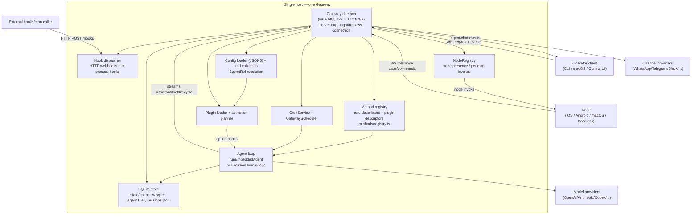

# Gateway runtime + protocol + agent loop

This is the substrate every OpenClaw feature plugs into: one long-lived
WebSocket daemon ("the Gateway") that owns all channel connections, a single
typed RPC/event protocol shared by operator clients and device nodes, the
per-session agent loop, and the config/plugin/state machinery underneath.

## What it is / user-visible behavior

- A **single long-lived Gateway process owns all messaging surfaces** (WhatsApp,
  Telegram, Slack, Discord, Signal, iMessage, WebChat) and is *the only place a
  WhatsApp session is opened* (`docs/concepts/architecture.md:10`,
  `docs/concepts/architecture.md:173`).
- Control-plane clients (macOS app, CLI, web UI/Control UI, automations) and
  **nodes** (macOS/iOS/Android/headless) both connect over the *same* WebSocket
  server; nodes declare `role: node` with explicit caps/commands
  (`docs/concepts/architecture.md:15`, `docs/concepts/architecture.md:41`).
- One Gateway per host, default bind `127.0.0.1:18789`
  (`docs/concepts/architecture.md:13`, `src/config/paths.ts:297`).
- The Gateway also hosts HTTP surfaces on the same port: Canvas/A2UI widget
  documents, webhook ingress, OpenAI-compatible APIs, and Control UI
  (`docs/concepts/architecture.md:18`, `docs/gateway/protocol/transport.md:37`).
- The agent loop is *serialized per session*: a message becomes actions + a
  reply through intake → context assembly → model inference → tool execution →
  streaming → persistence (`docs/concepts/agent-loop.md:9`).
- Config lives in a JSON5 file (`~/.openclaw/openclaw.json`) that the Gateway
  **watches and hot-reloads**; invalid reloads are skipped
  (`src/config/io.load.ts:114`, `docs/gateway/configuration.md:74`).

## End-to-end flow

## Mechanisms

### Process model: single gateway, loopback bind, auth modes

- Entry point lazily imports the full server, then acquires an exclusive
  **gateway state lock** (`listenerMode: "foreground"`) before the runtime
  starts, so one process owns a state directory
  (`src/gateway/server.ts:24`, `src/gateway/server.ts:33-36`).
- Startup resolves the SQLite state path and asserts owner access before
  continuing (`src/gateway/server.ts:44-46`).
- The kernel/server defaults `port = 18789`
  (`src/gateway/server-kernel.ts:113`, `src/gateway/server.ts:25`).
- Bind host is resolved from `gateway.bind`: `"loopback" → "127.0.0.1"`,
  `auto/tailnet` prefer loopback and fall back to `0.0.0.0`, and Tailscale
  serve/funnel *hard-requires* loopback (`src/gateway/net.ts:247-254`,
  `src/gateway/net.ts:264-266`, `src/gateway/net.ts:293-297`).
- Startup refuses a non-loopback bind without a shared secret or
  `trusted-proxy` auth, and refuses Tailscale serve/funnel on a non-loopback
  bind (`src/gateway/server-runtime-config.ts:101-108`).
- HTTP listen is a single `httpServer.listen(port, bindHost)` with EADDRINUSE
  retry (`src/gateway/server/http-listen.ts:52`).
- **Auth modes** are `token`, `password`, `trusted-proxy`, `none`, plus
  device/bootstrap token methods (`src/gateway/auth.ts:39-44`). Ambiguous
  token+password config without an explicit `gateway.auth.mode` is rejected
  (`src/gateway/auth-mode-policy.ts:10`). `assertGatewayAuthConfigured` fails
  closed on missing/redacted secrets (`src/gateway/auth.ts:128-175`);
  `trusted-proxy` satisfies auth from request headers
  (`src/gateway/auth.ts:350`, `src/gateway/auth.ts:441`); `mode: "none"`
  disables shared-secret auth (private ingress only) (`src/gateway/auth.ts:472`).

### Transport + protocol

- WS upgrade routing attaches to the already-created HTTP server and branches by
  path: worker ingress, plugin node-capability routes, desktop observe/audio,
  node desktop/portal attach, then core Gateway control connections
  (`src/gateway/server-http-upgrades.ts:154`, `:194`, `:227`, `:291`, `:365`,
  `:388`, `:405`). Upgrades pass a pre-auth connection budget and
  `wss.handleUpgrade` (`src/gateway/server-http-upgrades.ts:121`,
  `:136`).
- Physical sockets adapt into the shared connection owner via
  `attachGatewayWsConnectionHandler` on the `wss` `"connection"` event
  (`src/gateway/server/ws-connection.ts:35`, `:47`).
- The first frame must be `connect`; the Gateway sends a pre-connect
  `connect.challenge` event carrying a nonce + ts, and the client signs it
  (`src/gateway/server/connection.ts:329-331`,
  `docs/gateway/protocol/handshake.md:16`).
- Frame shapes: request `{type:"req", id, method, params, traceparent?,
  expectedProfileId?}`, response `{type:"res", id, ok, payload|error}`, event
  `{type:"event", event, payload, seq?, stateVersion?, recipientProfileId?}`
  (`docs/gateway/protocol/transport.md:58-60`; schemas in
  `packages/gateway-protocol/src/schema/frames.ts:187`, `:196`, `:205`).
- `hello-ok` returns `protocol`, `server`, `features`, `snapshot`, `auth`,
  `policy` (maxPayload/maxBufferedBytes/tickIntervalMs/attachments) — all
  required by `HelloOkSchema`
  (`packages/gateway-protocol/src/schema/frames.ts:94`,
  `docs/gateway/protocol/handshake.md:74-90`).
- Handshake frames are atomically typed: `GatewayFrameSchema` is a union of
  req/res/event (`packages/gateway-protocol/src/schema/frames.ts:217`).
- Method dispatch happens in `createGatewayAuthenticatedRequestDispatcher`,
  which logs `req`, checks scope/authority, and calls the registry handler
  (`src/gateway/server/ws-connection/authenticated-request-dispatch.ts:63`,
  `:109`).
- The **method registry** normalizes descriptors, enforces unique names, and
  routes `getHandler`/`listAdvertisedMethods`/`getScope`
  (`src/gateway/methods/registry.ts:67-90`). Core descriptors live in
  `src/gateway/methods/core-descriptors.ts`; the advertised catalog merges core
  + channel-plugin methods (`src/gateway/server-methods-list.ts:14`,
  `:29`).
- **Schema/codegen**: TypeBox schemas are composed into one registry
  (`packages/gateway-protocol/src/schema/protocol-schemas.ts:8`), re-exported
  from the package barrel (`packages/gateway-protocol/src/schema.ts:6`), and
  generated to JSON Schema + Swift via `pnpm protocol:gen` /
  `protocol:gen:swift` (`docs/gateway/protocol/versioning.md:29-32`).
- **Versioning**: `PROTOCOL_VERSION=4`, `MIN_CLIENT_PROTOCOL_VERSION=4`,
  `MIN_NODE_PROTOCOL_VERSION=3`, `MIN_PROBE_PROTOCOL_VERSION=3`
  (`packages/gateway-protocol/src/version.ts:2-8`). Nodes may run N-1 (v3);
  plugin node capabilities are withheld until the node upgrades
  (`docs/gateway/protocol/versioning.md:23-28`).
- Limits: `MAX_PAYLOAD_BYTES = 25 MiB`, `MAX_BUFFERED_BYTES = 50 MiB`,
  `MAX_PREAUTH_PAYLOAD_BYTES = 64 KiB`, `TICK_INTERVAL_MS = 30_000`,
  `DEDUPE_TTL_MS = 5 min` (`src/gateway/server-constants.ts:2-14`).
- Client package: `GatewayClient` (facade) over `GatewayProtocolClient`
  (`request`, `sendConnect`) with default 30s request timeout and reconnect
  policy (`packages/gateway-client/src/client.ts:241`,
  `packages/gateway-client/src/protocol-client.ts:45`, `:130`, `:353`).

### Sessions, routing, queues/steering

- Session keys are canonicalized as `agent:<agentId>:<...>`; the main session is
  `agent:<agentId>:main` (`src/routing/session-key.ts:46-47`,
  `docs/concepts/main-session.md:16`).
- Route selection maps inbound channel/peer → session key
  (`src/routing/resolve-route.ts:269`), and `buildAgentSessionKey`
  resolves the store key (`src/routing/resolve-route.ts:99`).
- Session store is a per-agent `sessions.json` beside per-session transcript
  files; SQLite owns transcripts/indexes
  (`src/config/sessions/paths.ts:57-58`, `src/config/sessions/paths.ts:287`).
- Runs serialize through **per-session and global lanes**; the orchestrator
  binds `enqueueGlobal`/`enqueueSession` and queues the embedded run
  (`src/agents/embedded-agent-runner/run-orchestrator.ts:106`, `:194`,
  `:713`).
- Queue modes `steer|followup|collect|interrupt`; `steer` (default) injects a
  new prompt into the active run at tool/model boundaries, skipping only
  *unstarted* sequential tool calls with synthetic "Skipped…" results
  (`docs/concepts/queue-steering.md:11`, `:19-27`, `:64-69`).
- Gateway RPC `agent` returns `{runId, acceptedAt}` immediately; `agent.wait`
  waits for the terminal outcome `{status, startedAt, endedAt, error?}`
  (`docs/concepts/agent-loop.md:20-24`,
  `src/gateway/server-methods/agent.ts:19`, `:63-65`).

### Turn lifecycle (agent loop, tools, streaming)

- `runEmbeddedAgent` resolves model + auth profile, builds the session,
  subscribes to runtime events, streams assistant/tool deltas, enforces the run
  timeout, and returns payloads + usage
  (`src/agents/embedded-agent-runner/run-orchestrator.ts:106`).
- Event streams are `lifecycle` (`start|finishing|end|error`), `assistant`,
  and `tool` (`docs/concepts/agent-loop.md:151-155`).
- Two hook systems run inside the loop: **internal hooks** (`HOOK.md` command
  events `command:new|reset|stop`, `agent:bootstrap`) and **plugin hooks**
  (`before_model_resolve`, `before_prompt_build`, `before_agent_reply`,
  `before_tool_call`/`after_tool_call`, `tool_result_persist`,
  `message_*`, `session_start/end`, `gateway_start/stop`)
  (`docs/concepts/agent-loop.md:63-95`).
- Streaming: adjacent text appends may merge; snapshots/content-block changes/
  reasoning/tool/terminal events are boundaries; block streaming emits partial
  replies on `text_end`/`message_end` (`docs/concepts/agent-loop.md:109-115`).
- A durable `activeWriterRunId` claim fences every transcript append/rewrite;
  superseded runs cannot commit stale transcript data
  (`docs/concepts/agent-loop.md:50`).
- Timeouts: `agent.wait` 30s (wait-only), agent runtime
  `agents.defaults.timeoutSeconds` 48h, model idle 120s cloud / 300s self-hosted,
  provider HTTP timeout `models.providers.<id>.timeoutSeconds`
  (`docs/concepts/agent-loop.md:211-217`).

### Config system (JSON5, schema, SecretRefs, hot reload)

- Config is parsed with `json5.parse`, includes are resolved, env substitution
  applied, then validated with plugins
  (`src/config/io.load.ts:110-119`, `:114`, `:154`).
- Missing config materializes runtime defaults (fresh-install path)
  (`src/config/io.load.ts:84-108`).
- Validation entrypoints are `validateConfigObjectWithPlugins` (and raw/async
  variants) exported from `src/config/config.ts:84`.
- **SecretRefs** are a discriminated union on `source` = `env | file | exec | store`
  (`src/config/zod-schema.secret-input.ts:22-54`; `SecretInputSchema` accepts a
  plain string *or* a SecretRef (`:57`). Startup forbids a SecretRef for
  `gateway.auth.password` because the secrets system has not initialized yet
  (`src/gateway/auth.ts:157`).
- Gateway config schema imports the full operator-scope enum and enforces the
  single multiplexed WS+HTTP port (`src/config/zod-schema.gateway.ts:29`,
  `:129`).
- **Hot reload**: `startGatewayConfigReloader` watches the authored config hash
  and applies a reload plan; invalid reloads are skipped
  (`src/gateway/config-reload.ts:92-104`,
  `docs/gateway/configuration.md:74`, `:109`).

### Plugin loading / activation

- Public facade `loadOpenClawPlugins` + `loadPluginRegistryHandle`
  (activate:false) (`src/plugins/loader.ts:17-30`).
- Gateway startup builds a plugin plan and resolves channel plugin ids
  (`src/plugins/gateway-startup-plugin-loader.ts:73`, `:13`).
- `resolveManifestActivationPlan` decides which plugins activate from manifests
  (`src/plugins/activation-planner.ts:76`).
- Plugin gateway methods pass through namespace policy so plugins cannot weaken
  protected core prefixes (`src/gateway/methods/registry.ts:22-36`;
  reserved prefixes `config.*`, `exec.approvals.*`, `wizard.*`, `update.*` →
  `operator.admin`, `docs/gateway/protocol/handshake.md:352`).
- Plugins receive the versioned `PluginServiceSchedulerV1` capability with
  `beginClose()`/`stop()` (`docs/concepts/architecture.md:165-169`).

### State persistence

- The shared state DB is SQLite at `<stateDir>/state/openclaw.sqlite`;
  a quarantine DB sits beside it (`src/state/openclaw-state-db.paths.ts:34-46`).
- Per-agent databases have their own schema + additive migrations and FTS for
  session transcripts (`src/state/openclaw-agent-db-schema.ts:231`, `:311-335`,
  `:595`).
- SQLite writer queue orders per-agent mutations; the state-directory lock
  prevents a second Gateway or `openclaw agent --local` from owning the same
  directory (`docs/concepts/agent-loop.md:50`).

### Cron / hooks / automation surface

- `buildGatewayCronService` constructs the `CronService`
  (`src/gateway/server-cron.ts:153`, `:502`); cron jobs are declarative and
  persistence-backed (`src/cron/service/jobs.ts`,
  `src/cron/service/timer-scheduler.ts`).
- `GatewayScheduler` is the single host-timer owner; `beginClose()` closes
  admission and cancels wakes, `stop()` joins callbacks
  (`src/infra/gateway-scheduler.ts:67`, `:204`, `:216`;
  `docs/concepts/architecture.md:146-163`).
- Hooks: `createGatewayHookDispatcher` and
  `createGatewayHooksRequestHandler` expose HTTP webhook ingress that maps to
  agent dispatches (`src/gateway/server/hooks.ts:190`, `:712`;
  `src/gateway/server/hooks-request-handler.ts:93`). External HTTP webhooks are
  distinct from in-process hook event subscriptions
  (`docs/concepts/agent-loop.md:70`).

### Node / device connection model

- Nodes connect over the same WS server with `role: "node"`,
  `caps`/`commands`/`permissions`; the Gateway treats these as *claims* and
  enforces server-side allowlists
  (`docs/gateway/protocol/handshake.md:276-318`, `:386`).
- `NodeRegistry` tracks `nodesById` and `pendingInvokes`, forwards progress,
  cancels, and disconnects pending invokes
  (`src/gateway/node-registry.ts:175`, `:179`).
- Node events broadcast host stats and presence
  (`src/gateway/server-node-events.ts:990`, `:1005`); the broadcaster scopes
  delivery per recipient (`src/gateway/server-broadcast.ts:189`, `:180-186`).
- Node-published plugin tools/skills use `node.pluginTools.update` /
  `node.skills.update` and are removed on disconnect
  (`docs/gateway/protocol/handshake.md:386-396`).

## Key contracts & data shapes

- Protocol version constants: `PROTOCOL_VERSION`, `MIN_CLIENT_PROTOCOL_VERSION`,
  `MIN_NODE_PROTOCOL_VERSION`, `MIN_PROBE_PROTOCOL_VERSION`
  (`packages/gateway-protocol/src/version.ts:2-8`).
- Frames: `ConnectParamsSchema`, `HelloOkSchema`, `RequestFrameSchema`,
  `ResponseFrameSchema`, `EventFrameSchema`, `GatewayFrameSchema`
  (`packages/gateway-protocol/src/schema/frames.ts:31`, `:94`, `:187`, `:196`,
  `:205`, `:217`).
- Gateway events: `connect.challenge`, `agent`, `chat`, `models.snapshot`,
  `session.*`, `presence`, `tick`, `talk.*`, `shutdown`, `gateway.suspension`
  (`src/gateway/server-methods-list.ts:34`); update/device events in
  `src/gateway/events.ts:8-16`.
- Roles: `operator | node | worker`; operator scopes include
  `operator.read|write|admin|approvals|questions|pairing|talk|talk.secrets` plus
  `operator.sessions.read|write` (`docs/gateway/protocol/handshake.md:325-341`,
  `src/gateway/operator-scopes.ts:1-10`).
- Auth result: `GatewayAuthResult { ok, method: token|password|device-token|
  bootstrap-token|trusted-proxy, ... }` (`src/gateway/auth.ts:35-44`).
- Registry: `createGatewayMethodRegistry(inputs, pluginRegistry?)`,
  `GatewayMethodDescriptor`, `getHandler/listMethods/getScope`
  (`src/gateway/methods/registry.ts:6`, `:67-90`).
- Session key: `buildAgentMainSessionKey`, `DEFAULT_AGENT_ID = "main"`,
  `buildAgentSessionKey` (`src/routing/session-key.ts:46-47`,
  `src/routing/resolve-route.ts:99`).
- Agent loop: `runEmbeddedAgent` (`src/agents/embedded-agent-runner/run-orchestrator.ts:106`);
  `agentHandlers` / `agentWaitHandler` (`src/gateway/server-methods/agent.ts:19`,
  `:63`).
- Config: `SecretRefSchema`, `SecretInputSchema`
  (`src/config/zod-schema.secret-input.ts:22`, `:57`).
- Client: `GatewayClient`, `GatewayClientRequestTimeoutError`,
  `GatewayProtocolClient` (`packages/gateway-client/src/client.ts:241`, `:154`;
  `packages/gateway-client/src/protocol-client.ts:45`).

## Tests & QA

- Protocol schemas are schema-tested (`packages/gateway-protocol/src/channels.schema.test.ts`,
  `devices.schema.test.ts`, `openclaw.schema.test.ts`,
  `primitives.secretref.test.ts`).
- Handshake/auth suites: `src/gateway/server.auth.control-ui.pairing.suite.ts`,
  `src/gateway/auth-mode-policy.test.ts`, `src/gateway/auth.test.ts`.
- Connection/dispatch: `src/gateway/server/connection.test.ts`,
  `src/gateway/server/ws-connection/authenticated-request-dispatch.server.test.ts`.
- Methods: `src/gateway/server-methods-list.test.ts`,
  `src/gateway/server-methods.authorization.test.ts`,
  `src/gateway/methods/registry.test.ts`.
- Client: `packages/gateway-client/src/protocol-client.handshake.test.ts`,
  `client.handshake.test.ts`, `reconnect-policy.test.ts`.
- Cron/hooks: `src/gateway/server-cron.test.ts`,
  `src/gateway/hooks.test.ts`, `src/gateway/hooks-mapping.test.ts`.
- Config: `src/config/config-misc.test.ts`, `io.*` suites,
  `src/gateway/config-reload.test.ts`.
- E2E: `src/gateway/*.e2e.test.ts` (e.g.
  `gateway.compaction-hot-reload.e2e.test.ts`,
  `gateway.sessions-send-hot-reload.e2e.test.ts`).

## Port notes to ROX

ROX (`Bun 1.3.14 + Electron 39 + React 18`, `packages/{core,shared,server-core,server}`,
`apps/electron`) already has an OMP RPC execution model, HTTP/WS backend, and a
330-skill catalog. Concrete mapping:

- **Process model → `apps/electron/src/main`**: mirror the single-owner +
  state-lock pattern. ROX's Electron main should acquire one exclusive
  `~/.rox` state lock and refuse a non-loopback bind without a shared secret
  (port `gateway-runtime` checks into the Electron main bootstrap). In Electron
  the preferred shape is **one in-process gateway module** rather than a
  child daemon; keep the `resolveGatewayBindHost`/refuse-non-loopback-without-auth
  invariant in `packages/server-core`.
- **Transport/protocol → `packages/server-core` + `packages/shared`**: adopt the
  frame triple (`req`/`res`/`event`), the `connect`-first handshake with a
  `connect.challenge` nonce, and `hello-ok` negotiation (`protocol`, `features`,
  `snapshot`, `auth`, `policy`). Replace OpenClaw's TypeBox codegen with ROX's
  existing schema approach (zod/TypeScript) but keep a **single generated
  contract packet** consumed by both Bun server and renderer/preload, plus an
  N-1 compatibility window.
- **Sessions/routing**: ROX already routes sessions/tasks via OMP RPC; port the
  canonical `agent:<id>:main` key convention, per-session + global lane
  serialization, and the `steer|followup|collect|interrupt` queue modes as the
  OMP session queue policy. Reuse ROX's `packages/server-core/src/meetings`
  session plumbing as the concrete session store.
- **Agent loop**: keep OMP as the model/tool executor; port only the *gateway
  side* of the loop — `agent` returns `{runId, acceptedAt}` immediately,
  `agent.wait` waits terminal, streaming is `lifecycle`/`assistant`/`tool`
  streams, and the `activeWriterRunId` transcript fence must be enforced where
  ROX writes transcripts.
- **Config/secrets → `packages/core/src/platform/identity`**: ROX is
  Russian-first and already has an identity/credential fabric; map OpenClaw
  SecretRef (`env|file|exec`) onto ROX credential sources rather than inventing a
  parallel store. JSON5 config is a good fit for a `~/.rox/config.json5` with a
  zod schema and a watched-file hot reload plus invalid-reload skip.
- **Plugins/skills**: ROX's 330-skill catalog maps to OpenClaw's skill snapshots;
  port the **activation planner + namespaced gateway-method policy** (plugin
  methods cannot weaken reserved core prefixes) rather than the full plugin
  loader. ROX should keep plugin/tool descriptors registered through the same
  method registry as core.
- **State**: ROX can use SQLite via Bun's `bun:sqlite` for the equivalent of
  `state/openclaw.sqlite` + per-agent DBs; keep sessions as JSON index + SQLite
  transcript rows and enforce the single-writer lock.
- **Cron/hooks**: port `GatewayScheduler` (one host timer, coalesced missed
  ticks, `beginClose`/`stop` semantics) and expose `/hooks` HTTP ingress plus
  in-process hooks behind ROX's existing HTTP server. ROX meetings/automation
  can register jobs on the same scheduler.
- **Nodes**: map OpenClaw nodes onto ROX's desktop/device model — same WS
  server, `role: node`, caps/commands/permissions *claims* enforced server-side,
  and a `NodeRegistry` equivalent for presence + pending invokes.

## Risks & unknowns

- **Scale/shape mismatch.** OpenClaw's gateway is a standalone Node daemon with
  ~4363 gateway files and a codegen pipeline; ROX runs a Bun+Electron app with
  in-process execution. A literal port is wrong; the *invariants* (single owner,
  loopback default, refuse non-loopback without auth, connect-first handshake,
  scope-gated method registry, per-session lane) are the real product.
- **Auth mode surface.** `trusted-proxy`, Tailscale serve/funnel, device tokens,
  and bootstrap setup-code handoff are deeply intertwined with native clients
  (`src/gateway/auth.ts:350-516`). ROX's identity fabric may not need
  device-pairing/QR bootstrap at all — decide scope before porting.
- **Protocol codegen.** OpenClaw generates JSON Schema + Swift from TypeBox
  (`docs/gateway/protocol/versioning.md:29-32`). If ROX targets Electron only
  (no native Swift), the entire Swift codegen leg is moot; do not port it.
- **SecretRef for bootstrap secrets.** `gateway.auth.password` cannot be a
  SecretRef because the secrets provider initializes after gateway startup
  (`src/gateway/auth.ts:157`). ROX must reproduce this ordering constraint or
  design bootstrap credentials separately.
- **N-1 window and feature negotiation.** Exact N-1 node semantics, the worker
  closed protocol, and capability-gated tools
  (`docs/gateway/protocol/handshake.md:220-257`, `:259-274`) are
  partially documented; `UNVERIFIED:` the precise wire validation for worker
  `worker.inference.start` (25 MiB negotiated frame) is only described in docs,
  not confirmed against a validator in this slice.
- `UNVERIFIED:` whether the gateway state lock is advisory across platforms
  (the code path was read at `src/gateway/server.ts:33-36` but the lock
  implementation in `src/infra/gateway-lock.ts` was not read in this slice).
- `UNVERIFIED:` exact `sessions.json` vs SQLite division of truth for session
  *metadata* — the paths were read (`src/config/sessions/paths.ts:57-58`) but
  the metadata commit path was not fully traced.