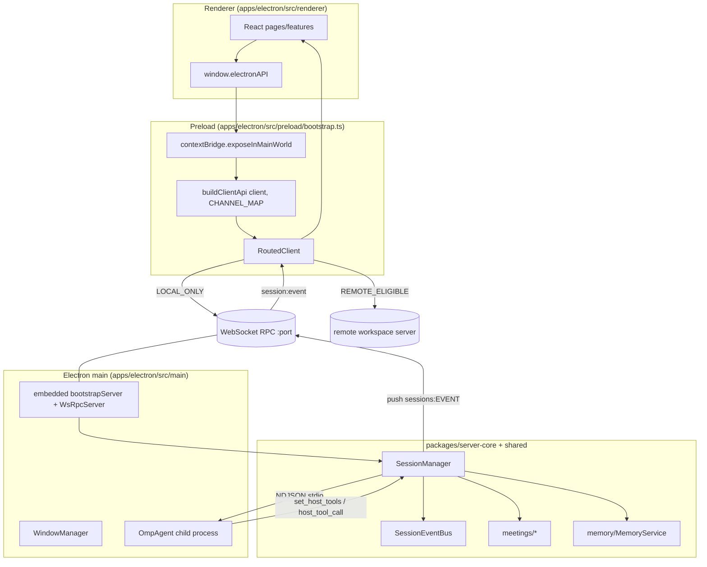

# G — ROX target surface (port destination)

This area documents **where** OpenClaw feature areas (a1 multi-user, b1 Control UI, b2
canvas/workboard, c1 memory, c2 skills, d1 voice, d2 meetings, e1/e2 macOS) can be ported
into the ROX desktop app. All OpenClaw citations are `path:line` against
`/Users/t/Projects/openclaw`; all ROX citations are `path:line` against the read-only clone
`/Users/t/Projects/rox-one` (fork of `craft-ai-agents/craft-agents-oss`, Bun 1.3.14 +
Electron 39 + React 18 + Tailwind v4).

> Scope note: this is a *destination survey*, not an OpenClaw feature spec. It answers
> "which ROX file owns this responsibility, and what is the nearest existing analogue".

---

## 1. What it is / user-visible behavior

ROX is a macOS-first personal AI-agent workspace. A single Electron app launches an
**embedded Node/WebSocket RPC server** in its own main process; the renderer talks to that
server (or to a remote server that owns the active workspace) through a typed, channel-routed
client. User-visible surfaces (per `DESIGN.md:32`, `docs/ru/RX-DOC-0024-hub.md:9`): Sessions,
Map Canvas, Local Knowledge/Notes, embedded Browser, Tasks/Calendar, and onboarding.

Every agent, task and helper session executes through the **OMP (oh-my-pi) runtime** as a
first-class backend (`AGENTS.md:11-17`): all user/task/auxiliary sessions run via OMP RPC, old
connections migrate to the configured OMP connection, and each request auto-activates
`orchestrate workflowz ultrathink` with maximum thinking (`AGENTS.md:48-51`).

ROX is already partly an OpenClaw integration host: it ships an **OpenClaw host-control**
surface (install/provision/start/stop + security audit) — `apps/electron/src/main/openclaw-host-control.ts:346`,
`packages/server-core/src/openclaw/runtime-manager.ts`, `packages/shared/src/openclaw/types.ts:73`.

---

## 2. End-to-end flow

---

## 3. Mechanisms (mechanism → evidence)

### 3.1 Electron main↔renderer IPC: typed channels + preload bridge

- The preload builds the renderer's API from a **single method→channel map** rather than
  hand-written `ipcRenderer` wrappers: `apps/electron/src/transport/channel-map.ts:19`
  (`CHANNEL_MAP`) maps `ElectronAPI` method names to `RPC_CHANNELS` entries, and
  `apps/electron/src/transport/build-api.ts:26` (`buildClientApi`) turns each entry into an
  `invoke`/`listener` function; dotted keys (`browserPane.create`) become nested namespaces
  (`build-api.ts:64-79`).
- Errors are **re-shaped, not thrown as `Error`**, because Electron's `contextBridge` copies
  native `Error`s by message only and drops `code`/`data`
  (`apps/electron/src/transport/build-api.ts:44-58`; pinned by
  `tests/lark-suite-extension/bridge-errors.test.ts`).
- The preload wires two real transports and exposes the merged proxy:
  `contextBridge`/`ipcRenderer` imported at `apps/electron/src/preload/bootstrap.ts:20`;
  workspace id/port resolved via `sendSync('__get-ws-port')`
  (`apps/electron/src/preload/bootstrap.ts:128`); `buildClientApi(client, CHANNEL_MAP, …)`
  at `apps/electron/src/preload/bootstrap.ts:241`.
- Channel names are the contract: `RPC_CHANNELS` (`packages/shared/src/protocol/channels.ts:6`),
  typed push events in `packages/shared/src/protocol/events.ts:56`
  (`[RPC_CHANNELS.sessions.EVENT]: [event: SessionEvent]`).
- Routing is exhaustive and CI-enforced: `packages/shared/src/protocol/routing.ts:17`
  (`LOCAL_ONLY_CHANNELS`) vs `:498` (`REMOTE_ELIGIBLE_CHANNELS`); every channel must be
  classified (exhaustiveness test). `RoutedClient` picks local vs workspace client per
  channel (`apps/electron/src/transport/routed-client.ts:104-111`) and re-subscribes
  `REMOTE_ELIGIBLE` listeners across workspace switches (make-before-break,
  `routed-client.ts:1-11`).
- **`lint:ipc-sends` rule**: `package.json:67` (`"lint:ipc-sends": "bash scripts/check-raw-sends.sh"`),
  part of `lint` (`package.json:81`). The script forbids raw
  `webContents|sender|window.send(` in `apps/electron/src/{main,preload}` outside a tiny
  allowlist (`scripts/check-raw-sends.sh:7`, `:13-32`), scanning with ripgrep at `:52-53`
  and failing with "Route new IPC through the typed transport/event sink" (`:47`).

### 3.2 HTTP/WS backend: packages/server + packages/server-core

- `packages/server/src/index.ts` is the standalone headless server entry owned by Bun
  (`#!/usr/bin/env bun`, `:1`); env contract includes `CRAFT_SERVER_TOKEN`, `CRAFT_RPC_PORT`
  (default 9100), TLS and `CRAFT_WEBUI_DIR` (`:3-29`). It boots via `bootstrapServer`
  (`:36`) and registers RPC handlers with `registerCoreRpcHandlers` (`:50`).
- The transport is `WsRpcServer` re-exported through `apps/electron/src/transport/server.ts:1`
  from `@rox/server-core/transport`. `WsRpcServer implements RpcServer`
  (`packages/server-core/src/transport/server.ts:197`) and attaches a `WebSocketServer`
  (`:198`) either to an HTTPS server (`:617`) or plain HTTP (`:633`), with upgrade/cookie
  validation at `:855`.
- The client side is `WsRpcClient implements RpcClient`
  (`packages/server-core/src/transport/client.ts:124`) with auto-reconnect + exponential
  backoff (`:39-45`, `:100`) and a synthetic `__transport:reconnected` event (`:300`).
- Interface contract: `RpcServer`/`RpcClient`/`RequestContext`/`RpcHandlerOptions`
  (`packages/server-core/src/transport/types.ts:66`, `:85`, `:28`, `:46`); handlers may opt
  into `access: 'localElectron' | 'nativeOrLocalElectron' | 'authenticatedWorkspace'` (`:47`).
- Both hosts (Electron main and standalone headless) share wiring:
  `packages/server-core/src/bootstrap/headless-start.ts:502` constructs the `WsRpcServer`;
  the native event channel set is declared at `:507-516`.
- **WebUI (Control UI analogue) is served by the same server**: `createWebuiHandler` /
  `nodeHttpAdapter` (`packages/server-core/src/webui/index.ts:1-2`) exposes `/login` (`:244`),
  `POST /api/auth` (`:268`), `GET /api/config` (`:379`), `GET /api/config/workspaces` (`:390`)
  in `packages/server-core/src/webui/http-server.ts`. The browser client lives in
  `apps/webui/src/` (`browser-main.tsx`, `adapter/web-api.ts`, `rox2-webui-surface.ts:12`).

### 3.3 Sessions/tasks via OMP RPC and where a per-session event stream attaches

- OMP is spawned as a child process speaking NDJSON over stdio in `--mode rpc`
  (`docs/omp-rpc-notes.md:40-43`, `:105-114`). `OmpAgent extends BaseAgent`
  (`packages/shared/src/agent/omp-agent.ts:386`), ready-timeout `OMP_READY_TIMEOUT_MS = 90_000`
  (`:144`), context prompt `OMP_ROX_CONTEXT_PROMPT` (`:167`), launch spec
  `buildOmpLaunchSpec` (`:243`).
- **Critical protocol fact**: the host MUST answer every `extension_ui_request` or the prompt
  pipeline stalls (`docs/omp-rpc-notes.md:42`); `OmpAgent` sends
  `type:'extension_ui_response'` at `omp-agent.ts:1645`.
- ROX session tools are published into OMP via `set_host_tools` (`omp-agent.ts:1711`, `:1745`);
  the shared builder `buildSessionToolDefs` lives in
  `packages/shared/src/agent/session-tool-defs.ts:61` and the canonical defs
  (`call_llm`, `spawn_session`, `browser_tool`, `mcp__session__*`) in
  `packages/session-tools-core/src/tool-defs.ts:878-883`; the same tool set is exposed to
  Codex over MCP by `packages/session-mcp-server/src/index.ts` (stdio transport, `__CALLBACK__`
  stderr protocol).
- Branching anchors: `OmpAgent` enqueues `omp_turn_anchor` at `omp-agent.ts:2285`, persisted to
  `<session>/meta/omp-turn-anchors.json` (`docs/omp-rpc-notes.md:95`, `AGENTS.md:29`).
- **Per-session event stream attach point**: `SessionManager` publishes every session event to
  the RPC event sink at `packages/server-core/src/sessions/SessionManager.ts:10788`
  (`this.eventSink(RPC_CHANNELS.sessions.EVENT, { to:'workspace', workspaceId }, event)`).
  In-process lifecycle events flow through the typed `SessionEventBus`
  (`packages/server-core/src/sessions/SessionEventBus.ts:159`; event map `:136`; noop instance
  `:214`). A new feature that needs a live per-session stream should subscribe to
  `SessionEventBus` (server-side consumers) or add a case to the `sessions.EVENT` projector —
  **not** open a second socket.

### 3.4 Meetings: structures that exist today

- **Server-side domain**: `packages/server-core/src/meetings/` — journal, repository, schema
  migrations, proposals, executor, capture/finalize/manual intents, outbox, retention,
  sharing, verification. Exports at `packages/server-core/src/meetings/index.ts:1-25`;
  `MeetingRepository` at `packages/server-core/src/meetings/repository.ts:4`;
  evidence/gate model `EvidenceLevel`/`GateStatus`/`MeetingOpStatus` in
  `packages/server-core/src/meetings/types.ts:6-20`.
- **Electron main**: capture + local ASR + overlay + screen context live under
  `apps/electron/src/main/meetings/` (`capture.ts`, `local-asr.ts`, `local-store.ts`,
  `overlay.ts`, `ipc.ts`, `screen-context.ts`); the native capture IPC surface is
  `MEETING_CAPTURE_IPC` + `registerMeetingCaptureIpc`
  (`apps/electron/src/main/meetings/ipc.ts:21`, `:50`); persistence `LocalMeetingStore`
  (`apps/electron/src/main/meetings/local-store.ts:111`).
- **Shared types**: `apps/electron/src/shared/meetings-local.ts` — `MEETINGS_LOCAL_IPC`
  (`:12`), `LocalMeeting` (`:159`), `LocalTranscript` (`:205`), `MeetingsLocalApi` (`:247`).
- **Meeting agents (multi-role)**: `packages/shared/src/meeting-agents/` — dispatcher
  `MeetingJobDispatcher` + `routeMeetingEvent` (`router.ts:149`, `:178`, concurrency
  `MEETING_CONCURRENT_JOBS = 2` at `:23`), planning `planMeetingActions` (`planning.ts:116`),
  plus `recipes.ts`, `policies.ts`, `extraction.ts`, `knowledge.ts`, `artifacts.ts`.
- **What exists vs an OpenClaw-style "meeting bot"**: ROX has capture (mic/import), local or
  cloud ASR, transcript segments + manual corrections, extraction of decisions/tasks,
  proposals with approve/reject journals, and room/mail/CRM/calendar native shells
  (`meetings/index.ts:1-25`). It is **not** a channel-joining bot that mediates a live
  external conference; the bot-like "join a room" path is a native-shell intent
  (`joinNativeRoom`, `packages/server-core/src/meetings/conation/native-shells.ts`).

### 3.5 Skills catalog + discovery format

- Discovery scans three roots: `~/.omp/agent/skills`, `~/.agents/skills`,
  `<workspaceRoot>/.omp/skills` (`packages/shared/src/skills/omp-discovery.ts:23-29`),
  `listOmpSkills` (`:125`), 60 s TTL cache (`:50`, `:54`). OMP skills are read-only in the ROX
  UI and exported via RPC `skills:importOmp` (`AGENTS.md:30`).
- Managed/bundled skills: global root `~/.agents/skills`, app-managed `<config>/skills`,
  project `.agents/skills` (`packages/shared/src/skills/storage.ts:42-47`); `loadAllSkills`
  (`:302`). Bundling: `packages/shared/src/skills/bundled.ts:118` (`linkBundledSkillsForOmp`).
- **Pinned catalog**: `apps/electron/resources/skills/SKILLS.lock` (`version: 2`, `packs[]`
  with `slug/origin/commit/license/licenseFile/skills`) parsed by `readSkillsLock` +
  `SKILLS_LOCK_FILE` (`packages/shared/src/skills/bundled-core.ts:63`, `:163`). The 330-entry
  request manifest is `apps/electron/resources/skills/REQUESTED-SKILLS.json`
  (`skillCount: 330`, `packCount: 34`), per `AGENTS.md:52`.
- RPC surface: `RPC_CHANNELS.skills.GET/GET_DETAILS/GET_FILES/UPDATE/DELETE/IMPORT_OMP/
  GET_USAGE/PRUNE_UNUSED/EXPORT_TO_PROJECT/CHANGED`
  (`packages/shared/src/protocol/channels.ts`, routing `routing.ts:891-900`, `:122-123`).

### 3.6 Identity / credentials fabric

- Identity store + profile types: `packages/core/src/platform/identity/` —
  `IdentityStore`/`getIdentityStore` (`index.ts:24`), `Profile`/`WorkspaceMembership`/
  `ServiceConnection` (`index.ts:1-12`), credential refs `attach-credential-ref.ts`,
  `broker.ts`, `provider-contract.ts`, `revalidation.ts`.
- Credential fabric (the "connection fabric"): local providers, OS discovery, grants and
  leases live in `packages/shared/src/credentials/fabric/` — `InProcessCredentialBroker`
  (`broker.ts:73`), lease/grant types (`broker.ts:12-36`), importers
  (`keychain-importer.ts`, `aws-profile-importer.ts`, `ssh-agent-importer.ts`,
  `github-oauth-importer.ts`, …), delivery (`http-header-delivery.ts`, `materialization.ts`).
- Runtime credential manager: `CredentialManager` (`packages/shared/src/credentials/manager.ts:35`),
  singleton `getCredentialManager` (`:981`). RPC: `RPC_CHANNELS.fabric.*`
  (`routing.ts:470-483`, LOCAL_ONLY) and `RPC_CHANNELS.identity.*` (`routing.ts:465-468`
  local; `:510`, `:551-552` remote-eligible profile reads/edits).
- Native (non-Electron) principals are governed by `NativeAuthority`
  (`packages/server-core/src/authority/native-authority.ts:104`) with `NativePrincipal`
  (`:12`), `authenticate` (`:327`), `authorize` (`:449`), `permissionFence` (`:567`).

### 3.7 Updater / installer

- Auto-update uses `electron-updater` (`apps/electron/src/main/auto-update.ts:17`);
  feed is GitHub `rox-one/rox-one` (`:5`, `:309`) or a generic override (`:311`);
  `autoDownload = true` (`:289`), `allowPrerelease = true` (`:293`),
  `allowDowngrade = false` (`:294`). Download-progress + ready events are broadcast
  (`:270`, `:280`). Update RPC channels are LOCAL_ONLY (`routing.ts:153-160`).
- Packaging: `apps/electron/electron-builder.yml` — publish `provider: github` (`:91`),
  macOS `dmg` + `zip` (`:125-130`) with `Rox-${arch}.dmg` (`:182-183`), Windows `nsis`
  (`:203-204`), Linux `AppImage` (`:277-278`). Scripts: `dist:mac`/`dist:win` in
  `apps/electron/package.json:32-34`. Manual release path:
  `apps/electron/src/main/manual-release-update.ts`.

### 3.8 i18n constraints

- Default UI language is **Russian**: `DEFAULT_LANGUAGE_CODE = "ru"`
  (`packages/shared/src/i18n/languages.ts:6`); init binds `fallbackLng: [ru, en]` and
  bundles resources inline (`packages/shared/src/i18n/setupI18n.ts:30`, `:42`, `:45-48`).
- 12 locales under `packages/shared/src/i18n/locales/*.json` (ar, de, en, es, fr, hu, ja, ko,
  pl, ru, zh-Hans, zh-Hant). **Hard rule** (`AGENTS.md:8`): ALL user-facing strings go through
  `t()` from react-i18next; a new key MUST be added to all 12 files, ASCII-sorted, and parity
  is checked by `bun test packages/shared/src/i18n`. Russian plural keys use
  `_one/_few/_many` (`AGENTS.md:9`). Root scripts add parity/sorted/coverage gates
  (`package.json:77-80`).

---

## 4. Key contracts & data shapes (exact names)

| Contract | Name | Location |
|---|---|---|
| Channel registry | `RPC_CHANNELS` (`sessions:get`, `session:event`, `meetings:*`, `skills:*`) | `packages/shared/src/protocol/channels.ts:6` |
| Push event typing | `[RPC_CHANNELS.sessions.EVENT]: [event: SessionEvent]` | `packages/shared/src/protocol/events.ts:56` |
| Method→channel map | `CHANNEL_MAP` / `ChannelMap` / `ChannelMapEntry` | `apps/electron/src/transport/channel-map.ts:19`, `build-api.ts:16-20` |
| Proxy builder | `buildClientApi(client, channelMap, isChannelAvailable)` | `apps/electron/src/transport/build-api.ts:26` |
| Routing sets | `LOCAL_ONLY_CHANNELS`, `REMOTE_ELIGIBLE_CHANNELS`, `isLocalOnly` | `packages/shared/src/protocol/routing.ts:17`, `:498` |
| Transport server/client | `WsRpcServer`, `WsRpcClient`, `RequestContext`, `HandlerFn`, `RpcHandlerOptions` | `packages/server-core/src/transport/{server.ts:197,client.ts:124,types.ts:28,40,46}` |
| Routes on the WS host | `sessions.EVENT` push target `{ to:'workspace', workspaceId }` | `packages/server-core/src/sessions/SessionManager.ts:10788` |
| Session lifecycle bus | `SessionEventBus`, `SessionLifecycleEventMap`, `NOOP_SESSION_EVENT_BUS` | `packages/server-core/src/sessions/SessionEventBus.ts:136,159,214` |
| OMP agent | `OmpAgent`, `buildOmpLaunchSpec`, `composeOmpAppendSystemPrompt`, `omp_turn_anchor` | `packages/shared/src/agent/omp-agent.ts:386,243,200,2285` |
| Session tool defs | `buildSessionToolDefs`, `spawn_session`, `call_llm`, `browser_tool`, `mcp__session__*` | `session-tool-defs.ts:61`, `packages/session-tools-core/src/tool-defs.ts:878-883` |
| Meetings local | `MEETINGS_LOCAL_IPC`, `LocalMeeting`, `LocalTranscript`, `MeetingsLocalApi` | `apps/electron/src/shared/meetings-local.ts:12,159,205,247` |
| Meeting ops model | `EvidenceLevel`, `GateStatus`, `MeetingOpStatus`, `MeetingRepository` | `packages/server-core/src/meetings/{types.ts:6-20,repository.ts:4}` |
| Meeting agents | `MeetingJobDispatcher`, `routeMeetingEvent`, `planMeetingActions` | `packages/shared/src/meeting-agents/{router.ts:178,149,planning.ts:116}` |
| Skills discovery | `OMP_GLOBAL_SKILLS_DIR`, `OMP_SHARED_SKILLS_DIR`, `listOmpSkills`, `loadAllSkills` | `packages/shared/src/skills/omp-discovery.ts:23-29,125`, `storage.ts:302` |
| Skills lock | `SKILLS_LOCK_FILE`, `readSkillsLock`, `SkillsLockPack` | `packages/shared/src/skills/bundled-core.ts:63,163,66` |
| Identity | `IdentityStore`, `Profile`, `ServiceConnection`, `NativePrincipal`, `NativeAuthority` | `packages/core/src/platform/identity/index.ts:24,1`, `packages/server-core/src/authority/native-authority.ts:12,104` |
| Credentials | `CredentialManager`, `getCredentialManager`, `InProcessCredentialBroker` | `packages/shared/src/credentials/manager.ts:35,981`, `fabric/broker.ts:73` |
| Update | `autoUpdater`, `getUpdateInfo`, `broadcastDownloadProgress` | `apps/electron/src/main/auto-update.ts:17,262,280` |
| i18n | `DEFAULT_LANGUAGE_CODE`, `SUPPORTED_LANGUAGE_CODES`, `setupI18n` | `packages/shared/src/i18n/languages.ts:6,10`, `setupI18n.ts:30` |

---

## 5. Tests & QA

- IPC bridge error shape is pinned by `tests/lark-suite-extension/bridge-errors.test.ts`
  (referenced at `build-api.ts:51`).
- Channel routing exhaustiveness is CI-enforced (`routing.ts:8` — "exhaustiveness test").
- IPC lint: `bun run lint:ipc-sends` = `scripts/check-raw-sends.sh`
  (`package.json:67`), inside `bun run lint` (`:81`).
- i18n gates: `lint:i18n:parity`, `lint:i18n:sorted`, `lint:i18n:coverage`
  (`package.json:77-80`), plus `bun test packages/shared/src/i18n` (`AGENTS.md:8`).
- Transport tests: `packages/server-core/src/transport/__tests__/` (server-lifecycle,
  codec-properties, response-admission, peer-trust, native-authorization).
- Sessions/meetings/memory/voice each carry `__tests__/` next to source
  (e.g. `packages/server-core/src/sessions/__tests__/session-event-bus.test.ts`,
  `packages/server-core/src/meetings/__tests__/`, `packages/shared/src/meeting-agents/__tests__/`).
- Full local gate: `bun run validate:ci` (`docs/ru/RX-DOC-0024-hub.md:55`) —
  `typecheck:all` + `test:shared:all` + i18n gates.

---

## 6. Port notes to ROX — per-area integration table (file-level targets)

| OpenClaw area | Nearest ROX analogue | Concrete ROX integration targets (file/dir) |
|---|---|---|
| **a1 multi-user** | Workspace membership + native authority + orgs | `packages/server-core/src/authority/native-authority.ts` (`NativeAuthority.authorize` :449, `permissionFence` :567); `packages/shared/src/orgs/{types.ts,storage.ts}`; `packages/server-core/src/collaboration/sync-service.ts:17`; `packages/shared/src/collaboration/{presence.ts:14,session-publication.ts,store.ts}`; `packages/core/src/platform/identity/store.ts`; RPC `RPC_CHANNELS.orgs.*` (`routing.ts:455-463`, LOCAL_ONLY) and `workspace-domain/identity/contracts` (`AuthenticatedActor`). |
| **b1 Control UI** | WebUI served by the embedded server | `packages/server-core/src/webui/http-server.ts` (`/login` :244, `/api/auth` :268, `/api/config` :379); `packages/server-core/src/webui/{auth.ts,node-adapter.ts,index.ts}`; `apps/webui/src/{browser-main.tsx,adapter/web-api.ts,rox2-webui-surface.ts,login.html}`; Electron host bridge `apps/electron/src/main/openclaw-host-control.ts` (`createControlUiWindowOptions` :255, `registerOpenClawHostControlIpc` :346); `apps/electron/src/preload/openclaw-host-control.ts`. |
| **b2 canvas / workboard** | Workflow Canvas + Kanban + Workgraph + Mindmap | `packages/shared/src/workflows/types.ts` (`CanvasNode` :44, `CanvasEdge` :62, `SessionWorkflowSpec` :71); `packages/shared/src/workflows/{graph.ts,run.ts,validate.ts}`; `packages/shared/src/kanban/{types.ts:8-21,config.ts,storage.ts}`; `packages/server-core/src/workgraph/`; renderer `apps/electron/src/renderer/mindmap/{MindMapHost.tsx,engine}`; `packages/ui/src/components/{gantt,tree-table}`. |
| **c1 memory** | MemoryService + lesson/proposal stores | `packages/server-core/src/memory/MemoryService.ts:247`; `packages/server-core/src/memory/{LessonStore.ts,MemoryProposalStore.ts,MemoryFileStore.ts,SkillPendingQueue.ts,episodic-memory.ts,fts-index.ts}`; `packages/shared/src/memory/{types.ts,proposals.ts,context-select.ts}`; RPC `RPC_CHANNELS.memory.*` (`routing.ts:744-766`), `RPC_CHANNELS.learning.*` (`:770-789`); event `RPC_CHANNELS.memory.CHANGED` (`events.ts:83`). |
| **c2 skills** | Bundled skill catalog + OMP discovery | `packages/shared/src/skills/{omp-discovery.ts:125,storage.ts:302,bundled.ts:118,bundled-core.ts:163}`; `apps/electron/resources/skills/SKILLS.lock` + `REQUESTED-SKILLS.json`; RPC `RPC_CHANNELS.skills.*` (`routing.ts:891-900`) and `skillsPending.*` (`:792-796`); event `RPC_CHANNELS.skills.CHANGED` (`events.ts:81`). |
| **d1 voice** | Voice service + dictation overlay | `packages/shared/src/voice/{index.ts,contracts.ts,runtime.ts,job-machine.ts,meeting-stream.ts,hotkey-types.ts}`; `packages/shared/src/voice/local/` + `models/`; Electron main `apps/electron/src/main/voice/{overlay-owner.ts,overlay-window.ts,command-input.ts}`; preload `apps/electron/src/preload/voice-overlay.ts`; renderer `apps/electron/src/renderer/voice/{hotkey-dictation-host.tsx,command-controller.ts}`; RPC `RPC_CHANNELS.voice.*` (`routing.ts:516-545`). |
| **d2 meetings** | Meetings domain + meeting agents + local capture | `packages/server-core/src/meetings/` (`index.ts`, `repository.ts:4`, `types.ts:6`, `capture.ts`, `proposals.ts`, `executor.ts`, `conation/native-shells.ts`); `apps/electron/src/main/meetings/` (`ipc.ts:21,50`, `capture.ts`, `local-asr.ts`, `local-store.ts:111`, `overlay.ts`); `apps/electron/src/shared/meetings-local.ts`; `packages/shared/src/meeting-agents/` (`router.ts:178`, `planning.ts:116`, `recipes.ts`, `policies.ts`); RPC `RPC_CHANNELS.meetings.*` (`routing.ts:349-370`). |
| **e1/e2 macOS** | Electron shell / lifecycle | `apps/electron/src/main/{index.ts:1100 (bootstrapServer), window-manager.ts:58, menu.ts:31, auto-update.ts:17, deep-link.ts, notifications.ts, power-manager.ts, brand-config-boot.ts, native-replica.ts:63, numbered-user-data.ts}`; `apps/electron/src/shared/{shell-window-lifecycle.ts,menu-schema.ts,settings-registry.ts}`; `apps/electron/electron-builder.yml` (dmg/nsis/AppImage); `apps/electron/src/preload/bootstrap.ts`. |

**Cross-cutting integration rules** (apply to every port): route new renderer calls through
`CHANNEL_MAP` + a new `RPC_CHANNELS` entry — never raw `webContents.send`
(`scripts/check-raw-sends.sh:7`); classify each new channel in `routing.ts`
(LOCAL_ONLY vs REMOTE_ELIGIBLE) or CI fails; add user-facing strings to all 12
`packages/shared/src/i18n/locales/*.json` (`AGENTS.md:8`); new per-session telemetry →
`SessionEventBus` or the `sessions.EVENT` sink (`SessionManager.ts:10788`), not a new socket.

---

## 7. Risks & unknowns

- **Embedded server vs remote**: `RoutedClient` swaps the `workspaceClient` on workspace
  switch (`routed-client.ts:1-11`); a port that stores per-connection state must re-subscribe
  listeners and re-resolve workspace IDs, otherwise it silently targets the wrong host.
- **OMP `extension_ui_request` stall**: any new dialog/UI path that does not reply
  `extension_ui_response` blocks the turn (`docs/omp-rpc-notes.md:42`). New approval/permission
  surfaces MUST answer.
- **i18n cost**: a new feature UI multiplies into 12 locale files + parity gates
  (`AGENTS.md:8`, `package.json:77-80`).
- **Meetings is not a channel bot**: ROX has capture/ASR/extraction/proposals but no
  channel-joining mediator; a full OpenClaw-style meeting bot needs the `conation` native
  shells plus a new capture source, not just UI.
- **Updater signing**: macOS ad-hoc-signed detection and `isUpdateFeedSuppressed`
  (`auto-update.ts:89`, `:111`) gate installation; a new release channel must respect them.
- `UNVERIFIED:` `set_env`/`stop` RPC commands are absent from the v17.2.9 `RpcCommand` union
  (`docs/omp-rpc-notes.md:59`); whether pinned OMP 18.4.12 exposes them is not confirmed here.
- `UNVERIFIED:` the exact runtime shape of `apps/webui` build output consumed by
  `CRAFT_WEBUI_DIR` (`packages/server/src/index.ts:20`) was not opened.
- `UNVERIFIED:` whether `apps/ios`/`apps/viewer`/`apps/workspace-service` are load-bearing for
  any of the listed port areas — they were listed but not read in this slice.
- `UNVERIFIED:` the ROX repo had uncommitted working-tree changes at study time; line numbers
  are against the read-only clone as read on 2026-10-09 and may drift.